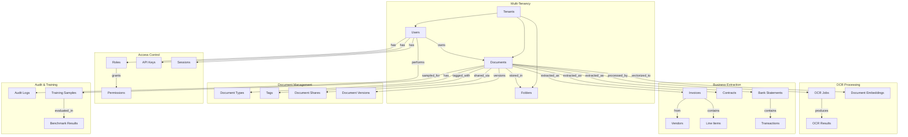

# Datenbank-Schema & Entity-Relationship-Diagramm

> **Ablage-System - Vollständige Datenbankarchitektur**
> Version: 1.0 | Stand: Januar 2025

---

## Übersicht

Dieses Dokument beschreibt die vollständige Datenbankarchitektur des Ablage-Systems, einschließlich aller Entitäten, Beziehungen und Indizes.

**Datenbank:** PostgreSQL 16
**ORM:** SQLAlchemy 2.0 (Async)
**Migrationen:** Alembic
**Erweiterungen:** pgvector, pg_trgm, uuid-ossp

---

## Entity-Relationship-Diagramm (Komplett)

```mermaid
erDiagram
    %% ===== Core Entities =====

    USERS ||--o{ DOCUMENTS : "owns"
    USERS ||--o{ API_KEYS : "has"
    USERS ||--o{ USER_SESSIONS : "has"
    USERS ||--o{ USER_ROLES : "has"
    USERS ||--o{ AUDIT_LOGS : "performs"
    USERS }o--|| TENANTS : "belongs_to"

    ROLES ||--o{ USER_ROLES : "assigned_to"
    ROLES ||--o{ ROLE_PERMISSIONS : "has"
    PERMISSIONS ||--o{ ROLE_PERMISSIONS : "granted_by"

    DOCUMENTS ||--o{ DOCUMENT_VERSIONS : "has"
    DOCUMENTS ||--o{ DOCUMENT_TAGS : "has"
    DOCUMENTS ||--o{ DOCUMENT_SHARES : "shared_via"
    DOCUMENTS ||--o{ OCR_RESULTS : "processed_to"
    DOCUMENTS ||--o{ DOCUMENT_EMBEDDINGS : "vectorized_to"
    DOCUMENTS }o--|| DOCUMENT_TYPES : "classified_as"
    DOCUMENTS }o--|| FOLDERS : "stored_in"

    TAGS ||--o{ DOCUMENT_TAGS : "applied_to"

    FOLDERS ||--o{ FOLDERS : "contains"
    FOLDERS }o--|| USERS : "owned_by"

    OCR_JOBS ||--|| DOCUMENTS : "processes"
    OCR_JOBS ||--o{ OCR_RESULTS : "produces"

    %% ===== Business Domain Entities =====

    DOCUMENTS ||--o{ INVOICES : "extracted_as"
    DOCUMENTS ||--o{ CONTRACTS : "extracted_as"
    DOCUMENTS ||--o{ BANK_STATEMENTS : "extracted_as"

    INVOICES ||--o{ INVOICE_LINE_ITEMS : "contains"
    INVOICES }o--|| VENDORS : "from"

    BANK_STATEMENTS ||--o{ BANK_TRANSACTIONS : "contains"
    BANK_TRANSACTIONS ||--o{ TRANSACTION_MATCHES : "matched_to"

    %% ===== Training & Quality =====

    DOCUMENTS ||--o{ TRAINING_SAMPLES : "sampled_for"
    TRAINING_SAMPLES ||--o{ BENCHMARK_RESULTS : "evaluated_in"
    TRAINING_SAMPLES ||--o{ USER_CORRECTIONS : "corrected_by"

    %% ===== Entity Definitions =====

    TENANTS {
        uuid id PK
        string name
        string slug UK
        jsonb settings
        boolean is_active
        timestamp created_at
        timestamp updated_at
    }

    USERS {
        uuid id PK
        uuid tenant_id FK
        string email UK
        string password_hash
        string full_name
        boolean is_active
        boolean is_superuser
        timestamp last_login
        timestamp created_at
        timestamp updated_at
        timestamp deleted_at
    }

    ROLES {
        uuid id PK
        uuid tenant_id FK
        string name
        string description
        jsonb permissions
        boolean is_system
        timestamp created_at
    }

    USER_ROLES {
        uuid id PK
        uuid user_id FK
        uuid role_id FK
        timestamp assigned_at
        uuid assigned_by FK
    }

    PERMISSIONS {
        uuid id PK
        string code UK
        string name
        string category
        string description
    }

    ROLE_PERMISSIONS {
        uuid id PK
        uuid role_id FK
        uuid permission_id FK
    }

    API_KEYS {
        uuid id PK
        uuid user_id FK
        string key_hash UK
        string name
        string prefix
        jsonb scopes
        timestamp expires_at
        timestamp last_used_at
        timestamp created_at
        boolean is_active
    }

    USER_SESSIONS {
        uuid id PK
        uuid user_id FK
        string token_hash UK
        string ip_address
        string user_agent
        timestamp expires_at
        timestamp created_at
    }

    DOCUMENTS {
        uuid id PK
        uuid tenant_id FK
        uuid owner_id FK
        uuid folder_id FK
        uuid document_type_id FK
        string filename
        string original_filename
        string mime_type
        bigint file_size
        string storage_path
        string status
        jsonb metadata
        tsvector search_vector
        timestamp processed_at
        timestamp created_at
        timestamp updated_at
        timestamp deleted_at
    }

    DOCUMENT_VERSIONS {
        uuid id PK
        uuid document_id FK
        integer version_number
        string storage_path
        bigint file_size
        string change_summary
        uuid created_by FK
        timestamp created_at
    }

    DOCUMENT_TYPES {
        uuid id PK
        uuid tenant_id FK
        string code UK
        string name
        string description
        jsonb extraction_schema
        jsonb classification_rules
        boolean is_system
        timestamp created_at
    }

    FOLDERS {
        uuid id PK
        uuid tenant_id FK
        uuid parent_id FK
        uuid owner_id FK
        string name
        string path
        integer depth
        timestamp created_at
        timestamp updated_at
    }

    TAGS {
        uuid id PK
        uuid tenant_id FK
        string name UK
        string color
        timestamp created_at
    }

    DOCUMENT_TAGS {
        uuid id PK
        uuid document_id FK
        uuid tag_id FK
        timestamp created_at
    }

    DOCUMENT_SHARES {
        uuid id PK
        uuid document_id FK
        uuid shared_with_user_id FK
        uuid shared_with_group_id FK
        string permission_level
        timestamp expires_at
        uuid shared_by FK
        timestamp created_at
    }

    OCR_JOBS {
        uuid id PK
        uuid document_id FK
        string backend
        string status
        integer priority
        jsonb config
        timestamp started_at
        timestamp completed_at
        integer retry_count
        text error_message
        timestamp created_at
    }

    OCR_RESULTS {
        uuid id PK
        uuid document_id FK
        uuid ocr_job_id FK
        string backend
        text extracted_text
        jsonb structured_data
        float confidence_score
        integer processing_time_ms
        jsonb page_results
        timestamp created_at
    }

    DOCUMENT_EMBEDDINGS {
        uuid id PK
        uuid document_id FK
        string model_name
        vector embedding
        integer chunk_index
        text chunk_text
        timestamp created_at
    }

    INVOICES {
        uuid id PK
        uuid document_id FK
        uuid vendor_id FK
        string invoice_number
        date invoice_date
        date due_date
        decimal net_amount
        decimal tax_amount
        decimal gross_amount
        string currency
        string status
        jsonb extracted_fields
        float confidence_score
        timestamp created_at
    }

    INVOICE_LINE_ITEMS {
        uuid id PK
        uuid invoice_id FK
        integer position
        string description
        decimal quantity
        string unit
        decimal unit_price
        decimal net_amount
        decimal tax_rate
        string article_number
    }

    VENDORS {
        uuid id PK
        uuid tenant_id FK
        string name
        string tax_id
        string iban
        jsonb address
        jsonb contact
        timestamp created_at
    }

    CONTRACTS {
        uuid id PK
        uuid document_id FK
        string contract_number
        string contract_type
        date start_date
        date end_date
        string status
        jsonb parties
        jsonb terms
        timestamp created_at
    }

    BANK_STATEMENTS {
        uuid id PK
        uuid document_id FK
        string account_iban
        string bank_name
        date statement_date
        date period_start
        date period_end
        decimal opening_balance
        decimal closing_balance
        string currency
        timestamp created_at
    }

    BANK_TRANSACTIONS {
        uuid id PK
        uuid statement_id FK
        date booking_date
        date value_date
        string description
        decimal amount
        string currency
        string counterparty_name
        string counterparty_iban
        string reference
        string category
        timestamp created_at
    }

    TRANSACTION_MATCHES {
        uuid id PK
        uuid transaction_id FK
        uuid invoice_id FK
        string match_type
        float confidence
        string status
        timestamp matched_at
        uuid matched_by FK
    }

    TRAINING_SAMPLES {
        uuid id PK
        uuid document_id FK
        string sample_type
        text ground_truth
        string status
        uuid verified_by FK
        timestamp verified_at
        timestamp created_at
    }

    BENCHMARK_RESULTS {
        uuid id PK
        uuid sample_id FK
        string backend
        text extracted_text
        float cer
        float wer
        float umlaut_accuracy
        integer processing_time_ms
        timestamp created_at
    }

    USER_CORRECTIONS {
        uuid id PK
        uuid sample_id FK
        uuid user_id FK
        text original_text
        text corrected_text
        string correction_type
        timestamp created_at
    }

    AUDIT_LOGS {
        uuid id PK
        uuid tenant_id FK
        uuid user_id FK
        string action
        string resource_type
        uuid resource_id
        jsonb old_values
        jsonb new_values
        string ip_address
        string user_agent
        timestamp created_at
    }
```



---

## Tabellen-Detailbeschreibung

### Core-Entitäten

#### `tenants` - Mandanten

Multi-Tenant-Unterstützung mit Row-Level-Security.

```sql
CREATE TABLE tenants (
    id UUID PRIMARY KEY DEFAULT gen_random_uuid(),
    name VARCHAR(255) NOT NULL,
    slug VARCHAR(100) NOT NULL UNIQUE,
    settings JSONB DEFAULT '{}',
    is_active BOOLEAN DEFAULT true,
    created_at TIMESTAMPTZ DEFAULT NOW(),
    updated_at TIMESTAMPTZ DEFAULT NOW()
);

-- RLS Policy
ALTER TABLE tenants ENABLE ROW LEVEL SECURITY;
CREATE POLICY tenant_isolation ON tenants
    USING (id = current_setting('app.current_tenant_id')::uuid);
```

#### `users` - Benutzer

```sql
CREATE TABLE users (
    id UUID PRIMARY KEY DEFAULT gen_random_uuid(),
    tenant_id UUID NOT NULL REFERENCES tenants(id),
    email VARCHAR(255) NOT NULL,
    password_hash VARCHAR(255) NOT NULL,
    full_name VARCHAR(255),
    is_active BOOLEAN DEFAULT true,
    is_superuser BOOLEAN DEFAULT false,
    last_login TIMESTAMPTZ,
    created_at TIMESTAMPTZ DEFAULT NOW(),
    updated_at TIMESTAMPTZ DEFAULT NOW(),
    deleted_at TIMESTAMPTZ,

    UNIQUE(tenant_id, email)
);

CREATE INDEX idx_users_email ON users(email);
CREATE INDEX idx_users_tenant ON users(tenant_id) WHERE deleted_at IS NULL;
```

#### `documents` - Dokumente

Zentrale Dokumententabelle mit Volltext-Suche.

```sql
CREATE TABLE documents (
    id UUID PRIMARY KEY DEFAULT gen_random_uuid(),
    tenant_id UUID NOT NULL REFERENCES tenants(id),
    owner_id UUID NOT NULL REFERENCES users(id),
    folder_id UUID REFERENCES folders(id),
    document_type_id UUID REFERENCES document_types(id),

    filename VARCHAR(255) NOT NULL,
    original_filename VARCHAR(255) NOT NULL,
    mime_type VARCHAR(100) NOT NULL,
    file_size BIGINT NOT NULL,
    storage_path VARCHAR(500) NOT NULL,

    status VARCHAR(50) DEFAULT 'pending',
    metadata JSONB DEFAULT '{}',
    search_vector TSVECTOR,

    processed_at TIMESTAMPTZ,
    created_at TIMESTAMPTZ DEFAULT NOW(),
    updated_at TIMESTAMPTZ DEFAULT NOW(),
    deleted_at TIMESTAMPTZ
);

-- Indizes
CREATE INDEX idx_documents_tenant ON documents(tenant_id) WHERE deleted_at IS NULL;
CREATE INDEX idx_documents_owner ON documents(owner_id);
CREATE INDEX idx_documents_status ON documents(status);
CREATE INDEX idx_documents_type ON documents(document_type_id);
CREATE INDEX idx_documents_folder ON documents(folder_id);
CREATE INDEX idx_documents_created ON documents(created_at DESC);

-- Volltext-Suche (Deutsch)
CREATE INDEX idx_documents_search ON documents USING GIN(search_vector);

-- Trigger für Search Vector
CREATE OR REPLACE FUNCTION documents_search_vector_update() RETURNS TRIGGER AS $$
BEGIN
    NEW.search_vector :=
        setweight(to_tsvector('german', COALESCE(NEW.filename, '')), 'A') ||
        setweight(to_tsvector('german', COALESCE(NEW.metadata->>'extracted_text', '')), 'B');
    RETURN NEW;
END;
$$ LANGUAGE plpgsql;

CREATE TRIGGER documents_search_update
    BEFORE INSERT OR UPDATE ON documents
    FOR EACH ROW EXECUTE FUNCTION documents_search_vector_update();
```

### OCR-Entitäten

#### `ocr_jobs` - Verarbeitungsaufträge

```sql
CREATE TABLE ocr_jobs (
    id UUID PRIMARY KEY DEFAULT gen_random_uuid(),
    document_id UUID NOT NULL REFERENCES documents(id) ON DELETE CASCADE,
    backend VARCHAR(50) NOT NULL,
    status VARCHAR(50) DEFAULT 'pending',
    priority INTEGER DEFAULT 0,
    config JSONB DEFAULT '{}',

    started_at TIMESTAMPTZ,
    completed_at TIMESTAMPTZ,
    retry_count INTEGER DEFAULT 0,
    error_message TEXT,

    created_at TIMESTAMPTZ DEFAULT NOW()
);

CREATE INDEX idx_ocr_jobs_status ON ocr_jobs(status, priority DESC);
CREATE INDEX idx_ocr_jobs_document ON ocr_jobs(document_id);
```

#### `ocr_results` - Erkennungsergebnisse

```sql
CREATE TABLE ocr_results (
    id UUID PRIMARY KEY DEFAULT gen_random_uuid(),
    document_id UUID NOT NULL REFERENCES documents(id) ON DELETE CASCADE,
    ocr_job_id UUID REFERENCES ocr_jobs(id),
    backend VARCHAR(50) NOT NULL,

    extracted_text TEXT,
    structured_data JSONB,
    confidence_score FLOAT,
    processing_time_ms INTEGER,
    page_results JSONB,

    created_at TIMESTAMPTZ DEFAULT NOW()
);

CREATE INDEX idx_ocr_results_document ON ocr_results(document_id);
CREATE INDEX idx_ocr_results_backend ON ocr_results(backend);
```

### Vektor-Suche

#### `document_embeddings` - Vektor-Embeddings

```sql
CREATE TABLE document_embeddings (
    id UUID PRIMARY KEY DEFAULT gen_random_uuid(),
    document_id UUID NOT NULL REFERENCES documents(id) ON DELETE CASCADE,
    model_name VARCHAR(100) NOT NULL,
    embedding VECTOR(1536),  -- Dimensionen je nach Modell
    chunk_index INTEGER DEFAULT 0,
    chunk_text TEXT,

    created_at TIMESTAMPTZ DEFAULT NOW()
);

-- HNSW-Index für schnelle Ähnlichkeitssuche
CREATE INDEX idx_embeddings_vector ON document_embeddings
    USING hnsw (embedding vector_cosine_ops)
    WITH (m = 16, ef_construction = 64);

CREATE INDEX idx_embeddings_document ON document_embeddings(document_id);
```

### Business-Domain-Entitäten

#### `invoices` - Rechnungen

```sql
CREATE TABLE invoices (
    id UUID PRIMARY KEY DEFAULT gen_random_uuid(),
    document_id UUID NOT NULL REFERENCES documents(id) ON DELETE CASCADE,
    vendor_id UUID REFERENCES vendors(id),

    invoice_number VARCHAR(100),
    invoice_date DATE,
    due_date DATE,

    net_amount DECIMAL(15, 2),
    tax_amount DECIMAL(15, 2),
    gross_amount DECIMAL(15, 2),
    currency VARCHAR(3) DEFAULT 'EUR',

    status VARCHAR(50) DEFAULT 'pending',
    extracted_fields JSONB,
    confidence_score FLOAT,

    created_at TIMESTAMPTZ DEFAULT NOW()
);

CREATE INDEX idx_invoices_document ON invoices(document_id);
CREATE INDEX idx_invoices_vendor ON invoices(vendor_id);
CREATE INDEX idx_invoices_number ON invoices(invoice_number);
CREATE INDEX idx_invoices_date ON invoices(invoice_date);
CREATE INDEX idx_invoices_status ON invoices(status);
```

#### `bank_transactions` - Banktransaktionen

```sql
CREATE TABLE bank_transactions (
    id UUID PRIMARY KEY DEFAULT gen_random_uuid(),
    statement_id UUID NOT NULL REFERENCES bank_statements(id) ON DELETE CASCADE,

    booking_date DATE NOT NULL,
    value_date DATE,
    description TEXT,
    amount DECIMAL(15, 2) NOT NULL,
    currency VARCHAR(3) DEFAULT 'EUR',

    counterparty_name VARCHAR(255),
    counterparty_iban VARCHAR(34),
    reference VARCHAR(255),
    category VARCHAR(100),

    created_at TIMESTAMPTZ DEFAULT NOW()
);

CREATE INDEX idx_transactions_statement ON bank_transactions(statement_id);
CREATE INDEX idx_transactions_date ON bank_transactions(booking_date);
CREATE INDEX idx_transactions_amount ON bank_transactions(amount);
CREATE INDEX idx_transactions_counterparty ON bank_transactions(counterparty_iban);
```

### Audit & Compliance

#### `audit_logs` - Audit-Protokoll

```sql
CREATE TABLE audit_logs (
    id UUID PRIMARY KEY DEFAULT gen_random_uuid(),
    tenant_id UUID NOT NULL REFERENCES tenants(id),
    user_id UUID REFERENCES users(id),

    action VARCHAR(100) NOT NULL,
    resource_type VARCHAR(100) NOT NULL,
    resource_id UUID,

    old_values JSONB,
    new_values JSONB,

    ip_address INET,
    user_agent TEXT,

    created_at TIMESTAMPTZ DEFAULT NOW()
);

-- Partitionierung nach Monat für Performance
CREATE TABLE audit_logs_y2025m01 PARTITION OF audit_logs
    FOR VALUES FROM ('2025-01-01') TO ('2025-02-01');

CREATE INDEX idx_audit_tenant ON audit_logs(tenant_id);
CREATE INDEX idx_audit_user ON audit_logs(user_id);
CREATE INDEX idx_audit_action ON audit_logs(action);
CREATE INDEX idx_audit_resource ON audit_logs(resource_type, resource_id);
CREATE INDEX idx_audit_created ON audit_logs(created_at DESC);
```

---

## Beziehungsdiagramm (Vereinfacht)



---

## Index-Strategie

### Primäre Indizes

| Tabelle | Index | Typ | Zweck |
|---------|-------|-----|-------|
| `documents` | `idx_documents_search` | GIN | Volltext-Suche |
| `document_embeddings` | `idx_embeddings_vector` | HNSW | Vektor-Ähnlichkeit |
| `audit_logs` | `idx_audit_created` | B-Tree | Zeitbasierte Abfragen |

### Composite-Indizes

```sql
-- Häufige Abfrage: Dokumente eines Benutzers nach Datum
CREATE INDEX idx_documents_owner_created
    ON documents(owner_id, created_at DESC)
    WHERE deleted_at IS NULL;

-- Häufige Abfrage: Unbezahlte Rechnungen nach Fälligkeit
CREATE INDEX idx_invoices_unpaid_due
    ON invoices(due_date)
    WHERE status = 'pending';

-- Häufige Abfrage: OCR-Jobs in Queue
CREATE INDEX idx_ocr_jobs_queue
    ON ocr_jobs(priority DESC, created_at)
    WHERE status = 'pending';
```

### Partial-Indizes

```sql
-- Nur aktive Benutzer
CREATE INDEX idx_users_active
    ON users(email)
    WHERE is_active = true AND deleted_at IS NULL;

-- Nur verarbeitete Dokumente
CREATE INDEX idx_documents_processed
    ON documents(processed_at DESC)
    WHERE status = 'completed' AND deleted_at IS NULL;
```

---

## Migrations-Beispiele

### Neue Tabelle hinzufügen

```python
# alembic/versions/xxx_add_document_comments.py
from alembic import op
import sqlalchemy as sa
from sqlalchemy.dialects.postgresql import UUID, JSONB

def upgrade():
    op.create_table(
        'document_comments',
        sa.Column('id', UUID(), primary_key=True, server_default=sa.text('gen_random_uuid()')),
        sa.Column('document_id', UUID(), sa.ForeignKey('documents.id', ondelete='CASCADE'), nullable=False),
        sa.Column('user_id', UUID(), sa.ForeignKey('users.id'), nullable=False),
        sa.Column('content', sa.Text(), nullable=False),
        sa.Column('parent_id', UUID(), sa.ForeignKey('document_comments.id')),
        sa.Column('created_at', sa.DateTime(timezone=True), server_default=sa.text('NOW()')),
        sa.Column('updated_at', sa.DateTime(timezone=True), server_default=sa.text('NOW()')),
    )

    op.create_index('idx_comments_document', 'document_comments', ['document_id'])
    op.create_index('idx_comments_user', 'document_comments', ['user_id'])

def downgrade():
    op.drop_table('document_comments')
```

### Spalte hinzufügen

```python
# alembic/versions/xxx_add_document_priority.py
def upgrade():
    op.add_column('documents',
        sa.Column('priority', sa.Integer(), server_default='0', nullable=False)
    )
    op.create_index('idx_documents_priority', 'documents', ['priority'])

def downgrade():
    op.drop_index('idx_documents_priority')
    op.drop_column('documents', 'priority')
```

---

## Performance-Optimierungen

### Query-Optimierungen

```sql
-- Materialized View für Dashboard-Statistiken
CREATE MATERIALIZED VIEW mv_document_stats AS
SELECT
    tenant_id,
    document_type_id,
    DATE_TRUNC('day', created_at) as date,
    COUNT(*) as document_count,
    SUM(file_size) as total_size,
    AVG(EXTRACT(EPOCH FROM (processed_at - created_at))) as avg_processing_time
FROM documents
WHERE deleted_at IS NULL
GROUP BY tenant_id, document_type_id, DATE_TRUNC('day', created_at);

CREATE UNIQUE INDEX ON mv_document_stats(tenant_id, document_type_id, date);

-- Refresh täglich
REFRESH MATERIALIZED VIEW CONCURRENTLY mv_document_stats;
```

### Connection Pooling

```python
# SQLAlchemy Async Engine Konfiguration
from sqlalchemy.ext.asyncio import create_async_engine

engine = create_async_engine(
    DATABASE_URL,
    pool_size=20,
    max_overflow=40,
    pool_pre_ping=True,
    pool_recycle=3600,
    echo=False,
)
```

---

## Backup-Strategie

### Logische Backups

```bash
# Vollständiges Backup
pg_dump -h localhost -U postgres -d ablage \
    --format=custom \
    --compress=9 \
    --file=/backups/ablage_$(date +%Y%m%d_%H%M%S).dump

# Nur Schema
pg_dump -h localhost -U postgres -d ablage \
    --schema-only \
    --file=/backups/ablage_schema.sql
```

### Point-in-Time Recovery

```bash
# WAL-Archivierung aktivieren
# postgresql.conf
archive_mode = on
archive_command = 'cp %p /var/lib/postgresql/wal_archive/%f'

# Recovery bis zu einem Zeitpunkt
restore_command = 'cp /var/lib/postgresql/wal_archive/%f %p'
recovery_target_time = '2025-01-08 14:30:00'
```

---

## Referenzen

- [PostgreSQL 16 Dokumentation](https://www.postgresql.org/docs/16/)
- [SQLAlchemy 2.0 Dokumentation](https://docs.sqlalchemy.org/en/20/)
- [pgvector](https://github.com/pgvector/pgvector)
- [Alembic Migrations](https://alembic.sqlalchemy.org/)

---

*Letzte Aktualisierung: Januar 2025*
