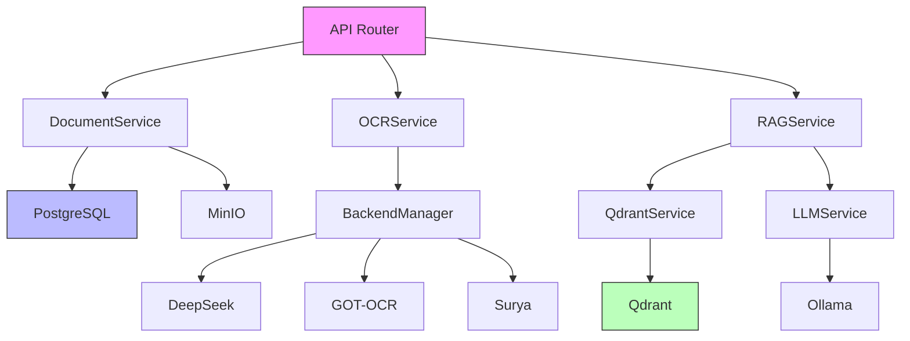

# Service Catalog - Ablage-System OCR

**Version:** 1.0
**Letzte Aktualisierung:** 2025-12-18
**Anzahl Services:** 89+

---

## 1. Übersicht

Dieses Dokument katalogisiert alle Backend-Services des Ablage-Systems mit ihren Verantwortlichkeiten, Dependencies und APIs.

### Service-Kategorien

| Kategorie | Anzahl | Beschreibung |
|-----------|--------|--------------|
| **Core** | 15 | Dokumenten-Management, CRUD |
| **OCR** | 12 | OCR-Backends, Preprocessing |
| **ML/AI** | 10 | Training, Feedback, Benchmarks |
| **RAG** | 8 | Vector Search, Chunking, LLM |
| **Banking** | 10 | Zahlungen, Reconciliation |
| **Infrastructure** | 15 | Backup, Monitoring, Config |
| **Security** | 10 | Auth, Encryption, RBAC |
| **Utilities** | 9 | German Text, Compression |

---

## 2. Core Services

### 2.1 Document Services (Kanonisch)

**Pfad:** `app/services/document_services/`

| Service | Datei | Beschreibung | Dependencies |
|---------|-------|--------------|--------------|
| **DocumentCRUDService** | `crud_service.py` | Basis-CRUD-Operationen | PostgreSQL, SQLAlchemy |
| **DocumentGDPRService** | `gdpr_service.py` | Soft-Delete, Restore, GDPR Art. 17 | DocumentCRUDService |
| **DocumentExportService** | `export_service.py` | Batch Export (JSON/CSV/ZIP) | MinIO, DocumentCRUDService |
| **DocumentBatchService** | `batch_service.py` | Bulk-Operationen | DocumentCRUDService |
| **DocumentFilterService** | `filter_service.py` | Query-Building, Filterung | SQLAlchemy |

```python
# Beispiel-Nutzung
from app.services.document_services.crud_service import DocumentCRUDService

service = DocumentCRUDService(db_session)
doc = await service.get_by_id(document_id)
```

### 2.2 Document Service (Legacy Wrapper)

**Pfad:** `app/services/document_service.py`

> **Hinweis:** Nutzt intern `document_services/` Module. Für neue Entwicklung direkt die modularen Services verwenden.

---

## 3. OCR Services

### 3.1 Backend Manager

**Pfad:** `app/services/backend_manager.py`

| Methode | Beschreibung | Return |
|---------|--------------|--------|
| `select_backend()` | Wählt optimales OCR-Backend | `str` |
| `get_backend_status()` | Status aller Backends | `dict` |
| `health_check()` | Prüft Backend-Verfügbarkeit | `bool` |

### 3.2 OCR Backends

**Pfad:** `app/agents/ocr/`

| Backend | Datei | VRAM | Stärken |
|---------|-------|------|---------|
| **DeepSeek-Janus-Pro** | `deepseek_backend.py` | 12GB | Umlaute, Fraktur, Layouts |
| **GOT-OCR 2.0** | `got_backend.py` | 10GB | Tabellen, Formeln |
| **Surya GPU** | `surya_backend.py` | 8GB | Schnell, Layout-Analyse |
| **Surya CPU** | `surya_cpu_backend.py` | 0GB | Fallback |

### 3.3 OCR Pipeline Services

| Service | Datei | Beschreibung |
|---------|-------|--------------|
| **OCRService** | `ocr_service.py` | Haupt-Orchestrierung |
| **BulkOCRService** | `bulk_ocr_processing_service.py` | Batch-Verarbeitung |
| **ImagePreprocessor** | `image_preprocessor.py` | Bildvorbereitung |

---

## 4. ML/AI Services

### 4.1 Training Services

**Pfad:** `app/services/`

| Service | Datei | Beschreibung |
|---------|-------|--------------|
| **OCRTrainingService** | `ocr_training_service.py` | Ground-Truth-Management |
| **BenchmarkRunnerService** | `benchmark_runner_service.py` | Backend-Vergleiche |
| **FeedbackLearningService** | `feedback_learning_service.py` | Self-Learning |
| **AutoGroundTruthService** | `auto_ground_truth_service.py` | Automatische Datengeneration |

### 4.2 ML-Routing

| Service | Datei | Beschreibung |
|---------|-------|--------------|
| **ConfidenceService** | `confidence_service.py` | Confidence-Scoring |
| **EnsembleVoting** | `ensemble_voting.py` | Multi-Backend-Voting |
| **FallbackChain** | `fallback_chain.py` | Fallback-Strategie |

---

## 5. RAG Services

**Pfad:** `app/services/rag/`

| Service | Datei | Beschreibung | Dependencies |
|---------|-------|--------------|--------------|
| **QdrantService** | `qdrant_service.py` | Vektor-DB-Integration | Qdrant |
| **ChunkingService** | `chunking_service.py` | Document-Chunking | - |
| **LLMService** | `llm_service.py` | LLM-Integration | Ollama/DeepSeek |
| **VectorSyncService** | `vector_sync_service.py` | Embedding-Sync | QdrantService |
| **SearchService** | `search_service.py` | Semantische Suche | QdrantService |
| **ChatService** | `chat_service.py` | RAG-Chat | LLMService, SearchService |
| **CustomerCardService** | `customer_card_service.py` | Kundenkarten-Extraktion | - |

```python
# Beispiel: RAG Search
from app.services.rag.search_service import SearchService

service = SearchService()
results = await service.search("Rechnung vom 15.12.2024", top_k=10)
```

---

## 6. Banking Services

**Pfad:** `app/services/banking/`

| Service | Datei | Beschreibung |
|---------|-------|--------------|
| **PaymentService** | `payment_service.py` | Zahlungsverarbeitung |
| **ReconciliationService** | `reconciliation_service.py` | Kontoabstimmung |
| **ImportService** | `import_service.py` | MT940/CAMT Import |
| **AgingReportService** | `aging_report_service.py` | Fälligkeitsanalyse |
| **CashFlowService** | `cash_flow_service.py` | Cashflow-Reports |
| **DunningService** | `dunning_service.py` | Mahnwesen |
| **TANHandlerService** | `tan_handler_service.py` | mTAN-Handling |

### Banking Parsers

**Pfad:** `app/services/banking/parsers/`

| Parser | Format | Beschreibung |
|--------|--------|--------------|
| `mt940_parser.py` | MT940 | SWIFT-Format |
| `camt_parser.py` | CAMT053 | ISO 20022 XML |
| `csv_parser.py` | CSV | Generisches CSV |

---

## 7. Infrastructure Services

### 7.1 Backup & Recovery

**Pfad:** `app/services/`

| Service | Datei | Beschreibung |
|---------|-------|--------------|
| **BackupService** | `backup_service.py` | Backup-Orchestrierung |
| **PostgresBackupService** | `postgres_backup_service.py` | DB-Backups |
| **MinIOBackupService** | `minio_backup_service.py` | Storage-Backups |

### 7.2 Monitoring

| Service | Datei | Beschreibung |
|---------|-------|--------------|
| **MetricsService** | `metrics_service.py` | Prometheus-Metriken |
| **HealthService** | `health_service.py` | Health Checks |
| **GPUMonitorService** | `gpu_monitor_service.py` | GPU-Überwachung |

### 7.3 Storage

| Service | Datei | Beschreibung |
|---------|-------|--------------|
| **StorageService** | `storage_service.py` | MinIO-Abstraktion |
| **CacheService** | `cache_service.py` | Redis-Caching |

---

## 8. Security Services

**Pfad:** `app/core/`

| Service | Datei | Beschreibung |
|---------|-------|--------------|
| **SecurityService** | `security.py` | JWT, Passwort-Hashing |
| **EncryptionService** | `encryption.py` | AES-256-GCM |
| **RBACService** | `rbac.py` | Rollenbasierte Zugriffskontrolle |
| **SessionManager** | `session_manager.py` | Session-Verwaltung |
| **TOTPService** | `totp.py` | 2FA |
| **AccountLockout** | `account_lockout.py` | Brute-Force-Schutz |
| **AuditLogger** | `audit_logger.py` | GDPR-konformes Logging |
| **CredentialRedaction** | `credential_redaction.py` | Secrets-Maskierung |

---

## 9. Utility Services

### 9.1 German Text Processing

**Pfad:** `app/services/`

| Service | Datei | Beschreibung |
|---------|-------|--------------|
| **GermanCompoundSplitter** | `german_compound_splitter.py` | Wort-Zerlegung |
| **ContextualUmlautRestorer** | `contextual_umlaut_restorer.py` | Umlaut-Korrektur |
| **TokenErrorAnalyzer** | `token_error_analyzer.py` | OCR-Fehleranalyse |

### 9.2 Export Services

| Service | Datei | Zweck |
|---------|-------|-------|
| **ExportService** | `export_service.py` | Invoice/Order/Contract → CSV/Excel |
| **DataExportService** | `data_export_service.py` | GDPR Art. 20 Portabilität |
| **TrainingDatasetExport** | `training_dataset_export_service.py` | OCR Training Export |

---

## 10. Celery Workers

**Pfad:** `app/workers/tasks/`

| Task-Modul | Beschreibung | Schedule |
|------------|--------------|----------|
| `ocr_tasks.py` | GPU-intensive OCR | On-Demand |
| `training_tasks.py` | OCR Training | Daily/Weekly |
| `embedding_tasks.py` | Vector Generation | On-Demand |
| `banking_tasks.py` | Banking-Operationen | On-Demand |
| `backup_tasks.py` | Backup & Restore | Daily 02:30 |
| `gdpr_tasks.py` | GDPR-Compliance | On-Demand |
| `rag_tasks.py` | RAG-Verarbeitung | On-Demand |
| `cleanup_tasks.py` | Aufräumarbeiten | Weekly |
| `monitoring_tasks.py` | Health Checks | Every 15 min |

---

## 11. Service Dependencies



---

## 12. Service-Konfiguration

### Environment Variables

```bash
# Core
DATABASE_URL=postgresql://...
REDIS_URL=redis://...
MINIO_ENDPOINT=localhost:9000

# OCR
OCR_DEFAULT_BACKEND=deepseek
GPU_MEMORY_FRACTION=0.85
GPU_LOCK_TIMEOUT=180

# RAG
QDRANT_HOST=localhost
QDRANT_PORT=6333
OLLAMA_HOST=localhost:11434

# Banking
BANKING_ENABLED=true
MT940_AUTO_IMPORT=true
```

---

## 13. API-Referenz

### Document Service

```python
class DocumentCRUDService:
    async def create(self, data: DocumentCreate) -> Document
    async def get_by_id(self, id: str) -> Document | None
    async def update(self, id: str, data: DocumentUpdate) -> Document
    async def delete(self, id: str) -> bool
    async def list(self, filters: DocumentFilter) -> list[Document]
```

### OCR Service

```python
class OCRService:
    async def process(self, document_id: str, backend: str = "auto") -> OCRResult
    async def process_batch(self, doc_ids: list[str]) -> list[OCRResult]
    async def get_status(self, task_id: str) -> TaskStatus
```

### RAG Service

```python
class SearchService:
    async def search(self, query: str, top_k: int = 10) -> list[SearchResult]
    async def hybrid_search(self, query: str) -> list[SearchResult]
    async def rerank(self, results: list[SearchResult]) -> list[SearchResult]
```

---

## 14. Änderungshistorie

| Version | Datum | Änderung |
|---------|-------|----------|
| 1.0 | 2025-12-18 | Initiale Katalogisierung |
