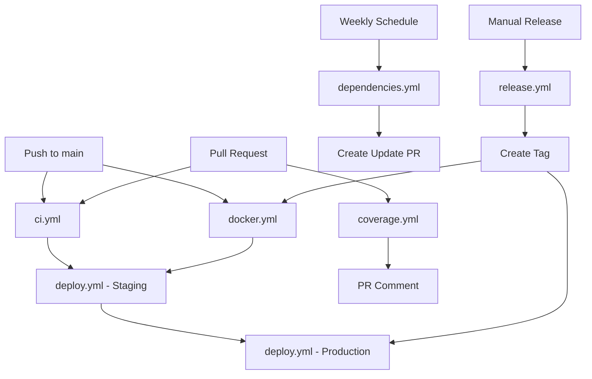

# GitHub Actions CI/CD Pipeline - Ablage-System OCR

Comprehensive automation for testing, building, deploying, and maintaining the Ablage-System.

## 📋 Workflows Overview

### 1. **ci.yml** - Continuous Integration ✅
**Trigger:** Push to `main`/`develop`, Pull Requests
**Purpose:** Comprehensive testing and quality checks

**Jobs:**
- **code-quality**: Ruff linting, formatting, MyPy type checking
- **security**: Bandit security scan, Safety dependency check
- **test-unit**: Unit tests with PostgreSQL + Redis
- **test-integration**: Integration tests with full stack (PostgreSQL, Redis, MinIO)
- **build**: Docker image build verification
- **docs**: MkDocs documentation build
- **ci-summary**: Aggregated results summary

**Services:** PostgreSQL 16, Redis 7, MinIO

**Artifacts:**
- Bandit security report (JSON)
- Safety dependency report (JSON)
- Code coverage reports (XML/HTML)
- Documentation site (HTML)

---

### 2. **docker.yml** - Docker Build & Publish 🐳
**Trigger:** Push to `main`/`develop`, Tags (`v*.*.*`), Manual
**Purpose:** Build and publish Docker images to GitHub Container Registry

**Images Built:**
- `ghcr.io/{repo}-backend`
- `ghcr.io/{repo}-worker`
- `ghcr.io/{repo}-frontend`

**Jobs:**
- **build-and-push**: Multi-platform builds with caching
- **security-scan**: Trivy vulnerability scanning
- **test-compose**: Docker Compose deployment testing

**Features:**
- GitHub Container Registry (GHCR) integration
- Image tagging: branch, PR, semver, SHA, latest
- Build cache optimization (GitHub Actions cache)
- Vulnerability scanning with Trivy
- SARIF upload to GitHub Security

---

### 3. **deploy.yml** - Deployment Pipeline 🚀
**Trigger:** Push to `main`, Tags (`v*.*.*`), Manual (with environment selection)
**Purpose:** Automated deployment to staging and production

**Environments:**
- **Staging:** Auto-deploy from `main` branch
- **Production:** Manual approval required, tag-based deployment

**Jobs:**
- **pre-deploy-checks**: Version verification, migration detection, smoke tests
- **deploy-staging**: Staging deployment with health checks
- **deploy-production**: Production deployment with blue-green strategy
- **deploy-summary**: Aggregated deployment status

**Deployment Features:**
- SSH-based deployment to servers
- Pre-deployment database backups
- Zero-downtime deployment (blue-green)
- Automatic health checks
- Rollback on failure
- Post-deployment monitoring

**Secrets Required:**
```bash
STAGING_SSH_KEY        # SSH private key for staging server
STAGING_HOST           # Staging server hostname
STAGING_USER           # SSH user for staging
PRODUCTION_SSH_KEY     # SSH private key for production
PRODUCTION_HOST        # Production server hostname
PRODUCTION_USER        # SSH user for production
```

---

### 4. **release.yml** - Release Automation 📦
**Trigger:** Manual (with version bump selection)
**Purpose:** Semantic versioning and automated release creation

**Version Bump Types:**
- `patch`: 0.1.0 → 0.1.1 (bug fixes)
- `minor`: 0.1.0 → 0.2.0 (new features)
- `major`: 0.1.0 → 1.0.0 (breaking changes)

**Jobs:**
- **create-release**: Version bump, changelog generation, Git tagging
- **notify-release**: Notification distribution

**Process:**
1. Read current version from `VERSION` file
2. Calculate new version based on bump type
3. Generate changelog from Git commits (categorized by type)
4. Update `VERSION` and `CHANGELOG.md`
5. Commit and push changes
6. Create Git tag (`v*.*.*`)
7. Create GitHub Release with notes
8. Build release artifacts (tar.gz + checksums)
9. Upload artifacts to GitHub Release
10. Trigger Docker build workflow for new tag
11. Set next development version (`*.*.*-dev`)

**Changelog Categorization:**
- ✨ **New Features** (feat: commits)
- 🐛 **Bug Fixes** (fix: commits)
- 📚 **Documentation** (docs: commits)
- 🔧 **Other Changes** (everything else)

---

### 5. **dependencies.yml** - Dependency Updates 📦
**Trigger:** Weekly (Mondays 9:00 UTC), Manual
**Purpose:** Automated dependency scanning and update PRs

**Jobs:**
- **python-dependencies**: Python package updates (pip-compile)
- **security-audit**: Safety vulnerability scanning
- **docker-updates**: Docker base image checks

**Features:**
- Automatic PR creation for updates
- Security vulnerability detection
- Automatic GitHub issue creation for vulnerabilities
- Integration with `dependabot.yml`

---

### 6. **coverage.yml** - Code Coverage Report 📊
**Trigger:** Push to `main`/`develop`, Pull Requests, Manual
**Purpose:** Generate and publish code coverage reports

**Jobs:**
- **coverage**: Full test suite with coverage analysis

**Features:**
- Branch coverage enabled
- Minimum threshold: 80% (enforced)
- Codecov integration
- PR comments with coverage summary
- HTML coverage report artifacts
- Coverage badge generation

**Outputs:**
- Coverage XML (for Codecov)
- Coverage HTML (for human review)
- Coverage summary in PR comments
- Coverage summary in workflow summary

---

## 🔧 Configuration Files

### dependabot.yml
Automated dependency updates for:
- **Python packages** (pip)
- **Docker images**
- **GitHub Actions**

**Schedule:** Weekly on Mondays
**Features:**
- Grouped updates (dev dependencies, production dependencies)
- Auto-labeling (dependencies, python, docker, github-actions)
- Commit message prefixes (chore(deps), chore(docker), chore(ci))

---

## 🚀 Usage Examples

### Run CI Pipeline Manually
```bash
gh workflow run ci.yml
```

### Trigger Deployment to Staging
```bash
gh workflow run deploy.yml -f environment=staging
```

### Trigger Deployment to Production
```bash
gh workflow run deploy.yml -f environment=production -f version=v1.2.3
```

### Create a New Release
```bash
# Patch release (bug fixes)
gh workflow run release.yml -f version_bump=patch

# Minor release (new features)
gh workflow run release.yml -f version_bump=minor

# Major release (breaking changes)
gh workflow run release.yml -f version_bump=major

# Pre-release
gh workflow run release.yml -f version_bump=minor -f prerelease=true
```

### Check Dependency Updates
```bash
gh workflow run dependencies.yml
```

### Generate Coverage Report
```bash
gh workflow run coverage.yml
```

---

## 🔐 Required Secrets

Add these secrets in **Settings → Secrets and variables → Actions**:

### Deployment
```bash
STAGING_SSH_KEY        # SSH private key for staging server
STAGING_HOST           # Staging server hostname (e.g., staging.ablage-system.local)
STAGING_USER           # SSH username (e.g., deploy)

PRODUCTION_SSH_KEY     # SSH private key for production server
PRODUCTION_HOST        # Production server hostname (e.g., ablage-system.local)
PRODUCTION_USER        # SSH username (e.g., deploy)
```

### Optional (for enhanced features)
```bash
CODECOV_TOKEN          # Codecov API token (for coverage reports)
SLACK_WEBHOOK_URL      # Slack webhook for notifications
DISCORD_WEBHOOK_URL    # Discord webhook for notifications
```

---

## 📊 Workflow Status Badges

Add these badges to your README.md:

```markdown
[](https://github.com/{owner}/{repo}/actions/workflows/ci.yml)
[](https://github.com/{owner}/{repo}/actions/workflows/docker.yml)
[](https://github.com/{owner}/{repo}/actions/workflows/deploy.yml)
[](https://codecov.io/gh/{owner}/{repo})
```

---

## 🎯 Workflow Dependencies



---

## 🔍 Troubleshooting

### CI Failures

**Linting errors:**
```bash
make lint-fix  # Auto-fix linting issues
```

**Type checking errors:**
```bash
mypy app/ --show-error-codes
```

**Test failures:**
```bash
make test-unit      # Run unit tests only
make test-integration  # Run integration tests only
pytest tests/path/to/test.py -v  # Run specific test
```

**Coverage below threshold:**
```bash
make test-cov  # Generate coverage report
open htmlcov/index.html  # View detailed coverage
```

### Deployment Failures

**SSH connection issues:**
```bash
# Test SSH connection
ssh -i ~/.ssh/staging_key deploy@staging.ablage-system.local

# Check SSH key permissions
chmod 600 ~/.ssh/staging_key
```

**Health check failures:**
```bash
# Check service status on server
ssh deploy@staging.ablage-system.local "cd /opt/ablage-system && docker-compose ps"

# Check logs
ssh deploy@staging.ablage-system.local "cd /opt/ablage-system && docker-compose logs backend"
```

**Rollback:**
```bash
# Find latest backup
ssh deploy@production.ablage-system.local "ls -lh /opt/ablage-system/backups/pre-deployment-*.tar.gz"

# Restore from backup
ssh deploy@production.ablage-system.local "cd /opt/ablage-system && ./scripts/restore.sh all backups/pre-deployment-XXXXXX.tar.gz"
```

---

## 📚 Best Practices

### Commit Messages
Follow Conventional Commits:
```
feat(api): add document export endpoint
fix(ocr): fix German umlaut handling
docs(readme): update deployment instructions
test(api): add integration tests for upload
chore(deps): update fastapi to 0.110.0
```

### Branch Strategy
- `main`: Production-ready code
- `develop`: Integration branch for features
- `feature/*`: Feature branches
- `fix/*`: Bug fix branches
- `hotfix/*`: Production hotfixes

### Pull Requests
- All checks must pass (CI, coverage, linting)
- Minimum 1 approval required
- PR template automatically populated
- Coverage must maintain >=80%

### Releases
- Use semantic versioning (MAJOR.MINOR.PATCH)
- Tag releases with `v` prefix (e.g., `v1.2.3`)
- Include changelog in release notes
- Deploy to staging first, then production

---

## 🔄 Future Enhancements

Planned additions:
- [ ] E2E testing workflow (Playwright/Cypress)
- [ ] Performance benchmarking workflow
- [ ] Load testing workflow (k6)
- [ ] Kubernetes deployment support
- [ ] Multi-region deployment
- [ ] Canary deployment strategy
- [ ] Automated rollback triggers
- [ ] Enhanced notification system (PagerDuty, OpsGenie)

---

**Last Updated:** 2025-01-24
**Maintainer:** Ablage-System Team
