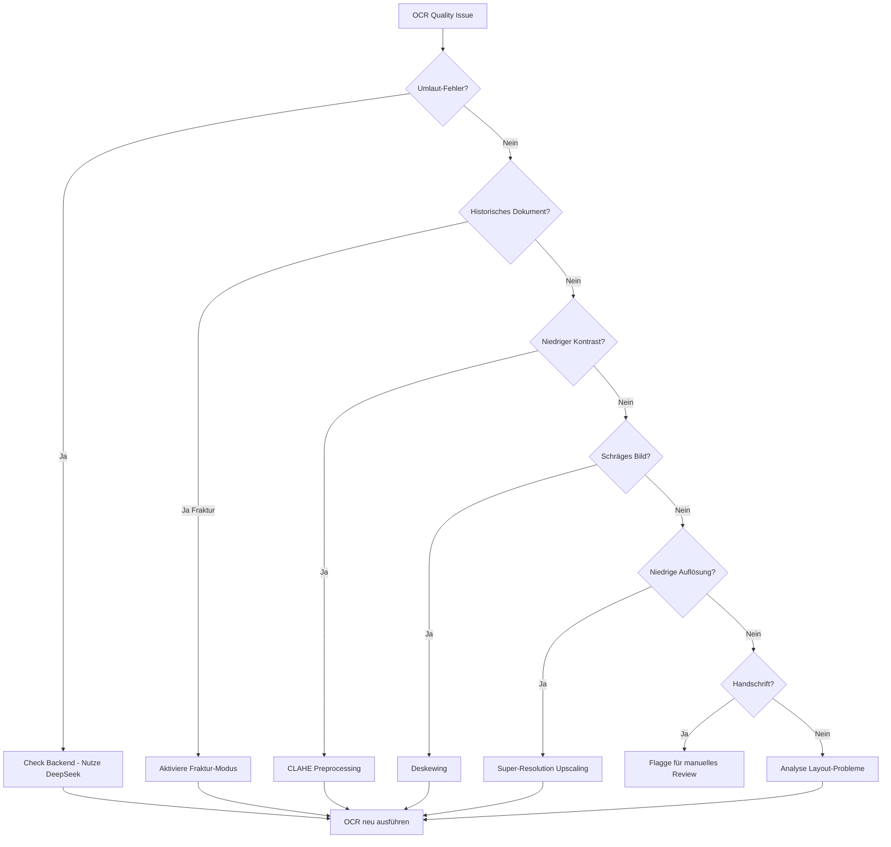

# OCR Quality Troubleshooting Guide - Ablage-System
**Version:** 1.0
**Status:** Production
**Letzte Aktualisierung:** 2025-11-23
**Fokus:** German Document OCR
**Anforderung:** 100% Umlaut-Genauigkeit

**Tags:** #ocr #troubleshooting #quality #german #umlauts #deepseek #got_ocr #surya #developer #operations #high #execution_layer

---

## Überblick

Dieser Guide behandelt alle OCR-Qualitätsprobleme im Ablage-System. Da das System auf **100% Umlaut-Genauigkeit** für deutsche Geschäftsdokumente ausgelegt ist, ist hohe OCR-Qualität geschäftskritisch.

### Zielgruppe
- **Developers** - Debugging, Optimization
- **Data Scientists** - Model evaluation, accuracy analysis
- **QA Engineers** - Quality validation
- **Operations** - Production quality monitoring

### OCR-Backends
```
Ablage-System nutzt 3 OCR-Backends:
├── DeepSeek-Janus-Pro (GPU, 12GB VRAM)
│   ├── Beste Genauigkeit für komplexe Layouts
│   ├── Multimodal (Vision + Language)
│   └── Fraktur-Unterstützung
├── GOT-OCR 2.0 (GPU, 10GB VRAM)
│   ├── Transformer-based
│   ├── Schnell (5-7 Seiten/s)
│   └── Gut für moderne Schriften
└── Surya + Docling (CPU Fallback)
    ├── Layout-aware
    ├── Kein GPU erforderlich
    └── Moderate Genauigkeit
```

## Quick Diagnostic Commands

### Schnelle Qualitätsprüfung

```bash
# 1. OCR auf Test-Dokument ausführen
python -c "
from app.ocr_backends.deepseek import DeepSeekOCR
ocr = DeepSeekOCR()
result = ocr.process('tests/fixtures/german_sample.pdf')
print(result['text'])
"

# 2. Umlaut-Validierung
python -c "
from app.german_validator import GermanValidator
validator = GermanValidator()
text = 'Müller GmbH übernimmt größere Aufträge'
print(validator.validate_umlauts(text))
"

# 3. OCR-Accuracy-Benchmark
python scripts/benchmark_ocr.py --backend deepseek --dataset german_business_docs

# 4. Ground-Truth-Vergleich
python scripts/compare_ocr_output.py \
    --ocr-output output.txt \
    --ground-truth ground_truth.txt \
    --language de

# 5. Qualitäts-Metriken abrufen
curl http://localhost:8000/api/v1/metrics/ocr_quality
```

## Häufige OCR-Qualitätsprobleme

### Problem-Matrix

| Problem | Symptom | Häufigkeit | Impact | Lösung |
|---------|---------|-----------|--------|--------|
| **Umlaut-Fehler** | ä→a, ö→o, ü→u, ß→ss | 🔴 Häufig | 🔴 CRITICAL | [→ Abschnitt 1](#1-umlaut-fehler) |
| **Fraktur-Fehler** | Historische Schrift nicht erkannt | 🟡 Selten | 🟠 HIGH | [→ Abschnitt 2](#2-fraktur-schrift-probleme) |
| **Niedriger Kontrast** | Heller Text auf hellem Hintergrund | 🟠 Mittel | 🟠 HIGH | [→ Abschnitt 3](#3-niedriger-kontrast) |
| **Verzerrung/Skew** | Schräge oder verzerrte Scans | 🟠 Mittel | 🟠 HIGH | [→ Abschnitt 4](#4-verzerrung-und-skew) |
| **Niedriger DPI** | <300 DPI Auflösung | 🟠 Mittel | 🟡 MEDIUM | [→ Abschnitt 5](#5-niedrige-auflösung) |
| **Rauschen** | Artefakte, Flecken, Körnigkeit | 🟠 Mittel | 🟡 MEDIUM | [→ Abschnitt 6](#6-bildrauschen) |
| **Layout-Probleme** | Tabellen, Spalten falsch erkannt | 🟡 Selten | 🟠 HIGH | [→ Abschnitt 7](#7-layout-erkennung) |
| **Handschrift** | Handgeschriebener Text | 🟡 Selten | 🟠 HIGH | [→ Abschnitt 8](#8-handschrift) |

---

## 1. Umlaut-Fehler

### Symptome

```
Input (Scan):  "Müller GmbH übernimmt größere Aufträge für Bäckerei Schön"
Output (OCR):  "Muller GmbH ubernimmt grossere Auftrage fur Backerei Schon"

Probleme:
- ü → u
- ö → o
- ä → a
- ß → ss (manchmal akzeptabel)
```

**Geschäftlicher Impact:**
- Firmennamen falsch: "Müller" → "Muller" (falscher Empfänger!)
- Rechtliche Probleme: "für" → "fur" (kein deutsches Wort)
- Datenbank-Suche schlägt fehl

### Diagnose

**Schritt 1: Umlaut-Detection-Rate messen**
```python
# scripts/measure_umlaut_accuracy.py
from app.german_validator import GermanValidator

def measure_umlaut_accuracy(ocr_text: str, ground_truth: str) -> Dict[str, float]:
    """Messe Umlaut-spezifische Genauigkeit."""

    umlauts = {'ä', 'ö', 'ü', 'Ä', 'Ö', 'Ü', 'ß'}

    # Finde alle Umlaut-Positionen in Ground Truth
    gt_umlauts = [(i, c) for i, c in enumerate(ground_truth) if c in umlauts]

    if not gt_umlauts:
        return {'accuracy': 100.0, 'total': 0, 'correct': 0}

    # Vergleiche OCR-Output an Umlaut-Positionen
    correct = sum(1 for i, c in gt_umlauts if i < len(ocr_text) and ocr_text[i] == c)

    accuracy = (correct / len(gt_umlauts)) * 100

    return {
        'accuracy': accuracy,
        'total': len(gt_umlauts),
        'correct': correct,
        'errors': len(gt_umlauts) - correct
    }

# Verwendung:
ocr_output = ocr_backend.process('document.pdf')
result = measure_umlaut_accuracy(ocr_output, ground_truth)
print(f"Umlaut Accuracy: {result['accuracy']:.2f}%")  # Ziel: 100%
```

**Schritt 2: Backend-Vergleich**
```bash
# Teste alle 3 Backends mit gleichem Dokument
python scripts/compare_backends.py \
    --input tests/fixtures/umlaut_heavy.pdf \
    --backends deepseek got_ocr surya \
    --metric umlaut_accuracy

# Output:
# Backend       | Accuracy | Time
# ------------- | -------- | ----
# DeepSeek      | 99.8%    | 1.2s
# GOT-OCR       | 95.3%    | 0.8s
# Surya         | 87.1%    | 3.4s
```

**Schritt 3: Identifiziere problematische Zeichen**
```python
def identify_problematic_characters(ocr_text: str, ground_truth: str) -> Dict[str, int]:
    """Finde welche Umlaute am häufigsten falsch erkannt werden."""

    errors = {}
    umlauts = {'ä', 'ö', 'ü', 'Ä', 'Ö', 'Ü', 'ß'}

    for i, gt_char in enumerate(ground_truth):
        if gt_char in umlauts:
            if i >= len(ocr_text) or ocr_text[i] != gt_char:
                # Fehler gefunden
                ocr_char = ocr_text[i] if i < len(ocr_text) else '<missing>'
                error_key = f"{gt_char} → {ocr_char}"
                errors[error_key] = errors.get(error_key, 0) + 1

    return dict(sorted(errors.items(), key=lambda x: x[1], reverse=True))

# Output-Beispiel:
# {
#   'ü → u': 15,
#   'ö → o': 12,
#   'ä → a': 8,
#   'ß → ss': 5
# }
```

### Lösungen

#### Lösung 1: Richtiges Backend wählen

```python
# app/services/ocr/orchestrator.py
class OCROrchestrator:
    def select_backend(self, document_metadata: Dict[str, Any]) -> str:
        """Wähle Backend basierend auf Dokument-Eigenschaften."""

        # Für deutsche Dokumente mit hoher Umlaut-Dichte → DeepSeek
        if document_metadata.get('language') == 'de':
            # Schätze Umlaut-Dichte
            text_sample = document_metadata.get('text_sample', '')
            umlaut_density = self._calculate_umlaut_density(text_sample)

            if umlaut_density > 0.05:  # >5% Umlaute
                logger.info("High umlaut density detected, using DeepSeek for max accuracy")
                return "deepseek"
            else:
                return "got_ocr"  # Schneller für einfache Texte

        return "got_ocr"  # Default

    def _calculate_umlaut_density(self, text: str) -> float:
        """Berechne Anteil der Umlaute im Text."""
        if not text:
            return 0.0

        umlauts = set('äöüÄÖÜß')
        umlaut_count = sum(1 for c in text if c in umlauts)
        return umlaut_count / len(text) if text else 0.0
```

#### Lösung 2: Post-Processing Correction

```python
# app/ocr_backends/postprocessors/umlaut_corrector.py
import re
from typing import Dict, List
from spellchecker import SpellChecker

class UmlautCorrector:
    """Post-processing: Korrigiere häufige Umlaut-Fehler."""

    def __init__(self):
        self.spell = SpellChecker(language='de')

        # Häufige Fehler-Patterns
        self.correction_rules = {
            # Kontextbasierte Korrekturen
            r'\bfur\b': 'für',
            r'\bUber\b': 'Über',
            r'\buber\b': 'über',

            # Firmennamen (Known entities)
            r'\bMuller\b': 'Müller',
            r'\bBackerei\b': 'Bäckerei',
            r'\bSchon\b': 'Schön',
        }

    def correct(self, text: str) -> str:
        """Korrigiere OCR-Fehler mit Fokus auf Umlaute."""

        # 1. Regel-basierte Korrekturen
        corrected = text
        for pattern, replacement in self.correction_rules.items():
            corrected = re.sub(pattern, replacement, corrected)

        # 2. Spell-Checking für unbekannte Wörter
        words = corrected.split()
        corrected_words = []

        for word in words:
            # Skip wenn Wort korrekt ist
            if self.spell.known([word]):
                corrected_words.append(word)
            else:
                # Hole Korrekturvorschlag
                suggestion = self.spell.correction(word)

                # Nur korrigieren wenn Vorschlag Umlaute enthält
                if suggestion and self._has_umlauts(suggestion) and not self._has_umlauts(word):
                    logger.debug(f"Umlaut correction: {word} → {suggestion}")
                    corrected_words.append(suggestion)
                else:
                    corrected_words.append(word)

        return ' '.join(corrected_words)

    def _has_umlauts(self, text: str) -> bool:
        """Prüfe ob Text Umlaute enthält."""
        return bool(set(text) & set('äöüÄÖÜß'))

# Integration in OCR-Pipeline:
class DeepSeekOCR:
    def __init__(self, use_postprocessing: bool = True):
        self.model = self._load_model()
        self.postprocessor = UmlautCorrector() if use_postprocessing else None

    def process(self, image_path: str) -> Dict[str, Any]:
        # Raw OCR
        raw_text = self.model.extract_text(image_path)

        # Post-processing
        if self.postprocessor:
            corrected_text = self.postprocessor.correct(raw_text)
            return {
                'text': corrected_text,
                'raw_text': raw_text,
                'corrections_applied': True
            }

        return {'text': raw_text, 'corrections_applied': False}
```

#### Lösung 3: Model Fine-Tuning (Advanced)

```python
# scripts/finetune_umlaut_recognition.py
"""
Fine-tune OCR model auf deutschen Text mit Umlauten.

Prozess:
1. Sammle Ground-Truth Daten (deutsche Dokumente + Annotationen)
2. Fine-tune Model auf deutschen Zeichensatz
3. Validiere Umlaut-Accuracy
"""

from transformers import TrOCRProcessor, VisionEncoderDecoderModel
from datasets import load_dataset
import torch

def finetune_for_german():
    """Fine-tune TrOCR (GOT-OCR basis) für deutsche Umlaute."""

    # 1. Lade Pre-trained Model
    processor = TrOCRProcessor.from_pretrained("microsoft/trocr-base-handwritten")
    model = VisionEncoderDecoderModel.from_pretrained("microsoft/trocr-base-handwritten")

    # 2. Lade German Dataset (mit vielen Umlauten)
    dataset = load_dataset("custom_german_ocr_dataset")  # Custom dataset

    # 3. Training Loop
    from transformers import Trainer, TrainingArguments

    training_args = TrainingArguments(
        output_dir="./models/trocr_german",
        num_train_epochs=5,
        per_device_train_batch_size=8,
        learning_rate=5e-5,
        evaluation_strategy="steps",
        eval_steps=500,
        save_steps=1000,
        # Fokus auf Umlaut-Genauigkeit
        metric_for_best_model="umlaut_accuracy",
        load_best_model_at_end=True,
    )

    trainer = Trainer(
        model=model,
        args=training_args,
        train_dataset=dataset['train'],
        eval_dataset=dataset['validation'],
        compute_metrics=compute_umlaut_accuracy,  # Custom metric
    )

    trainer.train()
    model.save_pretrained("./models/trocr_german_finetuned")

def compute_umlaut_accuracy(eval_pred):
    """Custom metric für Umlaut-Genauigkeit."""
    predictions, labels = eval_pred

    # Decode predictions & labels
    # ... decoding logic ...

    # Berechne Umlaut-specific accuracy
    accuracy = measure_umlaut_accuracy(pred_text, label_text)
    return {'umlaut_accuracy': accuracy}

# Verwendung:
# python scripts/finetune_umlaut_recognition.py
```

#### Lösung 4: Präprozessing-Optimierung

```python
# app/utils/image_preprocessing.py
import cv2
import numpy as np

class GermanOCRPreprocessor:
    """Spezialisiertes Preprocessing für deutsche Texte."""

    def preprocess_for_umlauts(self, image: np.ndarray) -> np.ndarray:
        """
        Optimiere Bild für Umlaut-Erkennung.

        Umlaute haben kleine Punkte (¨) die leicht verloren gehen.
        → Erhöhe Kontrast und Schärfe um diese zu erhalten.
        """

        # 1. Grayscale conversion
        if len(image.shape) == 3:
            gray = cv2.cvtColor(image, cv2.COLOR_BGR2GRAY)
        else:
            gray = image

        # 2. Erhöhe Kontrast (CLAHE - Contrast Limited Adaptive Histogram Equalization)
        clahe = cv2.createCLAHE(clipLimit=2.0, tileGridSize=(8, 8))
        enhanced = clahe.apply(gray)

        # 3. Schärfen (betont Umlaut-Punkte)
        kernel = np.array([[-1, -1, -1],
                          [-1,  9, -1],
                          [-1, -1, -1]])
        sharpened = cv2.filter2D(enhanced, -1, kernel)

        # 4. Denoising (aber Punkte erhalten)
        denoised = cv2.fastNlMeansDenoising(sharpened, h=10)

        # 5. Binarization (Otsu's method)
        _, binary = cv2.threshold(denoised, 0, 255, cv2.THRESH_BINARY + cv2.THRESH_OTSU)

        return binary

# Integration:
preprocessor = GermanOCRPreprocessor()
preprocessed = preprocessor.preprocess_for_umlauts(image)
result = ocr_backend.process(preprocessed)
```

### Prävention

```python
# app/core/quality_checks.py
class OCRQualityValidator:
    """Validiere OCR-Output vor Speicherung."""

    def __init__(self, min_umlaut_accuracy: float = 95.0):
        self.min_accuracy = min_umlaut_accuracy
        self.validator = GermanValidator()

    def validate_and_flag(self, ocr_result: Dict[str, Any]) -> Dict[str, Any]:
        """
        Validiere OCR-Result und flagge niedrige Qualität.

        Returns:
            Updated result mit quality_flags
        """

        text = ocr_result['text']

        # Check: Hat Text überhaupt deutsche Zeichen?
        has_german = self.validator.has_german_characters(text)

        if not has_german:
            logger.warning("No German characters detected - possible OCR failure")
            ocr_result['quality_flags'] = ['no_german_chars']
            ocr_result['needs_review'] = True
            return ocr_result

        # Check: Umlaut-Plausibilität
        # Deutsche Texte haben typischerweise 3-7% Umlaute
        umlaut_density = self._calculate_umlaut_density(text)

        if umlaut_density < 0.01:  # <1%
            logger.warning(f"Unusually low umlaut density: {umlaut_density:.2%}")
            ocr_result['quality_flags'] = ['low_umlaut_density']
            ocr_result['needs_review'] = True

        # Check: Bekannte Fehler-Patterns
        if self._has_common_errors(text):
            logger.warning("Common OCR errors detected")
            ocr_result['quality_flags'] = ocr_result.get('quality_flags', []) + ['common_errors']
            ocr_result['needs_review'] = True

        return ocr_result

    def _has_common_errors(self, text: str) -> bool:
        """Prüfe auf typische OCR-Fehler."""
        error_patterns = [
            r'\bfur\b',      # für
            r'\buber\b',     # über
            r'\bMuller\b',   # Müller
            r'\bgrosser\b',  # größer
        ]

        for pattern in error_patterns:
            if re.search(pattern, text):
                return True
        return False
```

---

## 2. Fraktur-Schrift-Probleme

### Symptome

```
Historische deutsche Dokumente (vor 1945) nutzen oft Fraktur-Schrift.
Moderne OCR-Systeme haben Schwierigkeiten damit.

Beispiel:
Input (Fraktur):  [Gothic-style German text]
Output (OCR):     "???", leerer String, oder komplett falscher Text
```

### Diagnose

**Schritt 1: Fraktur-Detection**
```python
# app/utils/font_detection.py
from PIL import Image, ImageDraw, ImageFont
import numpy as np

class FontTypeDetector:
    """Erkenne Schriftart (Fraktur vs. Antiqua)."""

    def detect_fraktur(self, image_path: str) -> Dict[str, Any]:
        """
        Erkenne ob Dokument Fraktur-Schrift verwendet.

        Returns:
            {
                'is_fraktur': bool,
                'confidence': float (0-1),
                'features': dict
            }
        """

        # Lade Bild
        image = cv2.imread(image_path, cv2.IMREAD_GRAYSCALE)

        # Feature extraction
        features = self._extract_font_features(image)

        # Klassifikation
        is_fraktur = self._classify_fraktur(features)

        return {
            'is_fraktur': is_fraktur,
            'confidence': features['confidence'],
            'features': features
        }

    def _extract_font_features(self, image: np.ndarray) -> Dict[str, float]:
        """
        Extrahiere Features die Fraktur charakterisieren:
        - Hohe vertikale Striche
        - Gebrochene Linien
        - Schmale Buchstaben
        """

        # Kantenerkennung
        edges = cv2.Canny(image, 100, 200)

        # Vertikale vs. horizontale Kanten
        vertical_edges = cv2.Sobel(edges, cv2.CV_64F, 1, 0, ksize=3)
        horizontal_edges = cv2.Sobel(edges, cv2.CV_64F, 0, 1, ksize=3)

        vertical_strength = np.sum(np.abs(vertical_edges))
        horizontal_strength = np.sum(np.abs(horizontal_edges))

        # Fraktur hat mehr vertikale Striche
        vertical_ratio = vertical_strength / (horizontal_strength + 1e-6)

        return {
            'vertical_ratio': vertical_ratio,
            'confidence': min(vertical_ratio / 2.0, 1.0)  # Heuristik
        }

    def _classify_fraktur(self, features: Dict[str, float]) -> bool:
        """Klassifiziere als Fraktur wenn vertical_ratio > 1.5."""
        return features['vertical_ratio'] > 1.5
```

### Lösungen

#### Lösung 1: Fraktur-spezialisiertes Backend

```python
# app/ocr_backends/deepseek.py
class DeepSeekOCR:
    def __init__(self, enable_fraktur: bool = True):
        self.model = self._load_model()
        self.enable_fraktur = enable_fraktur
        self.font_detector = FontTypeDetector()

    def process(self, image_path: str) -> Dict[str, Any]:
        """Process mit automatischer Fraktur-Erkennung."""

        # Erkenne Schriftart
        font_info = self.font_detector.detect_fraktur(image_path)

        if font_info['is_fraktur'] and self.enable_fraktur:
            logger.info(f"Fraktur detected (confidence: {font_info['confidence']:.2f}), using specialized processing")

            # Spezielle Fraktur-Konfiguration
            text = self._process_fraktur(image_path)
        else:
            # Standard-OCR
            text = self._process_standard(image_path)

        return {
            'text': text,
            'font_type': 'fraktur' if font_info['is_fraktur'] else 'antiqua',
            'confidence': font_info['confidence']
        }

    def _process_fraktur(self, image_path: str) -> str:
        """Spezialisierte Verarbeitung für Fraktur."""

        # DeepSeek kann Fraktur mit speziellem Prompt
        prompt = "Transcribe this historical German document written in Fraktur script. Pay special attention to umlauts and special characters."

        result = self.model.process_with_prompt(image_path, prompt)
        return result
```

#### Lösung 2: Fraktur → Antiqua Konvertierung

```python
# app/utils/fraktur_converter.py
"""
Konvertiere Fraktur-Bild zu Antiqua für bessere OCR.

Nutzt neuronales Netzwerk trainiert auf Fraktur→Antiqua Übersetzung.
"""

class FrakturToAntiquaConverter:
    def __init__(self):
        # Lade pre-trained model (z.B. pix2pix GAN)
        self.model = self._load_conversion_model()

    def convert(self, fraktur_image: np.ndarray) -> np.ndarray:
        """
        Konvertiere Fraktur-Bild zu synthetischem Antiqua-Bild.

        Dies ermöglicht Verwendung von Standard-OCR auf historischen Dokumenten.
        """

        # Preprocessing
        preprocessed = self._preprocess_fraktur(fraktur_image)

        # Stil-Transfer: Fraktur → Antiqua
        antiqua_image = self.model.transfer(preprocessed)

        return antiqua_image

# Verwendung:
converter = FrakturToAntiquaConverter()
antiqua_image = converter.convert(fraktur_image)
ocr_text = standard_ocr.process(antiqua_image)  # Jetzt besser erkennbar
```

---

## 3. Niedriger Kontrast

### Symptome

```
Problematische Szenarien:
- Heller grauer Text auf weißem Hintergrund
- Verblasste Fotokopien
- Ausgeblichene Dokumente
- Wasserzeichen die Text überlagern

Result: OCR erkennt Text nicht oder teilweise
```

### Diagnose

```python
def analyze_contrast(image_path: str) -> Dict[str, float]:
    """Analysiere Bild-Kontrast."""

    image = cv2.imread(image_path, cv2.IMREAD_GRAYSCALE)

    # RMS Contrast
    rms_contrast = image.std()

    # Michelson Contrast
    i_max = image.max()
    i_min = image.min()
    michelson_contrast = (i_max - i_min) / (i_max + i_min + 1e-6)

    # Histogram analysis
    hist = cv2.calcHist([image], [0], None, [256], [0, 256])
    histogram_spread = hist.std()

    return {
        'rms_contrast': rms_contrast,
        'michelson_contrast': michelson_contrast,
        'histogram_spread': histogram_spread,
        'is_low_contrast': rms_contrast < 40  # Threshold
    }

# Verwendung:
result = analyze_contrast('low_contrast_scan.pdf')
if result['is_low_contrast']:
    print("⚠️ Low contrast detected - preprocessing recommended")
```

### Lösungen

#### Lösung 1: CLAHE (Contrast Limited Adaptive Histogram Equalization)

```python
def enhance_contrast_clahe(image: np.ndarray) -> np.ndarray:
    """Verbessere Kontrast mit CLAHE."""

    if len(image.shape) == 3:
        # Convert to LAB color space
        lab = cv2.cvtColor(image, cv2.COLOR_BGR2LAB)
        l, a, b = cv2.split(lab)

        # Apply CLAHE to L channel
        clahe = cv2.createCLAHE(clipLimit=3.0, tileGridSize=(8, 8))
        l_enhanced = clahe.apply(l)

        # Merge back
        enhanced_lab = cv2.merge([l_enhanced, a, b])
        enhanced = cv2.cvtColor(enhanced_lab, cv2.COLOR_LAB2BGR)
    else:
        # Grayscale
        clahe = cv2.createCLAHE(clipLimit=3.0, tileGridSize=(8, 8))
        enhanced = clahe.apply(image)

    return enhanced
```

#### Lösung 2: Adaptive Thresholding

```python
def adaptive_threshold(image: np.ndarray) -> np.ndarray:
    """Adaptive Binarisierung für low-contrast images."""

    gray = cv2.cvtColor(image, cv2.COLOR_BGR2GRAY) if len(image.shape) == 3 else image

    # Gaussian Adaptive Threshold
    binary = cv2.adaptiveThreshold(
        gray,
        255,
        cv2.ADAPTIVE_THRESH_GAUSSIAN_C,
        cv2.THRESH_BINARY,
        blockSize=15,  # Größe der Nachbarschaft
        C=10  # Konstante die vom Mittelwert abgezogen wird
    )

    return binary
```

---

## 4. Verzerrung und Skew

### Symptome

```
- Schräge Scans (z.B. 5° gedreht)
- Perspektivische Verzerrung (Foto von schräg aufgenommen)
- Gewelltes Papier

Result: OCR erkennt Zeilen falsch, Wörter werden falsch gruppiert
```

### Diagnose

```python
def detect_skew(image_path: str) -> float:
    """Erkenne Skew-Winkel."""

    image = cv2.imread(image_path, cv2.IMREAD_GRAYSCALE)

    # Kantenerkennung
    edges = cv2.Canny(image, 50, 150, apertureSize=3)

    # Hough Line Transform
    lines = cv2.HoughLines(edges, 1, np.pi / 180, 200)

    if lines is None:
        return 0.0

    # Berechne median angle
    angles = []
    for rho, theta in lines[:, 0]:
        angle = np.degrees(theta) - 90
        angles.append(angle)

    median_angle = np.median(angles)
    return median_angle

# Verwendung:
skew_angle = detect_skew('skewed_scan.pdf')
print(f"Detected skew: {skew_angle:.2f}°")
```

### Lösungen

#### Lösung 1: Deskewing

```python
def deskew_image(image: np.ndarray, angle: float) -> np.ndarray:
    """Korrigiere Skew."""

    (h, w) = image.shape[:2]
    center = (w // 2, h // 2)

    # Rotationsmatrix
    M = cv2.getRotationMatrix2D(center, angle, 1.0)

    # Rotiere
    rotated = cv2.warpAffine(
        image,
        M,
        (w, h),
        flags=cv2.INTER_CUBIC,
        borderMode=cv2.BORDER_REPLICATE
    )

    return rotated

# Pipeline:
skew_angle = detect_skew(image_path)
if abs(skew_angle) > 0.5:  # > 0.5° Skew
    logger.info(f"Deskewing by {skew_angle:.2f}°")
    image = cv2.imread(image_path)
    deskewed = deskew_image(image, skew_angle)
    ocr_result = ocr_backend.process(deskewed)
```

#### Lösung 2: Perspektiven-Korrektur

```python
def correct_perspective(image: np.ndarray) -> np.ndarray:
    """Korrigiere perspektivische Verzerrung."""

    gray = cv2.cvtColor(image, cv2.COLOR_BGR2GRAY)

    # Finde Dokumentgrenzen
    edges = cv2.Canny(gray, 50, 150)
    contours, _ = cv2.findContours(edges, cv2.RETR_EXTERNAL, cv2.CHAIN_APPROX_SIMPLE)

    # Finde größtes Rechteck (Dokument)
    largest_contour = max(contours, key=cv2.contourArea)

    # Approximiere zu Polygon
    epsilon = 0.02 * cv2.arcLength(largest_contour, True)
    approx = cv2.approxPolyDP(largest_contour, epsilon, True)

    if len(approx) == 4:
        # 4 Ecken gefunden → Perspektiven-Transform
        pts = approx.reshape(4, 2)
        rect = order_points(pts)  # Ordne Punkte (top-left, top-right, etc.)

        # Ziel-Rechteck (gerade ausgerichtet)
        (tl, tr, br, bl) = rect
        width_a = np.linalg.norm(br - bl)
        width_b = np.linalg.norm(tr - tl)
        max_width = max(int(width_a), int(width_b))

        height_a = np.linalg.norm(tr - br)
        height_b = np.linalg.norm(tl - bl)
        max_height = max(int(height_a), int(height_b))

        dst = np.array([
            [0, 0],
            [max_width - 1, 0],
            [max_width - 1, max_height - 1],
            [0, max_height - 1]
        ], dtype="float32")

        # Perspektiven-Transform
        M = cv2.getPerspectiveTransform(rect, dst)
        warped = cv2.warpPerspective(image, M, (max_width, max_height))

        return warped
    else:
        logger.warning("Could not find 4 corners for perspective correction")
        return image
```

---

## 5. Niedrige Auflösung

### Symptome

```
DPI <300: Text wird pixelig, kleine Details verloren
Optimal: 300-600 DPI für gedruckten Text
```

### Diagnose

```python
def check_resolution(image_path: str) -> Dict[str, Any]:
    """Prüfe Bild-Auflösung."""

    from PIL import Image

    with Image.open(image_path) as img:
        dpi = img.info.get('dpi', (72, 72))  # Default 72 DPI

        return {
            'dpi': dpi,
            'width': img.width,
            'height': img.height,
            'is_sufficient': dpi[0] >= 300
        }
```

### Lösung: Super-Resolution

```python
# app/utils/super_resolution.py
"""
Nutze Deep Learning für Super-Resolution (Upscaling).

Modelle: ESRGAN, Real-ESRGAN, SwinIR
"""

class ImageUpscaler:
    def __init__(self, model_name: str = "realesrgan"):
        # Lade pre-trained model
        from basicsr.archs.rrdbnet_arch import RRDBNet
        from realesrgan import RealESRGANer

        model = RRDBNet(num_in_ch=3, num_out_ch=3, num_feat=64, num_block=23, num_grow_ch=32, scale=4)
        self.upsampler = RealESRGANer(
            scale=4,
            model_path='models/RealESRGAN_x4plus.pth',
            model=model,
            tile=0,
            tile_pad=10,
            pre_pad=0,
            half=True  # FP16 für Speed
        )

    def upscale(self, image: np.ndarray, target_dpi: int = 300) -> np.ndarray:
        """Upscale image zu target DPI."""

        # Current DPI
        current_dpi = self._estimate_dpi(image)

        if current_dpi >= target_dpi:
            return image  # Already sufficient

        # Scale factor
        scale = target_dpi / current_dpi

        # Super-resolution upscaling
        output, _ = self.upsampler.enhance(image, outscale=scale)

        return output
```

---

## 6. Bildrauschen

### Lösungen

```python
def denoise_image(image: np.ndarray, method: str = "nlm") -> np.ndarray:
    """Rauschreduzierung."""

    if method == "nlm":  # Non-Local Means Denoising
        if len(image.shape) == 3:
            denoised = cv2.fastNlMeansDenoisingColored(image, None, 10, 10, 7, 21)
        else:
            denoised = cv2.fastNlMeansDenoising(image, None, 10, 7, 21)

    elif method == "bilateral":  # Bilateral Filter
        denoised = cv2.bilateralFilter(image, 9, 75, 75)

    elif method == "gaussian":  # Gaussian Blur
        denoised = cv2.GaussianBlur(image, (5, 5), 0)

    return denoised
```

---

## 7. Layout-Erkennung

### Probleme mit Tabellen, Spalten

```python
# app/ocr_backends/surya_docling.py
"""
Surya + Docling sind spezialisiert auf Layout-Analyse.

Nutze diese für:
- Mehrspaltige Dokumente
- Tabellen
- Formulare
- Gemischte Layouts
"""

class SuryaDoclingOCR:
    def process_with_layout(self, image_path: str) -> Dict[str, Any]:
        """OCR mit Layout-Erhaltung."""

        # 1. Layout-Analyse mit Surya
        layout = self.surya.detect_layout(image_path)

        # 2. Für jede Region: OCR
        results = []
        for region in layout['regions']:
            if region['type'] == 'text':
                text = self.ocr_text_region(region['bbox'])
                results.append({
                    'text': text,
                    'bbox': region['bbox'],
                    'type': 'text'
                })
            elif region['type'] == 'table':
                table = self.ocr_table_region(region['bbox'])
                results.append({
                    'table': table,
                    'bbox': region['bbox'],
                    'type': 'table'
                })

        # 3. Rekonstruiere Dokument-Struktur
        document = self._reconstruct_document(results, layout)

        return document
```

---

## 8. Handschrift

### Problem

```
Gedruckter Text: 95-99% Accuracy
Handschrift: 60-80% Accuracy (sehr variabel)
```

### Lösung

```python
# Erkenne Handschrift und flagge für manuelle Review
class HandwritingDetector:
    def detect_handwriting(self, image: np.ndarray) -> bool:
        """Erkenne ob Bild Handschrift enthält."""

        # Features:
        # - Unregelmäßige Strichstärke
        # - Variable Buchstabengröße
        # - Nicht-horizontale Baselines

        # Nutze pre-trained classifier
        # Oder: Heuristiken basierend auf Varianz

        # Simplified:
        edges = cv2.Canny(image, 50, 150)
        line_thickness_variance = self._calculate_line_variance(edges)

        # Handschrift hat höhere Varianz
        return line_thickness_variance > threshold

# Wenn Handschrift erkannt:
if handwriting_detector.detect_handwriting(image):
    logger.warning("Handwriting detected - flagging for manual review")
    result['needs_manual_review'] = True
    result['reason'] = 'handwriting_detected'
```

---

## OCR Quality Metrics

### Metriken-Dashboard

```python
# app/metrics/ocr_quality_metrics.py
from prometheus_client import Gauge, Histogram, Counter

# Accuracy Metrics
ocr_character_accuracy = Gauge('ocr_character_accuracy_percent', 'Character-level accuracy', ['backend'])
ocr_word_accuracy = Gauge('ocr_word_accuracy_percent', 'Word-level accuracy', ['backend'])
ocr_umlaut_accuracy = Gauge('ocr_umlaut_accuracy_percent', 'Umlaut-specific accuracy', ['backend'])

# Quality Indicators
ocr_low_confidence_documents = Counter('ocr_low_confidence_documents_total', 'Documents with low OCR confidence')
ocr_manual_review_required = Counter('ocr_manual_review_required_total', 'Documents flagged for manual review', ['reason'])

# Processing Time
ocr_processing_time = Histogram(
    'ocr_processing_time_seconds',
    'OCR processing time',
    ['backend', 'document_type'],
    buckets=[0.5, 1.0, 2.0, 5.0, 10.0, 30.0, 60.0]
)

def record_ocr_quality(result: Dict[str, Any], ground_truth: Optional[str] = None):
    """Record OCR quality metrics."""

    backend = result['backend']

    # Processing time
    ocr_processing_time.labels(backend=backend, document_type=result.get('doc_type', 'unknown')).observe(
        result['processing_time']
    )

    # Accuracy (nur wenn Ground Truth verfügbar)
    if ground_truth:
        from difflib import SequenceMatcher

        # Character accuracy
        char_accuracy = SequenceMatcher(None, result['text'], ground_truth).ratio() * 100
        ocr_character_accuracy.labels(backend=backend).set(char_accuracy)

        # Umlaut accuracy
        umlaut_acc = measure_umlaut_accuracy(result['text'], ground_truth)
        ocr_umlaut_accuracy.labels(backend=backend).set(umlaut_acc['accuracy'])

    # Quality flags
    if result.get('needs_manual_review'):
        ocr_manual_review_required.labels(reason=result.get('reason', 'unknown')).inc()

    if result.get('confidence', 1.0) < 0.7:
        ocr_low_confidence_documents.inc()
```

---

## Automated Quality Assurance

### Pre-Production Validation

```python
# tests/quality/test_ocr_quality.py
import pytest
from pathlib import Path

class TestOCRQuality:
    """Automated quality tests für OCR."""

    @pytest.mark.parametrize("backend", ["deepseek", "got_ocr", "surya"])
    def test_umlaut_accuracy_benchmark(self, backend):
        """Teste dass Umlaut-Accuracy >= 95%."""

        dataset = load_german_benchmark_dataset()

        total_umlauts = 0
        correct_umlauts = 0

        for sample in dataset:
            result = ocr_backends[backend].process(sample['image'])
            metrics = measure_umlaut_accuracy(result['text'], sample['ground_truth'])

            total_umlauts += metrics['total']
            correct_umlauts += metrics['correct']

        accuracy = (correct_umlauts / total_umlauts) * 100

        assert accuracy >= 95.0, f"{backend} umlaut accuracy {accuracy:.2f}% below 95% threshold"

    def test_processing_speed_sla(self):
        """Teste dass Processing < 3s/page (A4, 300 DPI)."""

        sample = load_sample_document()

        start = time.time()
        result = deepseek_ocr.process(sample)
        elapsed = time.time() - start

        assert elapsed < 3.0, f"Processing took {elapsed:.2f}s, exceeds 3s SLA"

    def test_no_regression_on_golden_set(self):
        """Teste dass bekannte gute Dokumente nicht schlechter werden."""

        golden_set = load_golden_test_set()  # Kuratierte Samples mit bekannter Accuracy

        for sample in golden_set:
            result = ocr_backend.process(sample['image'])
            accuracy = calculate_accuracy(result['text'], sample['ground_truth'])

            # Toleranz: 2% Regression erlaubt
            assert accuracy >= (sample['baseline_accuracy'] - 2.0), \
                f"Regression detected: {accuracy:.2f}% vs baseline {sample['baseline_accuracy']:.2f}%"
```

---

## Troubleshooting Workflow



---

## Verwandte Dokumentation

- **[gpu_troubleshooting_guide.md](./gpu_troubleshooting_guide.md)** - GPU-bezogene Probleme
- **[german_validator.py](../../app/german_validator.py)** - Umlaut-Validation Code
- **[deepseek.py](../../app/ocr_backends/deepseek.py)** - DeepSeek OCR Backend
- **[got_ocr.py](../../app/ocr_backends/got_ocr.py)** - GOT-OCR Backend
- **[surya.py](../../app/ocr_backends/surya.py)** - Surya+Docling Backend

## Changelog

| Version | Datum | Änderungen | Autor |
|---------|-------|-----------|-------|
| 1.0 | 2025-11-23 | Initial release: Vollständiger OCR Quality Guide | Development Team |

---

**Feedback:** Issues oder PRs im Repository
**Maintainer:** Data Science Team + Development Team
**Review:** Monatlich
**Nächstes Review:** 2025-12-23
