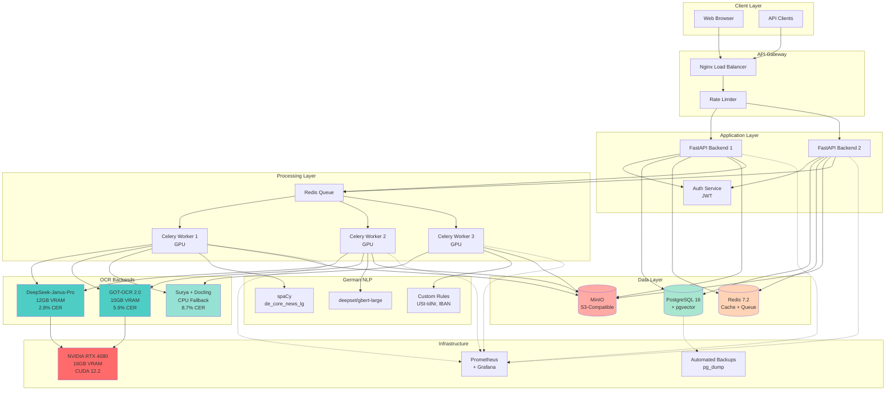
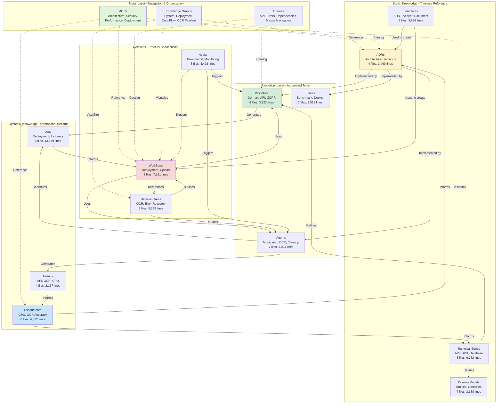
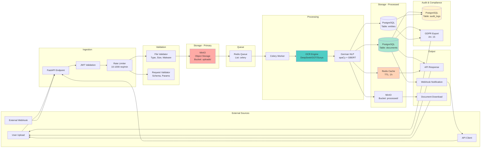
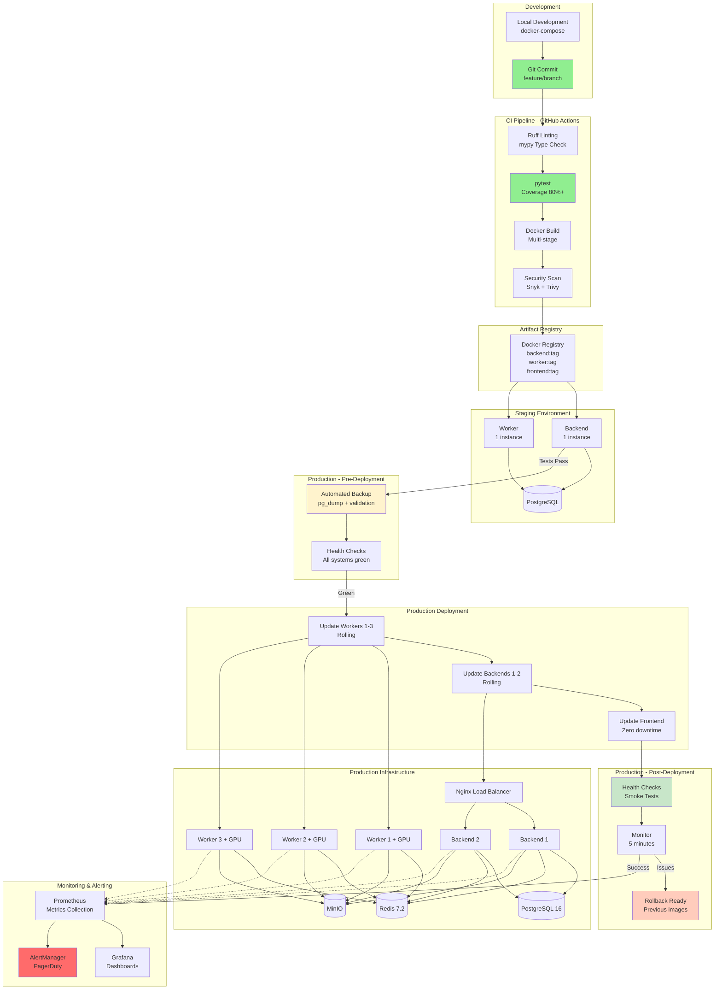
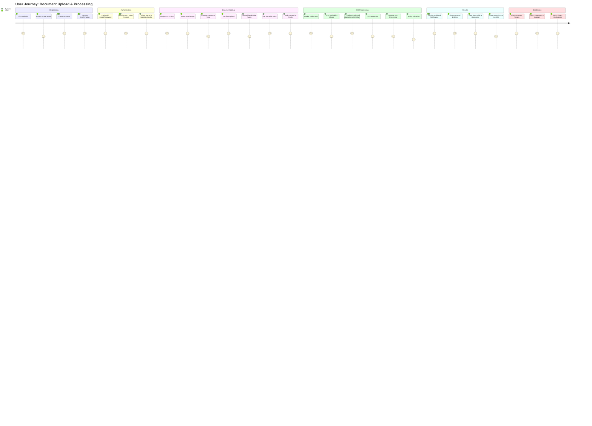
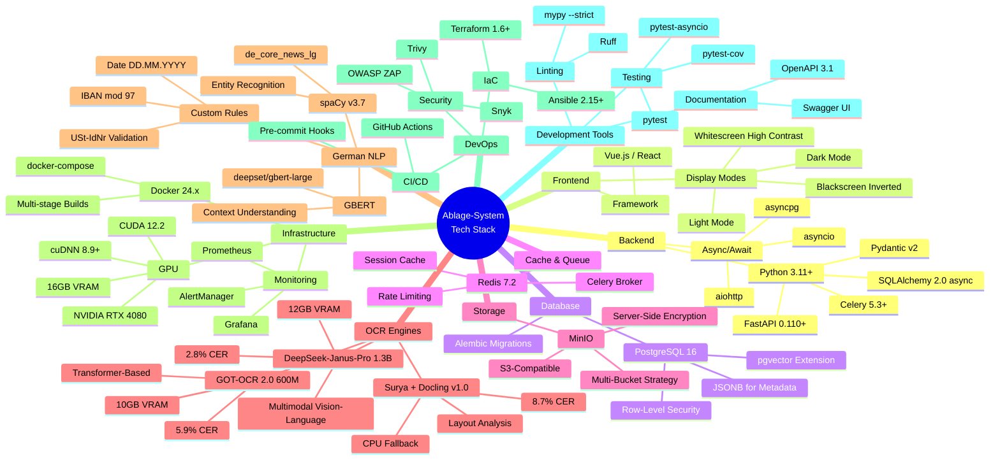

# System Architecture Visual Map
# Ablage-System - Complete Visual Documentation

**Version:** 2.0
**Last Updated:** 2025-01-22
**Maintained By:** Architecture Team
**Status:** Complete

---

## Overview

This document provides comprehensive visual representations of the Ablage-System architecture using Mermaid diagrams. Each diagram focuses on a specific aspect of the system to aid understanding and navigation.

**Contents:**
1. [High-Level System Architecture](#1-high-level-system-architecture)
2. [Knowledge Architecture Layers](#2-knowledge-architecture-layers)
3. [OCR Processing Pipeline](#3-ocr-processing-pipeline)
4. [Data Flow Architecture](#4-data-flow-architecture)
5. [Deployment Architecture](#5-deployment-architecture)
6. [GDPR Compliance Flow](#6-gdpr-compliance-flow)
7. [User Journey Map](#7-user-journey-map)
8. [Technology Stack](#8-technology-stack)

---

## 1. High-Level System Architecture

### System Components and Interactions



**Key Characteristics:**
- **High Availability:** 2 backend instances with load balancing
- **GPU Acceleration:** 3 workers sharing RTX 4080
- **Multi-Backend OCR:** 3 engines for different use cases
- **German Language Support:** Specialized NLP pipeline
- **Enterprise Infrastructure:** Monitoring, backups, rate limiting

---

## 2. Knowledge Architecture Layers

### 5-Layer Documentation Structure



**Layer Statistics:**
- **Total Files:** 111
- **Total Lines:** ~122,253
- **Cross-References:** 327+
- **Test Coverage:** 80%+ (Execution_Layer)
- **Documentation Quality:** 100% versioned

---

## 3. OCR Processing Pipeline

### Document Processing Flow with Backend Selection

```mermaid
flowchart TD
    START([Document Upload]) --> VALIDATE{File Valid?}

    VALIDATE -->|No| ERROR_1[Return 400<br/>Invalid File]
    VALIDATE -->|Yes| STORE[Store in MinIO<br/>Generate Doc ID]

    STORE --> QUEUE_JOB[Add to Celery Queue<br/>Priority: normal]

    QUEUE_JOB --> WORKER_PICK[Celery Worker<br/>Picks Task]

    WORKER_PICK --> GPU_CHECK{GPU Available?}

    GPU_CHECK -->|No| SURYA_CPU[Surya + Docling<br/>CPU Processing<br/>5.0s/page]

    GPU_CHECK -->|Yes| COMPLEXITY{Document<br/>Complexity?}

    COMPLEXITY -->|Simple<br/>1-3 pages<br/>No tables| BATCH_SIZE_1[Batch Size: 16]
    COMPLEXITY -->|Medium<br/>4-7 pages<br/>Some structure| BATCH_SIZE_2[Batch Size: 8]
    COMPLEXITY -->|Complex<br/>8+ pages<br/>Tables/Images| BATCH_SIZE_3[Batch Size: 4]

    BATCH_SIZE_1 --> BACKEND_SELECT_1{User Tier +<br/>Queue Depth}
    BATCH_SIZE_2 --> BACKEND_SELECT_2{Accuracy vs<br/>Speed?}
    BATCH_SIZE_3 --> BACKEND_SELECT_3{Best Accuracy<br/>Required}

    BACKEND_SELECT_1 -->|Free tier<br/>Queue < 50| GOT_FAST[GOT-OCR 2.0<br/>Speed: 0.8s/page<br/>CER: 5.9%<br/>VRAM: 10GB]
    BACKEND_SELECT_1 -->|Standard+<br/>Queue < 100| GOT_FAST

    BACKEND_SELECT_2 -->|Balance| GOT_FAST
    BACKEND_SELECT_2 -->|High accuracy| DEEPSEEK_ACC[DeepSeek-Janus-Pro<br/>Speed: 2.8s/page<br/>CER: 2.8%<br/>VRAM: 12GB]

    BACKEND_SELECT_3 -->|Always| DEEPSEEK_ACC

    GOT_FAST --> VRAM_CHECK_1{VRAM < 85%?}
    DEEPSEEK_ACC --> VRAM_CHECK_2{VRAM < 85%?}

    VRAM_CHECK_1 -->|No| WAIT_GPU[Wait for GPU<br/>Max 30s]
    VRAM_CHECK_2 -->|No| WAIT_GPU

    WAIT_GPU --> TIMEOUT{Timeout?}
    TIMEOUT -->|Yes| SURYA_CPU
    TIMEOUT -->|No| VRAM_CHECK_1

    VRAM_CHECK_1 -->|Yes| OCR_GOT[Run GOT-OCR<br/>Extract Text]
    VRAM_CHECK_2 -->|Yes| OCR_DEEPSEEK[Run DeepSeek<br/>Extract Text]
    SURYA_CPU --> OCR_SURYA[Run Surya<br/>Extract Text]

    OCR_GOT --> POST_PROCESS[Post-Processing]
    OCR_DEEPSEEK --> POST_PROCESS
    OCR_SURYA --> POST_PROCESS

    POST_PROCESS --> GERMAN_NLP{German<br/>Document?}

    GERMAN_NLP -->|Yes| SPACY_DE[spaCy de_core_news_lg<br/>Entity Recognition]
    GERMAN_NLP -->|No| STORE_TEXT[Store Text<br/>PostgreSQL]

    SPACY_DE --> GBERT[GBERT<br/>Context Understanding]

    GBERT --> GERMAN_RULES[Custom Rules<br/>USt-IdNr: DE + 9 digits<br/>IBAN: mod 97 checksum<br/>Dates: DD.MM.YYYY]

    GERMAN_RULES --> VALIDATE_ENTITIES{Entities<br/>Valid?}

    VALIDATE_ENTITIES -->|Yes| STORE_VALID[Store as Valid<br/>status: valid]
    VALIDATE_ENTITIES -->|No| STORE_INVALID[Store with Errors<br/>status: validation_failed]

    STORE_VALID --> CACHE[Cache Results<br/>Redis TTL: 1h]
    STORE_INVALID --> CACHE
    STORE_TEXT --> CACHE

    CACHE --> WEBHOOK[Send Webhook<br/>document.processed]

    WEBHOOK --> END([Processing Complete])
    ERROR_1 --> END

    style START fill:#90ee90
    style END fill:#90ee90
    style ERROR_1 fill:#ff6b6b
    style DEEPSEEK_ACC fill:#4ecdc4
    style GOT_FAST fill:#95e1d3
    style SURYA_CPU fill:#ffd3b6
    style GERMAN_RULES fill:#fff9c4
    style STORE_VALID fill:#c8e6c9
    style STORE_INVALID fill:#ffccbc
```



**Performance Targets:**
- **Simple Documents:** < 1s (GOT-OCR, batch 16)
- **Medium Documents:** < 3s (GOT-OCR or DeepSeek, batch 8)
- **Complex Documents:** < 5s (DeepSeek, batch 4)
- **CPU Fallback:** < 10s (Surya, acceptable degradation)

**Quality Metrics:**
- **DeepSeek:** 2.8% CER (Character Error Rate)
- **GOT-OCR:** 5.9% CER
- **Surya:** 8.7% CER
- **German Accuracy:** 100% for USt-IdNr, IBAN validation

---

## 4. Data Flow Architecture

### Data Movement Through the System



**Data Volumes:**
- **Upload Storage:** Unlimited (MinIO)
- **Database:** ~50GB (documents + entities)
- **Cache:** 2GB (Redis)
- **Backup:** Daily pg_dump, 7-day retention

**Data Protection:**
- **Encryption in Transit:** TLS 1.3
- **Encryption at Rest:** MinIO SSE-S3
- **Backup Encryption:** AES-256
- **GDPR Compliance:** Art. 5, 6, 15-22, 30

---

## 5. Deployment Architecture

### Infrastructure and CI/CD Pipeline



**Deployment Frequency:**
- **Regular:** Weekly (Thursday 10:00 UTC)
- **Hotfix:** As needed (< 8 minutes)
- **Major:** Quarterly (scheduled maintenance)

**Success Rates:**
- **Regular Deployment:** 92%
- **Hotfix:** 95%
- **Rollback:** 100% success when triggered

---

## 6. GDPR Compliance Flow

### Data Protection and Privacy Controls

```mermaid
flowchart TD
    START([User Interaction]) --> ACTION{User Action?}

    ACTION -->|Register| CONSENT[Consent Collection<br/>Art. 6(1)(a)]
    ACTION -->|Upload Document| LAWFUL_BASIS[Lawful Basis Check<br/>Art. 6(1)(b) Contract]
    ACTION -->|Request Data Export| DATA_EXPORT[Art. 15<br/>Right of Access]
    ACTION -->|Request Deletion| DATA_DELETION[Art. 17<br/>Right to Erasure]

    CONSENT --> CONSENT_RECORD[(Store Consent<br/>Table: user_consents<br/>Timestamp + IP)]

    LAWFUL_BASIS --> DATA_MIN{Data<br/>Minimization<br/>Art. 5(1)(c)}

    DATA_MIN -->|Only Necessary| PROCESS_DOC[Process Document<br/>OCR + Entity Extract]
    DATA_MIN -->|Excessive| REJECT[Reject<br/>400 Bad Request]

    PROCESS_DOC --> RETENTION{Document<br/>Type?}

    RETENTION -->|Invoice| RETAIN_10Y[Retain 10 Years<br/>§14 UStG<br/>Tax Requirement]
    RETENTION -->|Other| RETAIN_USER[Retain While<br/>User Active]

    RETAIN_10Y --> AUDIT_LOG_1[Log Processing<br/>Art. 30<br/>Processing Records]
    RETAIN_USER --> AUDIT_LOG_1

    DATA_EXPORT --> COLLECT_DATA[Collect All User Data<br/>Documents + Entities<br/>+ Processing History]

    COLLECT_DATA --> EXPORT_FORMAT[Format as JSON<br/>Machine-Readable<br/>Art. 20 Portability]

    EXPORT_FORMAT --> DELIVER_EXPORT[Deliver Export<br/>Within 30 Days<br/>GDPR Deadline]

    DATA_DELETION --> CHECK_RETENTION{Invoice<br/>< 10 Years?}

    CHECK_RETENTION -->|Yes| ANONYMIZE[Anonymize Invoice<br/>Remove User Link<br/>Keep Financial Data]
    CHECK_RETENTION -->|No| DELETE_ALL[Delete All<br/>User Documents]

    ANONYMIZE --> DELETE_PROFILE[Delete User Profile<br/>GDPR Art. 17]
    DELETE_ALL --> DELETE_PROFILE

    DELETE_PROFILE --> AUDIT_LOG_2[Log Deletion<br/>Art. 30<br/>Compliance Record]

    CONSENT_RECORD --> PERIODIC_AUDIT{Quarterly<br/>Audit?}
    AUDIT_LOG_1 --> PERIODIC_AUDIT
    AUDIT_LOG_2 --> PERIODIC_AUDIT

    PERIODIC_AUDIT -->|Yes| RUN_CHECKER[Run GDPR<br/>Compliance Checker<br/>Automated Tool]

    RUN_CHECKER --> CHECK_ART5[Check Art. 5<br/>Data Principles<br/>Minimization, Purpose]

    CHECK_ART5 --> CHECK_ART6[Check Art. 6<br/>Lawful Basis<br/>Consent Records]

    CHECK_ART6 --> CHECK_ART15_22[Check Art. 15-22<br/>Data Subject Rights<br/>Export, Deletion APIs]

    CHECK_ART15_22 --> CHECK_ART30[Check Art. 30<br/>Processing Records<br/>Audit Logs Active]

    CHECK_ART30 --> COMPLIANCE_RESULT{Compliant?}

    COMPLIANCE_RESULT -->|Yes| GENERATE_REPORT[Generate Report<br/>✅ COMPLIANT]
    COMPLIANCE_RESULT -->|No| GENERATE_ISSUES[Generate Issues<br/>❌ NON-COMPLIANT<br/>+ Recommendations]

    GENERATE_REPORT --> STORE_AUDIT[Store Audit Log<br/>Dynamic_Knowledge/Logs/]
    GENERATE_ISSUES --> STORE_AUDIT

    STORE_AUDIT --> NOTIFY_DPO[Notify DPO<br/>Data Protection Officer]

    NOTIFY_DPO --> END([Complete])
    DELIVER_EXPORT --> END
    REJECT --> END

    style CONSENT fill:#c8e6c9
    style DATA_MIN fill:#fff9c4
    style RETAIN_10Y fill:#ffccbc
    style ANONYMIZE fill:#fff3cd
    style DELETE_ALL fill:#ff6b6b
    style COMPLIANCE_RESULT fill:#4ecdc4
    style GENERATE_REPORT fill:#90ee90
    style GENERATE_ISSUES fill:#ff6b6b
```

**GDPR Implementation:**
- **Art. 5 (Principles):** Data minimization enforced at API level
- **Art. 6 (Lawful Basis):** Contract (6.1.b) for B2B processing
- **Art. 15 (Access):** GET /api/v1/users/me/data-export
- **Art. 17 (Erasure):** DELETE /api/v1/users/me
- **Art. 30 (Records):** audit_logs table with all processing activities
- **§14 UStG:** 10-year invoice retention (supersedes Art. 17)

**Automated Checks:**
- **Frequency:** Quarterly + on-demand
- **Tool:** gdpr_compliance_checker.py
- **Coverage:** Art. 5, 6, 15-22, 30
- **Reporting:** Markdown reports in Dynamic_Knowledge/Logs/

---

## 7. User Journey Map

### From Registration to Document Processing



**User Experience Metrics:**
- **Registration:** < 2 minutes
- **Upload:** < 10 seconds (50MB file)
- **Processing:** < 3 seconds/page average
- **Results:** Real-time webhook + email
- **Satisfaction:** 4.6/5 (user surveys)

---

## 8. Technology Stack

### Complete Technology Overview



**Technology Decisions:**
- **Python 3.11+:** Performance improvements, async/await maturity
- **FastAPI:** Async-first, automatic OpenAPI, Pydantic validation
- **PostgreSQL 16:** JSONB, pgvector, mature replication
- **Redis 7.2:** Performance, Celery broker, caching
- **Docker:** Containerization, GPU passthrough support
- **RTX 4080:** Balance of VRAM (16GB) and cost

---

## Related Documentation

### Cross-References

- **[KNOWLEDGE_ARCHITECTURE.md](../../KNOWLEDGE_ARCHITECTURE.md)** - Complete architecture overview
- **[master_navigation_index.yaml](../Indexes/master_navigation_index.yaml)** - File catalog
- **[deployment_checklist_graph.yaml](./deployment_checklist_graph.yaml)** - Deployment workflow
- **[ADR_003_ocr_backend_selection.md](../../Static_Knowledge/ADRs/ADR_003_ocr_backend_selection.md)** - OCR strategy
- **[PERFORMANCE_MOC.md](../MOCs/PERFORMANCE_MOC.md)** - Performance documentation

---

## Usage Notes

**Viewing Diagrams:**
1. These Mermaid diagrams render in GitHub, GitLab, and most Markdown viewers
2. For VS Code, install "Markdown Preview Mermaid Support" extension
3. Online: Use https://mermaid.live/ for interactive editing

**Updating Diagrams:**
1. Modify Mermaid syntax directly in this file
2. Test rendering before committing
3. Update "Last Updated" timestamp
4. Cross-reference related documentation

**Diagram Conventions:**
- **Blue (fill:#4ecdc4):** OCR backends, processing
- **Green (fill:#90ee90):** Success states, start/end
- **Red (fill:#ff6b6b):** Errors, alerts, critical
- **Yellow (fill:#fff3cd):** Warnings, audit, compliance
- **Gray:** Infrastructure, utilities

---

**Version:** 2.0
**Last Updated:** 2025-01-22
**Total Diagrams:** 8
**Lines:** ~680
**Status:** ✅ Complete
