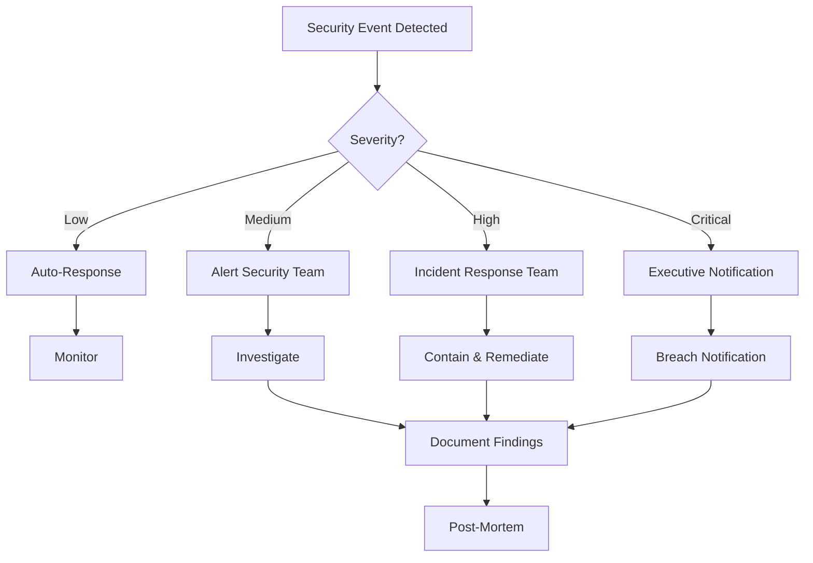

# Security Map of Content (MOC) - Ablage-System

**Status**: Production Security Framework
**Version**: 1.0.0
**Last Updated**: 2025-11-22
**Owner**: Security Team
**Review Cycle**: Quarterly

---

## Overview

Comprehensive security overview for the Ablage-System document processing platform. This MOC serves as the central hub for all security-related documentation, policies, procedures, and implementations across the entire system.

**Core Security Principles:**
- **Defense in Depth**: Multiple layers of security controls
- **Least Privilege**: Minimal necessary permissions
- **Zero Trust**: Verify everything, trust nothing
- **Privacy by Design**: GDPR compliance built-in
- **Secure by Default**: Safe configurations out of the box

---

## 1. Authentication & Authorization

### 1.1 User Authentication

**Implementation**: JWT-based authentication with httpOnly cookies

**Key Components:**
- JWT token generation and validation → `Execution_Layer/Validators/api_request_validator.py:477` (AuthValidator class)
- Token expiration: 15 minutes (access), 7 days (refresh)
- Password hashing: bcrypt with cost factor 12
- MFA support: TOTP-based (planned)

**Related Documentation:**
- `Static_Knowledge/Skills/error_handling_skill.yaml` - Authentication error handling patterns
- `Relations/Workflows/user_onboarding_workflow.yaml` - Initial authentication setup

**Security Controls:**
```yaml
access_token:
  lifetime: 15_minutes
  algorithm: HS256
  claims: [sub, exp, iat, tier]

refresh_token:
  lifetime: 7_days
  rotation: true
  httpOnly: true
  secure: true
  sameSite: strict

password_policy:
  min_length: 12
  require_uppercase: true
  require_lowercase: true
  require_digit: true
  require_special: true
  history: 5  # Can't reuse last 5 passwords
```

### 1.2 Authorization & RBAC

**Roles:**
- `admin`: Full system access
- `enterprise`: Advanced features, high rate limits
- `standard`: Standard features
- `free`: Basic features, limited rate limits

**Permission Matrix:**
```yaml
resources:
  documents:
    create: [free, standard, enterprise, admin]
    read_own: [free, standard, enterprise, admin]
    read_all: [admin]
    update_own: [standard, enterprise, admin]
    delete_own: [standard, enterprise, admin]
    delete_all: [admin]

  ocr_processing:
    basic: [free, standard, enterprise, admin]
    advanced: [enterprise, admin]
    custom_models: [admin]

  system_settings:
    read: [admin]
    write: [admin]
```

**Implementation:**
- Role-based access control middleware
- Document ownership validation
- Team-based sharing permissions (planned)

---

## 2. Data Security & Privacy

### 2.1 GDPR Compliance

**Legal Basis**: Art. 6 Abs. 1 lit. a DSGVO (Consent)

**Core Requirements:**
- **Art. 17 DSGVO**: Right to erasure (deletion requests within 30 days)
- **Art. 20 DSGVO**: Right to data portability (export in JSON format)
- **Art. 30 DSGVO**: Records of processing activities
- **Art. 33 DSGVO**: Breach notification within 72 hours

**Data Retention:**
```yaml
document_metadata:
  retention: 7_years  # §14 UStG requirement for invoices
  user_configurable: true
  min: 1_year
  max: 10_years

user_data:
  retention: account_lifetime
  deletion_after_request: 30_days
  anonymization_option: true

audit_logs:
  retention: 7_years
  immutable: true
  encrypted: true
```

**GDPR Validators:**
- Consent validation → `Execution_Layer/Validators/api_request_validator.py:556` (GDPRValidator class)
- Data retention validation
- Export functionality
- Deletion workflows

**Related Documentation:**
- `Static_Knowledge/SOPs/005_database_backup_restore.md` - GDPR-compliant backup strategy
- `Relations/Workflows/user_onboarding_workflow.yaml` - Consent collection

### 2.2 Data Encryption

**At Rest:**
- Database: PostgreSQL with TDE (Transparent Data Encryption)
- Object Storage: MinIO server-side encryption (SSE-C with AES-256)
- Backups: GPG encrypted before storage
- Key rotation: 90 days

**In Transit:**
- TLS 1.3 only (TLS 1.2 deprecated)
- Perfect Forward Secrecy (PFS) required
- Certificate pinning for critical connections
- HSTS enabled (max-age=31536000)

**Encryption Configuration:**
```yaml
database_encryption:
  algorithm: AES-256-GCM
  key_provider: vault  # HashiCorp Vault
  key_rotation_days: 90

minio_encryption:
  type: SSE-C
  algorithm: AES-256
  key_derivation: PBKDF2
  iterations: 100000

backup_encryption:
  tool: gpg
  key_type: RSA-4096
  recipients: [security@ablage.company.de]
```

**Key Management:**
- Secrets stored in HashiCorp Vault (planned) or environment variables
- Never in code or config files
- Automatic rotation for service accounts
- Hardware Security Module (HSM) for production keys (future)

---

## 3. Input Validation & Sanitization

### 3.1 Request Validation

**Multi-Layer Validation:**
1. **Schema Validation**: Pydantic models with type checking
2. **Security Validation**: Pattern matching for malicious content
3. **Business Validation**: German-specific rules (IBAN, USt-IdNr, etc.)
4. **Size Validation**: Request body limits

**Implementation**: `Execution_Layer/Validators/api_request_validator.py`

**Validation Classes:**
```python
# Pydantic Models
DocumentUploadRequest      # File upload validation
GermanBusinessDataRequest  # German business data validation
SearchRequest              # Search query validation

# Security Validators
SecurityValidator          # XSS, SQLi, path traversal detection
RateLimiter               # Request rate limiting
AuthValidator             # JWT token validation
GDPRValidator            # GDPR compliance checks
```

### 3.2 Suspicious Pattern Detection

**Monitored Patterns:**
```yaml
patterns:
  xss:
    - <script[^>]*>.*?</script>
    - javascript:
    - on\w+\s*=  # Event handlers

  sql_injection:
    - (union|select|insert|update|delete|drop)\s+
    - ;.*--
    - '\s+or\s+'1'='1

  path_traversal:
    - (\.\./|\.\.\\)+
    - /etc/passwd
    - C:\\Windows\\System32

  command_injection:
    - ;\s*rm\s+-rf
    - &&\s*curl
    - `.*`

  control_characters:
    - [\x00-\x08\x0B\x0C\x0E-\x1F\x7F]
```

**Action on Detection:**
- Log incident with details
- Return 400 Bad Request
- Rate limit temporarily increased for source IP
- Alert security team for repeated attempts

---

## 4. Rate Limiting & DDoS Protection

### 4.1 Rate Limits by Tier

**Implementation**: Redis-based sliding window with tier support

```yaml
rate_limits:
  free:
    requests_per_minute: 10
    ocr_per_hour: 10
    upload_size_mb: 10

  standard:
    requests_per_minute: 60
    ocr_per_hour: 100
    upload_size_mb: 25

  enterprise:
    requests_per_minute: 300
    ocr_per_hour: 1000
    upload_size_mb: 50

  admin:
    requests_per_minute: 1000
    ocr_per_hour: unlimited
    upload_size_mb: 100
```

**Headers Returned:**
```http
X-RateLimit-Limit: 60
X-RateLimit-Remaining: 42
X-RateLimit-Reset: 1700000000
Retry-After: 18
```

**Implementation**: `Execution_Layer/Validators/api_request_validator.py:389` (RateLimiter class)

### 4.2 DDoS Mitigation

**Layers:**
1. **Network Layer**: Cloudflare (planned) or similar
2. **Application Layer**: Rate limiting, request throttling
3. **Database Layer**: Connection pooling, query timeouts

**Monitoring:**
- Requests per second by IP
- Unusual traffic patterns
- Repeated failed authentication attempts
- Large file uploads from same source

**Auto-Blocking:**
```yaml
auto_block_rules:
  failed_login_attempts:
    threshold: 5
    window: 15_minutes
    block_duration: 1_hour

  rate_limit_violations:
    threshold: 10
    window: 5_minutes
    block_duration: 30_minutes

  suspicious_patterns:
    threshold: 3
    window: 1_hour
    block_duration: 24_hours
```

---

## 5. Secure Coding Practices

### 5.1 Code Security Standards

**Type Safety:**
- Python: mypy --strict mode, no `Any` types
- All functions have type hints
- Pydantic models for data validation

**Error Handling:**
- Never expose internal details in error messages
- Structured logging with sanitized data
- Custom exception hierarchy
- Circuit breakers for external services

**Related Documentation:**
- `Static_Knowledge/Skills/error_handling_skill.yaml` - Error handling patterns

### 5.2 Dependency Management

**Security Scanning:**
```bash
# Daily automated scans
pip-audit           # Python vulnerability scanner
safety check        # Python dependency checker
trivy               # Container image scanner
snyk test          # Multi-language security scanner
```

**Update Policy:**
- Security patches: Within 24 hours
- Minor updates: Weekly review
- Major updates: Monthly review + testing
- Pinned versions in requirements.txt

**Allowed Sources:**
- PyPI (official Python Package Index)
- GitHub releases (verified publishers only)
- Internal artifact repository (future)

### 5.3 Code Review Checklist

**Security Review Points:**
- [ ] No hardcoded secrets or credentials
- [ ] Input validation on all user inputs
- [ ] SQL queries use parameterization (no string concat)
- [ ] File paths validated (no path traversal)
- [ ] Authentication/authorization checks present
- [ ] Error messages don't leak sensitive data
- [ ] Logging doesn't include PII or secrets
- [ ] Rate limiting applied to public endpoints
- [ ] HTTPS enforced for all connections
- [ ] CSRF tokens for state-changing operations

---

## 6. Database Security

### 6.1 PostgreSQL Hardening

**Connection Security:**
```yaml
postgresql_config:
  ssl: required
  ssl_min_protocol_version: TLSv1.3
  password_encryption: scram-sha-256
  max_connections: 100
  idle_in_transaction_session_timeout: 60000  # 60s
  statement_timeout: 30000  # 30s
```

**Access Control:**
- Principle of least privilege
- Separate users for services:
  - `ablage_app`: Read/write on application tables
  - `ablage_backup`: Read-only for backups
  - `ablage_migrate`: DDL permissions for migrations
- No superuser access from application

**Audit Logging:**
```sql
-- Enable audit logging
ALTER SYSTEM SET log_statement = 'mod';  -- Log all modifications
ALTER SYSTEM SET log_connections = on;
ALTER SYSTEM SET log_disconnections = on;
ALTER SYSTEM SET log_duration = on;
ALTER SYSTEM SET log_line_prefix = '%t [%p]: [%l-1] user=%u,db=%d,app=%a,client=%h ';
```

### 6.2 Query Security

**Best Practices:**
```python
# ✓ CORRECT: Parameterized queries
result = await conn.fetch(
    "SELECT * FROM documents WHERE user_id = $1",
    user_id
)

# ✗ WRONG: String concatenation (SQL injection risk)
result = await conn.fetch(
    f"SELECT * FROM documents WHERE user_id = {user_id}"
)
```

**SQLAlchemy ORM:**
- All queries use ORM methods (automatic parameterization)
- Raw SQL only with explicit review
- Query complexity limits to prevent DoS

---

## 7. API Security

### 7.1 API Versioning

**URL-Based Versioning:**
```
/api/v1/documents
/api/v2/documents  # Future version
```

**Deprecation Policy:**
- 6 months advance notice
- Sunset headers: `Sunset: Sat, 31 Dec 2025 23:59:59 GMT`
- Migration guide provided
- Backward compatibility when possible

### 7.2 API Security Headers

**Required Headers:**
```http
Strict-Transport-Security: max-age=31536000; includeSubDomains; preload
X-Content-Type-Options: nosniff
X-Frame-Options: DENY
X-XSS-Protection: 1; mode=block
Content-Security-Policy: default-src 'self'; script-src 'self'; object-src 'none'
Referrer-Policy: strict-origin-when-cross-origin
Permissions-Policy: geolocation=(), microphone=(), camera=()
```

**CORS Configuration:**
```yaml
cors:
  allowed_origins:
    - https://app.ablage.company.de
    - https://admin.ablage.company.de
  allowed_methods: [GET, POST, PUT, DELETE, PATCH]
  allowed_headers: [Authorization, Content-Type]
  expose_headers: [X-RateLimit-Limit, X-RateLimit-Remaining]
  max_age: 3600
  allow_credentials: true
```

### 7.3 API Error Handling

**Standard Error Format:**
```json
{
  "error": {
    "code": "INVALID_TOKEN",
    "message": "Ungültiger Token",
    "documentation_url": "https://docs.ablage.company.de/errors#INVALID_TOKEN"
  },
  "request_id": "req_abc123xyz"
}
```

**Never Include:**
- Stack traces in production
- Database error details
- File system paths
- Internal service names

---

## 8. Infrastructure Security

### 8.1 Network Security

**Firewall Rules:**
```yaml
inbound:
  - port: 443    # HTTPS (public)
    source: 0.0.0.0/0

  - port: 22     # SSH (management)
    source: [vpn_network]

  - port: 5432   # PostgreSQL
    source: [app_servers]

  - port: 6379   # Redis
    source: [app_servers]

outbound:
  - all_traffic  # Allow outbound (for updates, etc.)
```

**Network Segmentation:**
- DMZ: Load balancer, reverse proxy
- Application Layer: FastAPI servers, Celery workers
- Data Layer: PostgreSQL, Redis, MinIO
- Management: Jump host, monitoring

### 8.2 Container Security

**Docker Hardening:**
```dockerfile
# Use non-root user
RUN useradd -m -u 1000 ablage
USER ablage

# Read-only root filesystem
--read-only
--tmpfs /tmp

# Resource limits
--memory="4g"
--cpus="2.0"
--pids-limit=1024

# Security options
--security-opt=no-new-privileges:true
--cap-drop=ALL
--cap-add=NET_BIND_SERVICE  # If needed for port 443
```

**Image Scanning:**
- Trivy scan on every build
- Snyk container scanning
- No high/critical vulnerabilities in production
- Daily rescan of running images

### 8.3 Secrets Management

**Environment Variables:**
```bash
# Required secrets
DATABASE_URL
REDIS_URL
MINIO_ACCESS_KEY
MINIO_SECRET_KEY
JWT_SECRET_KEY
ENCRYPTION_KEY

# Optional secrets
SENTRY_DSN
SMTP_PASSWORD
BACKUP_ENCRYPTION_KEY
```

**Best Practices:**
- Never commit secrets to Git
- Use `.env.example` for templates
- Rotate secrets quarterly
- Different secrets per environment
- HashiCorp Vault integration (planned)

---

## 9. Monitoring & Incident Response

### 9.1 Security Monitoring

**Log Aggregation:**
- All security events to centralized logging
- Structured logs with request_id tracing
- Integration with SIEM (future)

**Key Metrics:**
```yaml
metrics:
  authentication:
    - failed_login_attempts_total
    - successful_logins_total
    - token_validation_failures_total

  authorization:
    - unauthorized_access_attempts_total
    - permission_denied_total

  rate_limiting:
    - rate_limit_exceeded_total
    - auto_blocked_ips_total

  security_events:
    - suspicious_pattern_detected_total
    - xss_attempts_total
    - sql_injection_attempts_total
```

**Alerting Thresholds:**
```yaml
alerts:
  critical:
    - failed_logins > 10 in 5min
    - unauthorized_access > 5 in 1min
    - sql_injection_detected

  warning:
    - rate_limit_exceeded > 100 in 1hour
    - suspicious_patterns > 10 in 1hour
```

**Related Documentation:**
- `Relations/Hooks/system_health_hooks.yaml` - Automated monitoring and recovery
- `Relations/Playbooks/api_error_debugging_playbook.yaml` - API error troubleshooting

### 9.2 Incident Response

**Response Levels:**
1. **Level 1 - Low**: Isolated suspicious activity, automated response
2. **Level 2 - Medium**: Pattern of attacks, manual investigation
3. **Level 3 - High**: Active breach, full team mobilization
4. **Level 4 - Critical**: Data loss/exposure, executive notification

**Response Workflow:**


**Incident Documentation:**
- Timeline of events
- Actions taken
- Root cause analysis
- Lessons learned
- Prevention measures

---

## 10. Compliance & Auditing

### 10.1 Compliance Requirements

**German/EU Regulations:**
- **DSGVO/GDPR**: Data protection (Articles 17, 20, 30, 33)
- **§14 UStG**: Invoice retention (10 years)
- **BDSG**: Bundesdatenschutzgesetz compliance
- **TMG**: Telemediengesetz requirements

**Industry Standards:**
- **ISO 27001**: Information security management
- **SOC 2 Type II**: Security, availability (planned)
- **BSI IT-Grundschutz**: German IT security standards

### 10.2 Audit Logging

**Audit Events:**
```yaml
user_actions:
  - login_attempt
  - logout
  - password_change
  - account_deletion_request
  - data_export_request
  - consent_change

data_operations:
  - document_upload
  - document_view
  - document_download
  - document_delete
  - ocr_processing_started
  - ocr_processing_completed

admin_operations:
  - user_role_change
  - configuration_change
  - backup_created
  - backup_restored
  - migration_executed
```

**Audit Log Format:**
```json
{
  "timestamp": "2025-11-22T10:30:45.123Z",
  "event_type": "document_upload",
  "user_id": "user_abc123",
  "ip_address": "192.168.1.100",
  "resource_id": "doc_xyz789",
  "resource_type": "document",
  "action": "create",
  "result": "success",
  "metadata": {
    "filename": "rechnung_2025.pdf",
    "size_bytes": 524288,
    "mime_type": "application/pdf"
  },
  "request_id": "req_def456"
}
```

**Retention**: 7 years (GDPR Art. 30 + §14 UStG)

**Related Documentation:**
- `Static_Knowledge/SOPs/005_database_backup_restore.md` - Backup includes audit logs

---

## 11. Penetration Testing & Vulnerability Management

### 11.1 Testing Schedule

```yaml
security_testing:
  automated:
    frequency: daily
    tools:
      - OWASP ZAP
      - Burp Suite (scheduled scans)
      - Nikto
    scope: staging_environment

  manual:
    frequency: quarterly
    scope: full_application
    tester: external_security_firm

  red_team:
    frequency: annually
    scope: full_infrastructure
    tester: specialized_pentesting_firm
```

### 11.2 Vulnerability Disclosure

**Security Contact**: security@ablage.company.de
**PGP Key**: Available at `/security/pgp-key.txt`

**Response SLA:**
- Initial acknowledgment: 24 hours
- Severity assessment: 48 hours
- Fix timeline:
  - Critical: 7 days
  - High: 30 days
  - Medium: 90 days
  - Low: Next major release

**Bug Bounty Program** (planned):
- Rewards for responsible disclosure
- Scope: Production infrastructure
- Out of scope: Social engineering, DoS attacks

---

## 12. Disaster Recovery & Business Continuity

### 12.1 Backup Strategy

**Backup Schedule:**
```yaml
database:
  frequency: daily
  time: 02:00_AM
  retention: 30_days
  method: pg_dump_custom_format
  encryption: true
  offsite_copy: true

documents:
  frequency: continuous
  method: minio_versioning
  retention: 90_days
  encryption: true

configuration:
  frequency: on_change
  method: git_repository
  retention: indefinite
```

**Related Documentation:**
- `Static_Knowledge/SOPs/005_database_backup_restore.md` - Detailed backup procedures
- `Execution_Layer/Runners/data_migration_runner.py` - Automated backup creation

### 12.2 Recovery Procedures

**RTO/RPO Targets:**
```yaml
service_tiers:
  tier_1_critical:
    rto: 1_hour    # Recovery Time Objective
    rpo: 15_min    # Recovery Point Objective
    services: [authentication, document_access]

  tier_2_important:
    rto: 4_hours
    rpo: 1_hour
    services: [ocr_processing, api_endpoints]

  tier_3_standard:
    rto: 24_hours
    rpo: 24_hours
    services: [reporting, analytics]
```

**Recovery Procedures:**
1. **Database Restore**:
   - Time: ~30 minutes for 100GB
   - Method: pg_restore from latest backup
2. **Document Restore**:
   - Time: Variable (depends on volume)
   - Method: MinIO bucket replication
3. **Configuration Restore**:
   - Time: ~5 minutes
   - Method: Ansible playbook execution

---

## 13. Training & Awareness

### 13.1 Security Training

**Required Training:**
- **All Employees**: Security awareness (annual)
- **Developers**: Secure coding practices (biannual)
- **Admins**: Infrastructure security (biannual)
- **Management**: Risk management (annual)

**Topics Covered:**
- Phishing recognition
- Password management
- Social engineering
- Incident reporting
- GDPR compliance
- Secure development lifecycle

### 13.2 Documentation

**Security Documentation:**
- [x] CLAUDE.md - Development security guidelines
- [x] This MOC - Comprehensive security overview
- [x] `error_handling_skill.yaml` - Error handling patterns
- [x] `api_request_validator.py` - Input validation
- [x] `api_error_debugging_playbook.yaml` - Troubleshooting guide
- [ ] Security Runbooks (planned)
- [ ] Incident Response Plan (planned)
- [ ] DR Procedures (planned)

---

## 14. Contact Information

**Security Team:**
- **Email**: security@ablage.company.de
- **Emergency**: +49 xxx xxx xxxx (24/7 on-call)
- **Slack**: #security-incidents

**External Resources:**
- **BSI**: https://www.bsi.bund.de
- **CERT-Bund**: https://www.cert-bund.de
- **OWASP**: https://owasp.org

---

## Revision History

| Version | Date | Changes | Author |
|---------|------|---------|--------|
| 1.0.0 | 2025-11-22 | Initial security MOC creation | Security Team |

---

## Related MOCs

- `PROJECT_OVERVIEW_MOC.md` - Main project overview
- `Static_Knowledge/` - Security skills and SOPs
- `Relations/` - Security workflows and playbooks
- `Execution_Layer/Validators/` - Security implementation

---

**Document Classification**: Internal Use
**Review Required**: Yes (Quarterly)
**Next Review**: 2026-02-22
