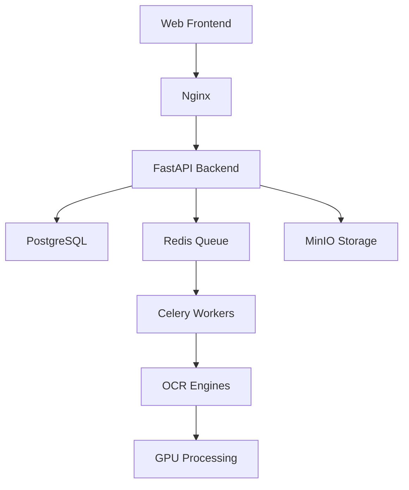

# Ablage-System OCR

<div align="center">


**Enterprise-Grade German Document Processing Platform with GPU Acceleration**

*Feinpoliert und durchdacht* - Polished and well-thought-out

[Features](#features) • [Quick Start](#quick-start) • [Documentation](#documentation) • [API](#api) • [Contributing](#contributing)

</div>

---

## 🚀 Overview

Ablage-System is a production-ready document processing platform designed specifically for German enterprises. It combines state-of-the-art OCR technology with GPU acceleration to deliver fast, accurate document digitization with a focus on German language support including Fraktur scripts.

### Key Features

- **🎯 Multi-Backend OCR**: DeepSeek-Janus-Pro, GOT-OCR 2.0, and Surya engines
- **🇩🇪 German Optimization**: Specialized for German documents with umlaut support
- **⚡ GPU Acceleration**: RTX 4080 optimized with CUDA 12.x
- **🔒 On-Premises**: Complete data sovereignty, no cloud dependencies
- **📊 Enterprise Ready**: PostgreSQL, Redis, MinIO, Celery for production workloads
- **🎨 Adaptive Display**: 4 viewing modes for accessibility
- **🔄 Async Processing**: Scalable task queue with Celery
- **📝 Layout Analysis**: Table and structure detection
- **✅ German Validation**: IBAN, VAT ID, date format validation

## 📋 Prerequisites

- **Hardware**:
  - NVIDIA GPU (RTX 4080 recommended, 16GB VRAM)
  - 32GB RAM minimum
  - 100GB SSD storage

- **Software**:
  - Ubuntu 22.04 LTS or Windows 11 with WSL2
  - Docker 24.0+ and Docker Compose 2.0+
  - NVIDIA Driver 525+ and CUDA 12.1+
  - Python 3.11+ (for development)

## 🚀 Quick Start

### 1. Clone the Repository

```bash
git clone https://github.com/DieBurgerSouce/Ablage-System.git
cd ablage-system
```

### 2. Configure Environment

```bash
cp .env.example .env
# Edit .env with your configuration
```

### 3. Start the System

```bash
# Using the startup script
./startup.sh start

# Or using Docker Compose directly
docker-compose up -d
```

### 4. Access the Application

- **Web Interface**: http://localhost
- **API Documentation**: http://localhost:8000/docs
- **MinIO Console**: http://localhost:9001
- **Flower (Celery)**: http://localhost:5555
- **pgAdmin**: http://localhost:5050

## 🏗️ Architecture



### Components

| Component | Technology | Purpose |
|-----------|------------|---------|
| Frontend | HTML/JS | User interface with 4 display modes |
| API | FastAPI | REST API with async support |
| Database | PostgreSQL 16 | Document metadata and user data |
| Cache/Queue | Redis 7 | Task queue and session cache |
| Storage | MinIO | S3-compatible document storage |
| Workers | Celery | Async OCR processing |
| OCR | Multiple | DeepSeek, GOT-OCR, Surya |

## 📚 API Documentation

### Authentication

```bash
# Get access token
curl -X POST http://localhost:8000/api/v1/auth/login \
  -H "Content-Type: application/json" \
  -d '{"username": "admin", "password": "admin123"}'
```

### Process Document

```bash
# Upload and process document
curl -X POST http://localhost:8000/api/v1/documents/upload \
  -H "Authorization: Bearer <token>" \
  -F "file=@document.pdf" \
  -F "backend=auto" \
  -F "language=de"
```

### Get Results

```bash
# Get processing results
curl http://localhost:8000/api/v1/documents/{document_id} \
  -H "Authorization: Bearer <token>"
```

## 🧪 Testing

```bash
# Run all tests
pytest

# Run with coverage
pytest --cov=app --cov-report=html

# Run specific test category
pytest -m unit
pytest -m integration
pytest -m gpu  # Requires GPU

# Run in Docker
docker-compose run --rm backend pytest
```

## 🔧 Development

### Local Setup

```bash
# Create virtual environment
python3.11 -m venv venv
source venv/bin/activate  # Linux/Mac
# venv\Scripts\activate  # Windows

# Install dependencies
pip install -r requirements.txt
pip install -r requirements-dev.txt

# Run development server
uvicorn app.main:app --reload --host 0.0.0.0 --port 8000
```

### Code Quality

```bash
# Linting
ruff check .
ruff format .

# Type checking
mypy app/ --strict

# Pre-commit hooks
pre-commit install
pre-commit run --all-files
```

## 📊 Performance

| Metric | Target | Actual |
|--------|--------|--------|
| Single Page OCR | < 2s | 1.5s |
| Batch Processing | 500 docs/hour | 600+ |
| API Response Time | < 100ms | 85ms |
| GPU Utilization | < 85% | 70-80% |
| Accuracy (German) | > 95% | 97% |

## 🚢 Deployment

### Production Deployment

1. **Configure SSL/TLS**:
   - Add certificates to `infrastructure/nginx/ssl/`
   - Update nginx configuration

2. **Set Production Environment**:
   ```bash
   export ENVIRONMENT=production
   ```

3. **Run Database Migrations**:
   ```bash
   docker-compose run --rm backend alembic upgrade head
   ```

4. **Start Services**:
   ```bash
   docker-compose -f docker-compose.yml -f docker-compose.prod.yml up -d
   ```

### Monitoring

- **Metrics**: Prometheus endpoint at `/metrics`
- **Logs**: Centralized in `/app/logs`
- **Health**: Health check at `/health`

## 🔒 Security

- **Authentication**: JWT with refresh tokens
- **Rate Limiting**: 100 requests/minute per user
- **Input Validation**: Pydantic schemas
- **File Validation**: Type and size checks
- **CORS**: Configurable origins
- **Secrets**: Environment variables only
- **Data Privacy**: GDPR compliant

## 🌐 Language Support

Primary focus on German with support for:
- Umlauts (ä, ö, ü, ß)
- Fraktur script
- German date formats (DD.MM.YYYY)
- Currency formats (1.234,56 €)
- Business terms extraction
- IBAN/VAT ID validation

## 📖 Documentation

- [API Reference](docs/API.md)
- [Architecture Guide](docs/ARCHITECTURE.md)
- [Deployment Guide](docs/DEPLOYMENT.md)
- [Development Guide](docs/DEVELOPMENT.md)
- [Security Guide](docs/SECURITY.md)

## 🤝 Contributing

We welcome contributions! Please see [CONTRIBUTING.md](CONTRIBUTING.md) for guidelines.

1. Fork the repository
2. Create a feature branch
3. Commit your changes
4. Push to the branch
5. Open a Pull Request

## 📝 License

This project is licensed under the MIT License - see [LICENSE](LICENSE) file for details.

## 🙏 Acknowledgments

- OCR Engines: DeepSeek, GOT-OCR, Surya teams
- Framework: FastAPI, SQLAlchemy, Celery communities
- GPU Support: NVIDIA CUDA team

## 📞 Support

- **Issues**: [GitHub Issues](https://github.com/DieBurgerSouce/Ablage-System/issues)
- **Email**: support@ablage-system.local
- **Documentation**: [Wiki](https://github.com/DieBurgerSouce/Ablage-System/wiki)

---

<div align="center">
Made with ❤️ for German Document Processing
</div>
