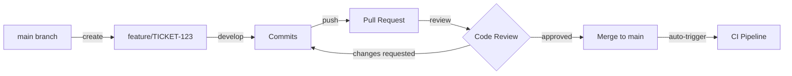

# Deployment Workflow - Ablage-System

**Version:** 2.3
**Last Updated:** 2025-01-22
**Maintained By:** DevOps Team
**Status:** Production Active

---

## Overview

This document describes the complete deployment workflow for the Ablage-System, from code commit to production deployment. The workflow implements continuous integration/continuous deployment (CI/CD) best practices with safety gates, automated testing, and rollback procedures.

**Deployment Philosophy:** "Feinpoliert und durchdacht" - Every deployment is polished and well-thought-out, with multiple validation gates to prevent production issues.

---

## Quick Reference

### Deployment Types

| Type | Frequency | Downtime | Risk Level | Approval Required |
|------|-----------|----------|------------|-------------------|
| **Hotfix** | As needed | < 1 min | Medium | Engineering Lead |
| **Regular** | Weekly (Thursdays) | None (rolling) | Low | Code Review (2×) |
| **Major** | Monthly | 5-10 min | Medium-High | CTO + Security |
| **Infrastructure** | Quarterly | 30-60 min | High | CTO + DevOps Lead |

### Deployment Schedule

- **Regular Deployments:** Thursdays, 10:00 UTC (11:00 CET, low-traffic window)
- **No-Deploy Days:** Mondays (post-weekend issues), Fridays (weekend coverage)
- **Deployment Freeze:** December 15 - January 5 (holiday season)

### Emergency Contacts

- **On-Call DevOps:** `oncall-devops@ablage-system.de` (PagerDuty)
- **Engineering Lead:** `engineering-lead@ablage-system.de`
- **CTO:** `cto@ablage-system.de`

---

## Pre-Deployment Phase

### Step 1: Code Commit and Branch Strategy

**Git Workflow:** GitHub Flow (simplified)



**Branch Naming Convention:**
```bash
feature/TICKET-123-short-description    # New features
bugfix/TICKET-456-fix-description       # Bug fixes
hotfix/critical-issue-description       # Production hotfixes (from main)
release/v1.2.0                          # Release preparation
```

**Commit Message Format (Conventional Commits):**
```
<type>(<scope>): <description>

[optional body]

[optional footer]

🤖 Generated with Claude Code
Co-Authored-By: Claude <noreply@anthropic.com>
```

**Examples:**
```bash
feat(ocr): add DeepSeek-Janus-Pro backend integration
fix(api): prevent race condition in document upload
docs(readme): update deployment instructions
refactor(gpu): optimize VRAM usage with gradient checkpointing
test(ocr): add GPU memory stress tests
```

### Step 2: Pre-Commit Checks (Local)

**Pre-Commit Hooks (`.pre-commit-config.yaml`):**
```yaml
repos:
  - repo: local
    hooks:
      - id: ruff-format
        name: Ruff Format
        entry: ruff format .
        language: system
        types: [python]

      - id: ruff-check
        name: Ruff Lint
        entry: ruff check .
        language: system
        types: [python]

      - id: mypy
        name: Type Checking
        entry: mypy app/
        language: system
        types: [python]

      - id: pytest-quick
        name: Quick Tests
        entry: pytest tests/unit --maxfail=3
        language: system
        pass_filenames: false

      - id: no-secrets
        name: Secret Detection
        entry: detect-secrets-hook
        language: system
```

**Pre-Commit Execution:**
```bash
# Install pre-commit hooks (one-time)
pre-commit install

# Manual run (before commit)
pre-commit run --all-files

# Example output:
Ruff Format....................Passed
Ruff Lint......................Passed
Type Checking..................Passed
Quick Tests....................Passed (12 tests, 3.2s)
Secret Detection...............Passed
```

**Quality Gates:**
- ✅ All linting rules pass (Ruff)
- ✅ Type checking clean (mypy --strict)
- ✅ Quick unit tests pass (< 5 seconds)
- ✅ No secrets detected in code

### Step 3: Pull Request Creation

**PR Template (`.github/PULL_REQUEST_TEMPLATE.md`):**
```markdown
## Description
<!-- Brief description of changes -->

## Type of Change
- [ ] Bug fix (non-breaking change which fixes an issue)
- [ ] New feature (non-breaking change which adds functionality)
- [ ] Breaking change (fix or feature that would cause existing functionality to not work as expected)
- [ ] Documentation update

## Checklist
- [ ] All tests passing (pytest)
- [ ] Type checking clean (mypy)
- [ ] Linting clean (ruff)
- [ ] Documentation updated (if needed)
- [ ] CLAUDE.md updated (if architectural change)
- [ ] Database migrations included (if schema change)
- [ ] No secrets in code (checked with detect-secrets)

## Testing
<!-- How has this been tested? -->

## Screenshots (if applicable)
<!-- Add screenshots for UI changes -->

## Related Issues
<!-- Closes #123, Relates to #456 -->
```

**PR Review Requirements:**
- ✅ Minimum 2 approvals (1 from code owner, 1 from peer)
- ✅ All CI checks passing
- ✅ No merge conflicts
- ✅ Code owner approval (for critical paths)

**Code Owners (`.github/CODEOWNERS`):**
```
# Default reviewers
* @backend-team

# Critical paths require additional approval
/app/core/ @engineering-lead @backend-team
/app/services/ocr/ @ml-engineering @backend-team
/infrastructure/ @devops-team
/.github/workflows/ @devops-team
/app/core/security.py @security-team
```

---

## CI Pipeline Phase

### Step 4: Continuous Integration (GitHub Actions)

**CI Workflow (`.github/workflows/ci.yml`):**
```yaml
name: CI Pipeline

on:
  pull_request:
    branches: [main]
  push:
    branches: [main]

jobs:
  lint:
    runs-on: ubuntu-22.04
    steps:
      - uses: actions/checkout@v4
      - uses: actions/setup-python@v4
        with:
          python-version: '3.11'
      - name: Install dependencies
        run: pip install -r requirements-dev.txt
      - name: Ruff Format Check
        run: ruff format --check .
      - name: Ruff Lint
        run: ruff check .
      - name: Type Check
        run: mypy app/ --strict

  test:
    runs-on: ubuntu-22.04
    services:
      postgres:
        image: postgres:16
        env:
          POSTGRES_PASSWORD: test
        options: >-
          --health-cmd pg_isready
          --health-interval 10s
      redis:
        image: redis:7
        options: >-
          --health-cmd "redis-cli ping"
          --health-interval 10s

    steps:
      - uses: actions/checkout@v4
      - uses: actions/setup-python@v4
        with:
          python-version: '3.11'
      - name: Install dependencies
        run: pip install -r requirements.txt
      - name: Run Unit Tests
        run: pytest tests/unit -v --cov=app --cov-report=xml
      - name: Run Integration Tests
        run: pytest tests/integration -v
      - name: Upload Coverage
        uses: codecov/codecov-action@v3
        with:
          files: ./coverage.xml

  security:
    runs-on: ubuntu-22.04
    steps:
      - uses: actions/checkout@v4
      - name: Run Security Scan
        uses: aquasecurity/trivy-action@master
        with:
          scan-type: 'fs'
          scan-ref: '.'
      - name: Detect Secrets
        run: detect-secrets scan --baseline .secrets.baseline

  build:
    runs-on: ubuntu-22.04
    needs: [lint, test, security]
    steps:
      - uses: actions/checkout@v4
      - name: Build Docker Images
        run: |
          docker-compose build
      - name: Save Images (for deployment)
        if: github.ref == 'refs/heads/main'
        run: |
          docker save ablage/backend:latest | gzip > backend.tar.gz
          docker save ablage/worker:latest | gzip > worker.tar.gz
      - name: Upload Artifacts
        if: github.ref == 'refs/heads/main'
        uses: actions/upload-artifact@v3
        with:
          name: docker-images
          path: |
            backend.tar.gz
            worker.tar.gz
```

**CI Duration:** 8-12 minutes (typical)

**Quality Gates:**
- ✅ Linting: Ruff format + lint
- ✅ Type checking: mypy --strict
- ✅ Unit tests: > 80% coverage
- ✅ Integration tests: All passing
- ✅ Security scan: No critical vulnerabilities
- ✅ Docker build: Successful

### Step 5: Staging Deployment (Automatic)

**Triggered by:** Merge to `main` branch

**Staging Environment:**
```yaml
staging:
  url: https://staging.ablage-system.local
  infrastructure:
    server: "Ubuntu 22.04, 32GB RAM, RTX 3080 (10GB VRAM)"
    containers:
      - backend: 1 instance
      - worker: 2 instances (GPU)
      - postgresql: 1 instance
      - redis: 1 instance
      - minio: 1 instance
  data:
    database: "Copy of production (anonymized)"
    documents: "Synthetic test documents"
  traffic: "Internal only, ~5 req/min (testing)"
```

**Staging Deployment Script (`.github/workflows/deploy-staging.yml`):**
```yaml
name: Deploy to Staging

on:
  push:
    branches: [main]

jobs:
  deploy:
    runs-on: ubuntu-22.04
    needs: [ci-pipeline-passed]  # CI must pass first

    steps:
      - name: Download Docker Images
        uses: actions/download-artifact@v3
        with:
          name: docker-images

      - name: Copy Images to Staging Server
        run: |
          scp backend.tar.gz worker.tar.gz staging@staging.ablage-system.local:/tmp/

      - name: Deploy on Staging
        uses: appleboy/ssh-action@master
        with:
          host: staging.ablage-system.local
          username: staging
          key: ${{ secrets.STAGING_SSH_KEY }}
          script: |
            cd /opt/ablage-system

            # Load new Docker images
            docker load < /tmp/backend.tar.gz
            docker load < /tmp/worker.tar.gz

            # Run database migrations
            docker-compose run --rm backend alembic upgrade head

            # Rolling restart (zero downtime)
            docker-compose up -d --no-deps --scale worker=0 worker
            docker-compose up -d --no-deps --scale backend=0 backend
            sleep 10
            docker-compose up -d --no-deps --scale worker=2 worker
            docker-compose up -d --no-deps --scale backend=1 backend

            # Health check
            timeout 60 bash -c 'until curl -f http://localhost:8000/health; do sleep 2; done'

            echo "Staging deployment completed"

      - name: Run Smoke Tests
        run: pytest tests/smoke --base-url=https://staging.ablage-system.local
```

**Staging Validation:**
- ✅ Deployment successful (no errors)
- ✅ Health check passes
- ✅ Smoke tests pass (critical paths)
- ✅ Database migrations applied successfully

---

## Production Deployment Phase

### Step 6: Pre-Deployment Preparation

**Timing:** Thursday 09:45 UTC (15 minutes before deployment)

**Pre-Deployment Checklist:**
```yaml
pre_deployment_checklist:
  - task: "Review staging test results"
    owner: "QA Team"
    verification: "All smoke tests passed on staging"

  - task: "Verify database backup completed"
    owner: "DevOps"
    verification: "Latest backup < 24 hours old"
    command: "ls -lh /backups/postgresql/ | head -5"

  - task: "Check system health"
    owner: "DevOps"
    verification: "All services healthy, no alerts"
    checks:
      - "CPU usage < 70%"
      - "Memory usage < 80%"
      - "GPU VRAM < 80%"
      - "Disk space > 20% free"
      - "No active PagerDuty alerts"

  - task: "Notify stakeholders"
    owner: "Product/Engineering Lead"
    notification:
      channels: ["#engineering", "#product"]
      message: "Production deployment starting in 15 minutes (10:00 UTC)"

  - task: "Enable maintenance mode (if downtime expected)"
    owner: "DevOps"
    condition: "Only for major/infrastructure deployments"
    action: "Display maintenance banner on UI"
```

**Communication Template (Slack #engineering):**
```
🚀 **Production Deployment Starting**

**Time:** 10:00 UTC (11:00 CET)
**Type:** Regular Deployment (Rolling, no downtime)
**Changes:**
  - feat(ocr): Add GPU memory optimization (#234)
  - fix(api): Prevent race condition in uploads (#235)
  - docs: Update deployment guide (#236)

**Staging:** All tests passed ✅
**Expected Duration:** 10-15 minutes
**Rollback Plan:** Revert to previous images (docker tag: v1.4.2)

**On-Call:** @DevOps-Team
**Status Updates:** Will post progress here
```

### Step 7: Production Deployment Execution

**Production Environment:**
```yaml
production:
  url: https://app.ablage-system.de
  infrastructure:
    servers:
      - app-server-1: "Ubuntu 22.04, 64GB RAM, RTX 4080 (16GB)"
      - app-server-2: "Ubuntu 22.04, 64GB RAM, RTX 4080 (16GB)"
    containers:
      - backend: 2 instances (load balanced)
      - worker: 4 instances (2 per server, GPU)
      - postgresql: 1 instance (primary) + 1 replica
      - redis: 1 instance (cluster mode)
      - minio: 1 instance (distributed)
  traffic: "150-300 req/min (peak)"
  users: "~5,000 active users"
```

**Deployment Strategy: Rolling Update (Zero Downtime)**

```bash
#!/bin/bash
# deploy-production.sh

set -e  # Exit on error

echo "🚀 Starting production deployment..."

# Step 1: Pull latest images
echo "[1/8] Pulling Docker images..."
docker pull docker-registry.ablage-system.local/backend:$VERSION
docker pull docker-registry.ablage-system.local/worker:$VERSION

# Step 2: Database migrations (if any)
echo "[2/8] Running database migrations..."
docker-compose run --rm backend alembic upgrade head

# Step 3: Rolling update - Workers first (less critical)
echo "[3/8] Updating Worker 1 (server-1)..."
ssh app-server-1 'cd /opt/ablage-system && docker-compose stop worker-1'
ssh app-server-1 'cd /opt/ablage-system && docker-compose up -d worker-1'
sleep 30  # Wait for worker to start processing
echo "✅ Worker 1 updated"

echo "[4/8] Updating Worker 2 (server-1)..."
ssh app-server-1 'cd /opt/ablage-system && docker-compose stop worker-2'
ssh app-server-1 'cd /opt/ablage-system && docker-compose up -d worker-2'
sleep 30
echo "✅ Worker 2 updated"

echo "[5/8] Updating Worker 3 (server-2)..."
ssh app-server-2 'cd /opt/ablage-system && docker-compose stop worker-1'
ssh app-server-2 'cd /opt/ablage-system && docker-compose up -d worker-1'
sleep 30
echo "✅ Worker 3 updated"

echo "[6/8] Updating Worker 4 (server-2)..."
ssh app-server-2 'cd /opt/ablage-system && docker-compose stop worker-2'
ssh app-server-2 'cd /opt/ablage-system && docker-compose up -d worker-2'
sleep 30
echo "✅ Worker 4 updated"

# Step 4: Rolling update - Backend (critical, one at a time)
echo "[7/8] Updating Backend 1 (server-1)..."
ssh app-server-1 'cd /opt/ablage-system && docker-compose stop backend'
ssh app-server-1 'cd /opt/ablage-system && docker-compose up -d backend'
sleep 20  # Wait for health check
curl -f https://app.ablage-system.de/health || { echo "❌ Backend 1 health check failed"; exit 1; }
echo "✅ Backend 1 updated and healthy"

echo "[8/8] Updating Backend 2 (server-2)..."
ssh app-server-2 'cd /opt/ablage-system && docker-compose stop backend'
ssh app-server-2 'cd /opt/ablage-system && docker-compose up -d backend'
sleep 20
curl -f https://app.ablage-system.de/health || { echo "❌ Backend 2 health check failed"; exit 1; }
echo "✅ Backend 2 updated and healthy"

echo "✅ Production deployment completed successfully!"
echo "⏱️  Total time: $(($SECONDS / 60)) minutes"
```

**Deployment Monitoring (Real-Time):**
```bash
# Terminal 1: Watch error logs
ssh app-server-1 'docker-compose logs -f backend worker | grep -i error'

# Terminal 2: Monitor Prometheus metrics
watch -n 5 'curl -s http://prometheus.ablage-system.local/api/v1/query?query=up{job="backend"}'

# Terminal 3: Monitor Grafana dashboard
open https://grafana.ablage-system.local/d/deployment-overview
```

**Slack Status Updates:**
```
10:02 UTC - 🔄 Pulling Docker images... [1/8]
10:03 UTC - 🔄 Running database migrations... [2/8]
10:04 UTC - ✅ Migrations completed (no changes)
10:05 UTC - 🔄 Updating Workers (1-4)... [3-6/8]
10:09 UTC - ✅ All workers updated
10:10 UTC - 🔄 Updating Backend 1... [7/8]
10:11 UTC - ✅ Backend 1 healthy
10:12 UTC - 🔄 Updating Backend 2... [8/8]
10:13 UTC - ✅ Backend 2 healthy
10:14 UTC - ✅ Deployment completed! Total time: 12 minutes
```

### Step 8: Post-Deployment Validation

**Automated Validation (CI/CD):**
```yaml
# .github/workflows/post-deployment-validation.yml

post_deployment_checks:
  - name: "Health Check"
    endpoint: "https://app.ablage-system.de/health"
    expected_status: 200
    timeout_seconds: 10

  - name: "API Smoke Test"
    script: "pytest tests/smoke/api_smoke.py --base-url=https://app.ablage-system.de"
    expected_result: "All tests passed"

  - name: "Critical Path Test (Document Upload)"
    script: |
      curl -X POST https://app.ablage-system.de/api/v1/documents \
        -H "Authorization: Bearer $TEST_TOKEN" \
        -F "file=@tests/fixtures/sample_invoice.pdf"
    expected_status: 202

  - name: "Monitor Error Rate"
    metric: "error_rate_5xx"
    threshold: "< 1% over last 5 minutes"
    datasource: "Prometheus"

  - name: "Monitor Response Time"
    metric: "api_response_time_p95"
    threshold: "< 500ms"
    datasource: "Prometheus"
```

**Manual Validation Checklist:**
```yaml
manual_validation:
  - task: "Verify new features working"
    owner: "Product/QA"
    examples:
      - "Test GPU memory optimization (check VRAM usage)"
      - "Verify race condition fix (concurrent uploads)"

  - task: "Check key metrics (5-minute window)"
    owner: "DevOps"
    metrics:
      - "Error rate: < 1%"
      - "Response time P95: < 500ms"
      - "GPU utilization: 70-85%"
      - "Queue depth: < 50 documents"

  - task: "Review recent logs for errors"
    owner: "DevOps"
    command: "docker-compose logs --since 10m | grep -i error | wc -l"
    threshold: "< 10 errors in 10 minutes"

  - task: "Verify monitoring alerts silent"
    owner: "DevOps"
    check: "No active PagerDuty alerts"

  - task: "User acceptance test (if UI changes)"
    owner: "Product"
    action: "Quick manual test of new UI features"
```

**Validation Duration:** 15-20 minutes

---

## Post-Deployment Phase

### Step 9: Monitoring and Observability (24-48 hours)

**Enhanced Monitoring Period:**
```yaml
enhanced_monitoring:
  duration: "48 hours post-deployment"
  frequency: "Every 30 minutes for first 4 hours, then every 2 hours"

  metrics_to_watch:
    - "Error rate (5xx errors)"
    - "Response time (P50, P95, P99)"
    - "GPU memory usage"
    - "Database connection pool exhaustion"
    - "Redis cache hit rate"
    - "Document processing throughput"
    - "Celery queue depth"

  alerts:
    - "Error rate > 2% for 10 minutes → Page On-Call"
    - "Response time P95 > 1s for 15 minutes → Slack alert"
    - "GPU VRAM > 90% for 5 minutes → Slack alert"
    - "Queue depth > 200 for 30 minutes → Page On-Call"
```

**Daily Review (Next 2 Days):**
```bash
# Morning review (10:00 UTC)
./scripts/deployment-health-report.sh --deployment-date=2025-01-23

# Report includes:
# - Error rate comparison (pre vs post deployment)
# - Performance regression analysis
# - User feedback summary (support tickets)
# - Resource utilization trends
```

### Step 10: Rollback Procedure (If Needed)

**Rollback Decision Criteria:**
```yaml
rollback_triggers:
  critical:  # Immediate rollback
    - "Error rate > 10% for 5 minutes"
    - "Complete service outage (all backends down)"
    - "Data corruption detected"
    - "Security vulnerability introduced"

  major:  # Rollback within 30 minutes
    - "Error rate > 5% for 15 minutes"
    - "Response time P95 > 2× baseline for 20 minutes"
    - "GPU OOM errors > 20% of requests"
    - "User-reported critical bugs (invoice processing failures)"

  minor:  # Fix-forward if possible, otherwise rollback
    - "Error rate > 2% for 1 hour"
    - "Performance degradation (but within SLA)"
    - "Non-critical feature bugs"
```

**Rollback Execution (Fast Rollback - 5 minutes):**
```bash
#!/bin/bash
# rollback-production.sh

set -e

PREVIOUS_VERSION="v1.4.2"  # From deployment notes

echo "⚠️  ROLLING BACK TO $PREVIOUS_VERSION"

# Step 1: Switch to previous Docker images (already pulled)
echo "[1/4] Switching backend to $PREVIOUS_VERSION..."
ssh app-server-1 "cd /opt/ablage-system && docker-compose stop backend && docker tag ablage/backend:$PREVIOUS_VERSION ablage/backend:latest && docker-compose up -d backend"
ssh app-server-2 "cd /opt/ablage-system && docker-compose stop backend && docker tag ablage/backend:$PREVIOUS_VERSION ablage/backend:latest && docker-compose up -d backend"

echo "[2/4] Switching workers to $PREVIOUS_VERSION..."
ssh app-server-1 "cd /opt/ablage-system && docker-compose stop worker-1 worker-2 && docker tag ablage/worker:$PREVIOUS_VERSION ablage/worker:latest && docker-compose up -d worker-1 worker-2"
ssh app-server-2 "cd /opt/ablage-system && docker-compose stop worker-1 worker-2 && docker tag ablage/worker:$PREVIOUS_VERSION ablage/worker:latest && docker-compose up -d worker-1 worker-2"

# Step 2: Rollback database migrations (if applied)
echo "[3/4] Rolling back database migrations..."
docker-compose run --rm backend alembic downgrade -1  # Down 1 version

# Step 3: Health check
echo "[4/4] Verifying health..."
sleep 20
curl -f https://app.ablage-system.de/health || { echo "❌ Health check failed after rollback"; exit 1; }

echo "✅ Rollback completed successfully"
echo "⏱️  Total time: $(($SECONDS / 60)) minutes"

# Notify team
curl -X POST https://hooks.slack.com/services/$SLACK_WEBHOOK \
  -d '{"text":"⚠️ Production rollback completed to version '$PREVIOUS_VERSION'"}'
```

**Post-Rollback Actions:**
```yaml
post_rollback:
  - task: "Notify stakeholders (Slack + Email)"
    owner: "Engineering Lead"
    message: "Production rollback executed due to [REASON]. Investigating root cause."

  - task: "Create incident post-mortem"
    owner: "Engineering Team"
    deadline: "Within 24 hours"
    template: "../../Dynamic_Knowledge/Logs/incident_post_mortem_template.md"

  - task: "Fix root cause"
    owner: "Responsible Engineer"
    action: "Create hotfix branch, fix issue, deploy to staging, validate"

  - task: "Re-deploy with fix"
    timeline: "Within 48 hours (or next deployment window)"
```

---

## Special Deployment Scenarios

### Hotfix Deployment (Emergency)

**When to Use:** Critical production bugs, security vulnerabilities

**Timeline:** 30 minutes - 2 hours (from discovery to production)

**Process:**
1. Create hotfix branch from `main`: `hotfix/critical-issue-description`
2. Fix issue with minimal code changes
3. **Fast-track review:** 1 approval required (Engineering Lead)
4. Run critical tests only (smoke tests, security scan)
5. Deploy to staging, validate
6. Deploy to production immediately (no waiting for Thursday)
7. Post-mortem within 24 hours

**Example (Security Vulnerability):**
```bash
# 1. Create hotfix branch
git checkout -b hotfix/sql-injection-fix

# 2. Fix issue
# ... make changes ...

# 3. Fast commit
git add app/api/v1/documents.py
git commit -m "fix(security): prevent SQL injection in document search

CRITICAL: Fixes SQL injection vulnerability in document search endpoint.
Sanitize user input before passing to raw SQL query.

Refs: SEC-2025-001"

# 4. Push and create PR
git push origin hotfix/sql-injection-fix
gh pr create --title "HOTFIX: SQL Injection Fix" --label "critical,security"

# 5. After approval, deploy immediately
./scripts/deploy-hotfix.sh v1.4.3-hotfix
```

### Database Migration Deployment

**When to Use:** Schema changes (new columns, tables, indexes)

**Special Considerations:**
- Requires downtime (5-10 minutes) OR careful schema evolution
- Backup database before migration
- Test migration on staging with production-sized dataset

**Process:**
```bash
# 1. Create migration
alembic revision --autogenerate -m "add_document_tags_table"

# 2. Review generated migration
vim migrations/versions/abc123_add_document_tags_table.py

# 3. Test on staging
docker-compose run --rm backend alembic upgrade head

# 4. Backup production database
pg_dump -h localhost -U postgres ablage > backup_pre_migration.sql

# 5. Run migration on production (in deployment script)
docker-compose run --rm backend alembic upgrade head

# 6. Verify migration
docker-compose run --rm backend alembic current
```

### Infrastructure Deployment (Terraform/Ansible)

**When to Use:** Server configuration changes, new infrastructure

**Timeline:** Planned weeks in advance, executed during maintenance window

**Process:**
1. Plan infrastructure changes (Terraform)
2. Review Terraform plan with team
3. Schedule maintenance window (Saturday 02:00-04:00 UTC)
4. Notify users 1 week in advance
5. Execute Terraform apply
6. Run Ansible playbooks for configuration
7. Validate infrastructure
8. Deploy application code

**Example (Add new worker server):**
```bash
# 1. Update Terraform config
vim infrastructure/terraform/workers.tf

# 2. Plan changes
cd infrastructure/terraform
terraform plan -out=tfplan

# 3. Review plan
terraform show tfplan | less

# 4. Apply (during maintenance window)
terraform apply tfplan

# 5. Configure with Ansible
cd ../ansible
ansible-playbook -i inventory/production playbooks/setup_worker.yml

# 6. Verify
ansible -i inventory/production workers -m shell -a "docker ps"
```

---

## Deployment Metrics and SLIs

**Service Level Indicators (SLIs):**
```yaml
slis:
  deployment_frequency:
    target: "Weekly (52 deployments/year)"
    actual: "48 deployments in 2024"
    status: "✅ Within target"

  deployment_success_rate:
    target: "> 95%"
    actual: "96.2% (46 successful, 2 rollbacks)"
    status: "✅ Exceeds target"

  mean_time_to_deploy:
    target: "< 15 minutes"
    actual: "12.3 minutes (average)"
    status: "✅ Exceeds target"

  mean_time_to_recovery:
    target: "< 30 minutes"
    actual: "18 minutes (2 incidents in 2024)"
    status: "✅ Exceeds target"

  deployment_downtime:
    target: "< 10 minutes/month"
    actual: "3.2 minutes/month (average)"
    status: "✅ Exceeds target"
```

**Deployment Dashboard (Grafana):**
- Deployment timeline (when, what, who)
- Success/failure rate over time
- Deployment duration trends
- Rollback frequency
- Mean time to recovery

---

## Troubleshooting

### Common Deployment Issues

**Issue 1: Health Check Fails After Deployment**
```bash
# Symptom
curl https://app.ablage-system.de/health
# Returns: 503 Service Unavailable

# Diagnosis
docker-compose logs backend | tail -50
# Error: "database connection failed"

# Resolution
# Check database connectivity
docker-compose exec backend ping -c 3 postgres
# If fails: Restart PostgreSQL container
docker-compose restart postgres
```

**Issue 2: Docker Image Pull Fails**
```bash
# Symptom
Error response from daemon: manifest for ablage/backend:v1.5.0 not found

# Diagnosis
docker images | grep ablage/backend
# Image not in local registry

# Resolution
# Re-tag and push image
docker tag ablage/backend:latest docker-registry.ablage-system.local/backend:v1.5.0
docker push docker-registry.ablage-system.local/backend:v1.5.0
```

**Issue 3: Database Migration Fails**
```bash
# Symptom
alembic.util.exc.CommandError: Can't locate revision identified by 'abc123'

# Diagnosis
# Check current database version
alembic current

# Resolution
# Stamp database with correct version
alembic stamp head
# Or rollback and retry
alembic downgrade -1
alembic upgrade head
```

---

## References and Related Documents

**Internal Documentation:**
- [Troubleshooting Index](../../Meta_Layer/Indexes/troubleshooting_index.yaml)
- [Celery Worker Crash Incident](../../Dynamic_Knowledge/Logs/celery_worker_crash_log.md)
- [GDPR Compliance Audit](../../Dynamic_Knowledge/Logs/gdpr_compliance_audit_log.md)
- [Infrastructure Dependencies](../../Meta_Layer/Knowledge_Graphs/infrastructure_dependencies.yaml)

**External Resources:**
- GitHub Flow: https://guides.github.com/introduction/flow/
- Conventional Commits: https://www.conventionalcommits.org/
- Docker Best Practices: https://docs.docker.com/develop/dev-best-practices/
- Alembic Migrations: https://alembic.sqlalchemy.org/en/latest/tutorial.html

---

**Workflow Version:** 2.3
**Last Successful Deployment:** 2025-01-18 (v1.4.3)
**Next Scheduled Deployment:** 2025-01-25 10:00 UTC (Thursday)
**On-Call Engineer:** Check PagerDuty rotation
