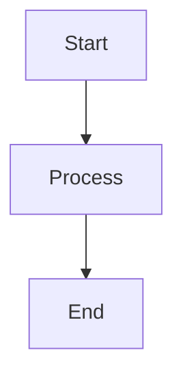

# Ablage-System OCR - Dokumentation

Offizielle Dokumentation für Ablage-System OCR, erstellt mit MkDocs Material.

---

## 📖 Über diese Dokumentation

Diese Dokumentation deckt alle Aspekte des Ablage-System OCR Projekts ab:

- **Installation & Setup**: Schritt-für-Schritt Anleitungen
- **Architektur**: Systemdesign und Komponenten
- **Benutzerhandbuch**: Dokumentenverarbeitung und Features
- **Entwicklung**: Code-Standards und Workflows
- **API-Referenz**: Vollständige REST-API Dokumentation
- **Infrastruktur**: Deployment und Operations
- **OCR-Engines**: Backend-Vergleich und Optimierung
- **Sicherheit**: Security Best Practices
- **Performance**: Optimierung und Benchmarks

---

## 🚀 Schnellstart

### Lokal anzeigen

#### Option 1: Development Server (empfohlen)

```bash
# Startskript ausführen (installiert Dependencies automatisch)
./serve.sh

# Dokumentation verfügbar unter: http://127.0.0.1:8000
```

#### Option 2: Manuelle Installation

```bash
# Virtual Environment erstellen
python3 -m venv venv
source venv/bin/activate  # Linux/Mac
# venv\Scripts\activate  # Windows

# Dependencies installieren
pip install -r requirements.txt

# Server starten
mkdocs serve

# Öffnen Sie: http://127.0.0.1:8000
```

### Statische Site erstellen

```bash
# Build-Skript ausführen
./build.sh

# Oder manuell:
mkdocs build

# Ergebnis in: site/
```

---

## 📁 Struktur

```
docs/
├── mkdocs.yml              # MkDocs Konfiguration
├── requirements.txt        # Python Dependencies
├── serve.sh                # Development Server Skript
├── build.sh                # Build-Skript
├── README.md               # Diese Datei
│
├── docs/                   # Dokumentationsinhalt
│   ├── index.md            # Homepage
│   ├── getting-started.md  # Schnellstart-Guide
│   ├── faq.md              # Häufige Fragen
│   ├── changelog.md        # Änderungshistorie
│   │
│   ├── architecture/       # Architektur-Dokumentation
│   │   ├── overview.md
│   │   ├── system-architecture.md
│   │   ├── data-flow.md
│   │   └── ...
│   │
│   ├── installation/       # Installations-Anleitungen
│   │   ├── prerequisites.md
│   │   ├── docker.md
│   │   ├── production.md
│   │   └── ...
│   │
│   ├── user-guide/         # Benutzerhandbuch
│   │   ├── upload-documents.md
│   │   ├── ocr-processing.md
│   │   └── ...
│   │
│   ├── development/        # Entwickler-Dokumentation
│   │   ├── environment.md
│   │   ├── code-structure.md
│   │   └── ...
│   │
│   ├── api/                # API-Referenz
│   │   ├── overview.md
│   │   ├── authentication.md
│   │   └── ...
│   │
│   ├── infrastructure/     # Infrastruktur-Docs
│   │   ├── docker/
│   │   ├── terraform/
│   │   ├── vault/
│   │   └── ...
│   │
│   ├── ocr-engines/        # OCR-Backend-Dokumentation
│   │   ├── overview.md
│   │   ├── deepseek.md
│   │   └── ...
│   │
│   └── assets/             # Statische Assets
│       ├── images/
│       ├── stylesheets/
│       └── javascripts/
│
└── site/                   # Generierte statische Site (nach Build)
```

---

## 🎨 Theme & Customization

### Theme

Wir verwenden **Material for MkDocs** mit folgenden Features:

- **Responsive Design**: Mobile-friendly
- **Dark/Light Mode**: Automatischer Theme-Switch
- **Search**: Volltext-Suche in Deutsch und Englisch
- **Navigation**: Tabs, Sections, TOC
- **Code Highlighting**: Syntax-Highlighting für 30+ Sprachen
- **Mermaid Diagrams**: Eingebettete Diagramme
- **Admonitions**: Info-Boxen, Warnungen, Tips

### Customization

Custom CSS und JavaScript in:
- `docs/stylesheets/extra.css`
- `docs/stylesheets/custom.css`
- `docs/javascripts/custom.js`

---

## ✍️ Dokumentation schreiben

### Markdown-Format

Alle Dokumentationsseiten sind in Markdown geschrieben (`.md` Dateien).

#### Basis-Syntax

```markdown
# Überschrift 1
## Überschrift 2
### Überschrift 3

**Fettgedruckt**
*Kursiv*
~~Durchgestrichen~~

- Liste Punkt 1
- Liste Punkt 2
  - Unterpunkt

1. Nummerierte Liste
2. Punkt 2

[Link-Text](https://example.com)


`inline code`

```python
# Code-Block
def hello():
    print("Hello World")
```
```

#### Erweiterte Features

**Admonitions (Info-Boxen)**

```markdown
!!! note "Hinweis"
    Dies ist eine wichtige Notiz.

!!! warning "Warnung"
    Seien Sie vorsichtig!

!!! tip "Tipp"
    Pro-Tipp für bessere Ergebnisse.

!!! danger "Gefahr"
    Kritische Warnung!
```

**Tabs**

```markdown
=== "Python"

    ```python
    print("Hello")
    ```

=== "Bash"

    ```bash
    echo "Hello"
    ```
```

**Mermaid-Diagramme**

```markdown

```

**Tabellen**

```markdown
| Header 1 | Header 2 | Header 3 |
|----------|----------|----------|
| Cell 1   | Cell 2   | Cell 3   |
| Cell 4   | Cell 5   | Cell 6   |
```

**Task Lists**

```markdown
- [x] Aufgabe erledigt
- [ ] Aufgabe offen
- [ ] Weitere Aufgabe
```

---

## 🔧 Konfiguration

### mkdocs.yml

Hauptkonfigurationsdatei mit:

- **Site Information**: Name, Beschreibung, URL
- **Theme Configuration**: Farben, Features, Icons
- **Plugins**: Search, Minify, Git-Revision-Date, etc.
- **Markdown Extensions**: PyMdown, Admonitions, Tables, etc.
- **Navigation Structure**: Hierarchische Navigation

### Navigation hinzufügen

Bearbeiten Sie `mkdocs.yml` unter `nav:`:

```yaml
nav:
  - Home: index.md
  - Architektur:
    - Übersicht: architecture/overview.md
    - System: architecture/system-architecture.md
  - Neue Sektion:
    - Neue Seite: new-section/new-page.md
```

---

## 🧪 Lokales Testen

### Hot-Reload Development Server

```bash
./serve.sh

# Änderungen werden automatisch neu geladen
# Öffnen Sie: http://127.0.0.1:8000
```

### Build-Test

```bash
# Build mit strikter Validierung
./build.sh

# Prüft:
# - Markdown-Syntax
# - Broken Links
# - Missing Files
# - YAML-Syntax
```

### Link-Validierung

```bash
# Alle internen Links prüfen
mkdocs build --strict

# Mit externen Links (langsam)
pip install mkdocs-linkcheck
# Konfiguration in mkdocs.yml hinzufügen
```

---

## 📦 Deployment

### GitHub Pages

#### Option 1: Automatisches Deployment (empfohlen)

GitHub Actions Workflow (`.github/workflows/docs.yml`):

```yaml
name: Deploy Docs

on:
  push:
    branches: [main]
    paths: ['docs/**']

jobs:
  deploy:
    runs-on: ubuntu-latest
    steps:
      - uses: actions/checkout@v4
      - uses: actions/setup-python@v4
        with:
          python-version: 3.11
      - run: pip install -r docs/requirements.txt
      - run: cd docs && mkdocs gh-deploy --force
```

#### Option 2: Manuelles Deployment

```bash
cd docs
./build.sh --deploy

# Oder:
mkdocs gh-deploy --force
```

Dokumentation verfügbar unter: `https://username.github.io/ablage-system-ocr/`

### Self-Hosted

#### Option 1: Nginx

```bash
# Build
./build.sh

# Site-Verzeichnis zu Webserver kopieren
sudo cp -r site/* /var/www/docs/

# Nginx Config
server {
    listen 80;
    server_name docs.ablage-system.local;
    root /var/www/docs;
    index index.html;

    location / {
        try_files $uri $uri/ =404;
    }
}
```

#### Option 2: Docker

```dockerfile
# Dockerfile
FROM nginx:alpine
COPY site/ /usr/share/nginx/html/
EXPOSE 80
```

```bash
# Build Image
docker build -t ablage-docs .

# Run Container
docker run -d -p 8080:80 ablage-docs
```

### Versioning mit Mike

```bash
# Install Mike
pip install mike

# Deploy version
mike deploy 1.0 latest --update-aliases

# List versions
mike list

# Set default
mike set-default latest

# Serve locally
mike serve
```

---

## 📊 Analytics & Tracking

### Google Analytics (optional)

In `mkdocs.yml`:

```yaml
extra:
  analytics:
    provider: google
    property: G-XXXXXXXXXX
```

### Umami Analytics (Self-Hosted)

```yaml
extra_javascript:
  - https://analytics.example.com/umami.js
```

### Matomo (Self-Hosted)

```yaml
extra_javascript:
  - https://matomo.example.com/matomo.js
```

---

## 🔍 Search Configuration

### Lunr.js (Standard)

Konfiguriert in `mkdocs.yml`:

```yaml
plugins:
  - search:
      lang:
        - de
        - en
      separator: '[\s\-,:!=\[\]()"/]+|(?!\b)(?=[A-Z][a-z])|\.(?!\d)|&[lg]t;'
```

### Algolia DocSearch (Alternative)

1. Beantrage Algolia DocSearch: https://docsearch.algolia.com/apply/
2. Konfiguration in `mkdocs.yml`

---

## 🤝 Contributing

### Neue Dokumentation hinzufügen

1. **Erstellen Sie eine neue `.md` Datei** in passendem Verzeichnis:
   ```bash
   touch docs/new-section/new-page.md
   ```

2. **Fügen Sie Inhalt hinzu** mit Markdown

3. **Navigation aktualisieren** in `mkdocs.yml`:
   ```yaml
   nav:
     - Neue Sektion:
       - Neue Seite: new-section/new-page.md
   ```

4. **Lokal testen**:
   ```bash
   ./serve.sh
   ```

5. **Commit & Push**:
   ```bash
   git add docs/
   git commit -m "docs: add new page"
   git push
   ```

### Style Guide

- **Sprache**: Deutsch (primär), Englisch (optional)
- **Überschriften**: Satzformat (nicht UPPERCASE)
- **Code-Blöcke**: Immer mit Sprache annotiert
- **Links**: Relative Pfade für interne Links
- **Bilder**: Optimiert (< 500KB), im `assets/images/` Verzeichnis
- **Dateinamen**: `lowercase-with-dashes.md`

---

## 🐛 Troubleshooting

### "No module named 'mkdocs'"

```bash
pip install -r requirements.txt
```

### "Config file 'mkdocs.yml' does not exist"

```bash
# Stellen Sie sicher, dass Sie im docs/ Verzeichnis sind
cd docs/
```

### "Navigation item not found"

Prüfen Sie `mkdocs.yml` Navigation und Dateipfade:
```bash
# Datei existiert?
ls -la docs/path/to/file.md

# Pfad in mkdocs.yml korrekt?
grep "path/to/file.md" mkdocs.yml
```

### "Build fails with 'strict' mode"

Strict-Modus findet:
- Broken links
- Missing files
- Invalid markdown

Prüfen Sie Build-Output für Details:
```bash
mkdocs build --strict --verbose
```

---

## 📚 Ressourcen

### MkDocs

- [MkDocs Documentation](https://www.mkdocs.org/)
- [Material for MkDocs](https://squidfunk.github.io/mkdocs-material/)
- [PyMdown Extensions](https://facelessuser.github.io/pymdown-extensions/)

### Markdown

- [Markdown Guide](https://www.markdownguide.org/)
- [CommonMark Spec](https://commonmark.org/)
- [GitHub Flavored Markdown](https://github.github.com/gfm/)

### Diagramme

- [Mermaid Documentation](https://mermaid.js.org/)
- [Mermaid Live Editor](https://mermaid.live/)

---

## 📞 Support

Fragen zur Dokumentation?

- **GitHub Issues**: [ablage-system/ablage-system-ocr/issues](https://github.com/ablage-system/ablage-system-ocr/issues)
- **Email**: [docs@ablage-system.local](mailto:docs@ablage-system.local)
- **Community Forum**: [forum.ablage-system.local](https://forum.ablage-system.local)

---

## 📄 Lizenz

Die Dokumentation ist unter der gleichen Lizenz wie das Hauptprojekt (MIT) lizenziert.

---

**Letzte Aktualisierung**: 2025-01-24
**MkDocs Version**: 1.5.3
**Theme**: Material for MkDocs 9.5.3
