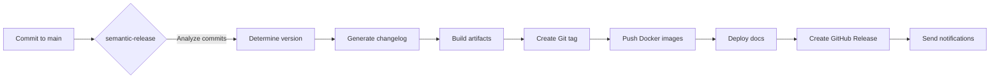

# Release Automation - Ablage-System OCR

Comprehensive documentation for the automated release system using semantic-release.

---

## Table of Contents

- [Overview](#overview)
- [Release Process](#release-process)
- [Conventional Commits](#conventional-commits)
- [Semantic Release Configuration](#semantic-release-configuration)
- [Release Scripts](#release-scripts)
- [GitHub Actions Workflow](#github-actions-workflow)
- [Manual Releases](#manual-releases)
- [Troubleshooting](#troubleshooting)

---

## Overview

Ablage-System uses **automated semantic versioning** and **release automation** based on:

- **[Semantic Versioning](https://semver.org/)** (SemVer)
- **[Conventional Commits](https://www.conventionalcommits.org/)** specification
- **[semantic-release](https://github.com/semantic-release/semantic-release)** for automation

### Release Workflow



### Release Triggers

Releases are automatically triggered on:
- **Push to `main`**: Production releases
- **Push to `beta`**: Beta pre-releases
- **Push to `alpha`**: Alpha pre-releases

---

## Release Process

### Automatic Release

1. **Developer makes changes** following Conventional Commits
2. **Create Pull Request** to `main` branch
3. **PR Review & Approval**
4. **Merge to `main`**
5. **GitHub Actions runs** `release.yml` workflow
6. **semantic-release analyzes** commit messages
7. **Version determined** based on commit types:
   - `feat:` → **MINOR** version bump (e.g., 1.0.0 → 1.1.0)
   - `fix:` → **PATCH** version bump (e.g., 1.0.0 → 1.0.1)
   - `BREAKING CHANGE:` → **MAJOR** version bump (e.g., 1.0.0 → 2.0.0)
8. **Changelog generated** from commits
9. **Git tag created** (e.g., `v1.1.0`)
10. **Docker images built & pushed** to GitHub Container Registry
11. **Documentation deployed** to GitHub Pages
12. **GitHub Release created** with release notes
13. **Notifications sent** (Slack, Email, etc.)

---

## Conventional Commits

### Commit Format

```
<type>(<scope>): <subject>

<body>

<footer>
```

### Commit Types

| Type | Description | Version Bump | Example |
|------|-------------|--------------|---------|
| `feat` | New feature | MINOR | `feat(ocr): add GOT-OCR 2.0 backend` |
| `fix` | Bug fix | PATCH | `fix(api): resolve race condition in upload` |
| `perf` | Performance improvement | PATCH | `perf(gpu): optimize batch processing` |
| `docs` | Documentation only | None | `docs(readme): update installation guide` |
| `style` | Code style changes | None | `style: format with ruff` |
| `refactor` | Code refactoring | PATCH | `refactor(db): simplify query logic` |
| `test` | Add/update tests | None | `test(ocr): add unit tests for deepseek` |
| `build` | Build system changes | None | `build(docker): update base image` |
| `ci` | CI/CD changes | None | `ci: add release workflow` |
| `chore` | Maintenance tasks | None | `chore: update dependencies` |
| `revert` | Revert previous commit | PATCH | `revert: feat(ocr): remove experimental feature` |

### Breaking Changes

Add `BREAKING CHANGE:` in the footer or use `!` after type:

```bash
# Option 1: Footer
feat(api): redesign authentication endpoint

BREAKING CHANGE: /api/v1/auth endpoint now requires API key header

# Option 2: Exclamation mark
feat(api)!: redesign authentication endpoint
```

This triggers a **MAJOR** version bump (e.g., 1.2.3 → 2.0.0).

### Scopes

Common scopes:

- `api` - REST API changes
- `ocr` - OCR backend changes
- `db` - Database changes
- `auth` - Authentication/authorization
- `gpu` - GPU-related changes
- `docs` - Documentation
- `ci` - CI/CD pipeline
- `docker` - Docker/containers
- `terraform` - Infrastructure

### Examples

```bash
# New feature (MINOR bump: 1.0.0 → 1.1.0)
git commit -m "feat(ocr): add batch processing support"

# Bug fix (PATCH bump: 1.1.0 → 1.1.1)
git commit -m "fix(api): handle empty file uploads"

# Performance improvement (PATCH bump)
git commit -m "perf(gpu): reduce memory usage by 20%"

# Documentation (no bump)
git commit -m "docs(api): add WebSocket examples"

# Breaking change (MAJOR bump: 1.1.1 → 2.0.0)
git commit -m "feat(api)!: remove deprecated /v1/upload endpoint"

# Multiple changes
git commit -m "feat(ocr): add German Fraktur support

- Add Fraktur character recognition
- Improve umlaut accuracy
- Update training data

Closes #123"
```

---

## Semantic Release Configuration

Configuration in [.releaserc.json](../.releaserc.json):

### Branches

```json
{
  "branches": [
    "main",                  // Production releases (latest)
    {"name": "beta", "prerelease": true},   // Beta releases
    {"name": "alpha", "prerelease": true}   // Alpha releases
  ]
}
```

### Plugins

1. **@semantic-release/commit-analyzer**: Analyzes commit messages
2. **@semantic-release/release-notes-generator**: Generates changelog
3. **@semantic-release/changelog**: Updates CHANGELOG.md
4. **@semantic-release/npm**: Updates package.json (no publish)
5. **@semantic-release/git**: Commits changes back to repo
6. **@semantic-release/github**: Creates GitHub Release
7. **@semantic-release/exec**: Runs custom scripts

### Release Rules

```json
{
  "releaseRules": [
    {"type": "feat", "release": "minor"},
    {"type": "fix", "release": "patch"},
    {"type": "perf", "release": "patch"},
    {"type": "refactor", "release": "patch"},
    {"breaking": true, "release": "major"}
  ]
}
```

---

## Release Scripts

### 1. prepare-release.sh

**Purpose**: Prepare release artifacts before publishing

**Actions**:
- Updates version in `pyproject.toml` and `__init__.py`
- Builds Docker images (backend, worker, frontend)
- Creates distribution tarball
- Runs tests
- Validates Docker images
- Builds documentation

**Usage**:
```bash
./scripts/prepare-release.sh 1.2.0
```

**Called by**: semantic-release via `@semantic-release/exec`

### 2. publish-release.sh

**Purpose**: Publish release artifacts

**Actions**:
- Logs in to Docker registry
- Pushes Docker images (version + latest + major + minor tags)
- Deploys documentation to GitHub Pages
- Publishes Python package to PyPI (if configured)
- Creates release manifest
- Verifies published artifacts

**Usage**:
```bash
./scripts/publish-release.sh 1.2.0
```

**Environment Variables**:
- `DOCKER_REGISTRY`: Docker registry URL (default: ghcr.io)
- `DOCKER_USERNAME`: Docker registry username
- `DOCKER_PASSWORD`: Docker registry password/token
- `GITHUB_TOKEN`: GitHub API token
- `PYPI_TOKEN`: PyPI API token (optional)

### 3. post-release.sh

**Purpose**: Post-release notifications and cleanup

**Actions**:
- Sends Slack notification
- Sends email notification
- Creates GitHub discussion
- Posts to social media (if configured)
- Updates project website
- Cleans up temporary files
- Creates release report

**Usage**:
```bash
./scripts/post-release.sh 1.2.0
```

**Environment Variables**:
- `SLACK_WEBHOOK_URL`: Slack webhook for notifications
- `NOTIFICATION_EMAIL`: Email for notifications
- `GITHUB_TOKEN`: GitHub API token for discussions
- `TWITTER_API_KEY`: Twitter API credentials (optional)
- `MASTODON_ACCESS_TOKEN`: Mastodon API token (optional)

---

## GitHub Actions Workflow

### Workflow File

[.github/workflows/release.yml](../.github/workflows/release.yml)

### Workflow Steps

1. **Checkout code** with full history
2. **Setup Node.js** for semantic-release
3. **Setup Python** for building packages
4. **Install semantic-release** and plugins
5. **Setup Docker Buildx** for multi-platform builds
6. **Login to GitHub Container Registry**
7. **Run semantic-release**:
   - Analyzes commits
   - Determines version
   - Generates changelog
   - Runs prepare-release.sh
   - Commits changes
   - Creates Git tag
   - Runs publish-release.sh
   - Creates GitHub Release
   - Runs post-release.sh
8. **Upload release artifacts**
9. **Validate release** (separate job)

### Required Secrets

Configure in GitHub → Settings → Secrets:

| Secret | Description | Required |
|--------|-------------|----------|
| `GITHUB_TOKEN` | GitHub API token (auto-provided) | Yes |
| `SLACK_WEBHOOK_URL` | Slack webhook for notifications | Optional |
| `NOTIFICATION_EMAIL` | Email for notifications | Optional |
| `PYPI_TOKEN` | PyPI API token for package publishing | Optional |

### Permissions Required

```yaml
permissions:
  contents: write        # Create tags and releases
  issues: write          # Comment on issues
  pull-requests: write   # Comment on PRs
  packages: write        # Push Docker images
```

---

## Manual Releases

### Emergency Release

If automated release fails, create a manual release:

```bash
# 1. Determine new version
NEW_VERSION="1.2.3"

# 2. Update version files
echo "$NEW_VERSION" > VERSION
sed -i "s/version = .*/version = \"$NEW_VERSION\"/" pyproject.toml
echo "__version__ = \"$NEW_VERSION\"" > app/__init__.py

# 3. Run prepare script
./scripts/prepare-release.sh "$NEW_VERSION"

# 4. Commit changes
git add VERSION pyproject.toml app/__init__.py CHANGELOG.md
git commit -m "chore(release): $NEW_VERSION"

# 5. Create tag
git tag -a "v$NEW_VERSION" -m "Release v$NEW_VERSION"

# 6. Push tag and commits
git push origin main
git push origin "v$NEW_VERSION"

# 7. Run publish script
export DOCKER_PASSWORD="your_token"
export DOCKER_USERNAME="your_username"
./scripts/publish-release.sh "$NEW_VERSION"

# 8. Create GitHub Release manually
gh release create "v$NEW_VERSION" \
  --title "Release v$NEW_VERSION" \
  --notes-file RELEASE_NOTES.md \
  dist/ablage-system-$NEW_VERSION.tar.gz \
  dist/docker-images.txt

# 9. Run post-release script
export SLACK_WEBHOOK_URL="your_webhook"
./scripts/post-release.sh "$NEW_VERSION"
```

### Hotfix Release

For urgent bug fixes:

```bash
# 1. Create hotfix branch from main
git checkout -b hotfix/critical-bug main

# 2. Make the fix
# ... fix the bug ...

# 3. Commit with fix: prefix
git commit -m "fix(api): resolve critical security vulnerability

SECURITY: CVE-2024-XXXXX
This fix addresses a critical authentication bypass."

# 4. Create PR to main
gh pr create --title "Hotfix: Critical security fix" \
  --body "Urgent hotfix for CVE-2024-XXXXX"

# 5. After merge, release is automatic
```

---

## Troubleshooting

### Release Workflow Failed

**Check logs**:
```bash
gh run view --log
```

**Common issues**:

1. **Tests failed**:
   - Fix failing tests
   - Push fix with `test:` prefix (no release)

2. **Docker build failed**:
   - Check Docker logs
   - Verify Dockerfile syntax
   - Check base image availability

3. **Permission denied**:
   - Verify GitHub token has correct permissions
   - Check GITHUB_TOKEN in workflow

4. **Tag already exists**:
   - Delete tag: `git push --delete origin v1.2.3`
   - Delete release in GitHub UI
   - Re-run workflow

### No Release Created

**Possible reasons**:

1. **No release-worthy commits**: Only `docs:`, `test:`, `chore:` commits
   - Solution: Merge a `feat:` or `fix:` commit

2. **On wrong branch**: Commits not on `main`, `beta`, or `alpha`
   - Solution: Merge to release branch

3. **Dry-run mode enabled**: Check `.releaserc.json`
   - Remove `"dryRun": true`

### Docker Images Not Pushed

**Check**:
1. Docker registry login successful?
2. DOCKER_PASSWORD secret set correctly?
3. Registry accepts pushes?
4. Image name/tag valid?

**Debug**:
```bash
docker login ghcr.io -u username
docker push ghcr.io/ablage-system/ablage-backend:1.2.3
```

### Notifications Not Sent

**Check environment variables**:
```bash
echo $SLACK_WEBHOOK_URL
echo $NOTIFICATION_EMAIL
```

**Test Slack webhook**:
```bash
curl -X POST $SLACK_WEBHOOK_URL \
  -H 'Content-Type: application/json' \
  -d '{"text": "Test notification"}'
```

### Version Not Bumped

**Check commit messages**:
```bash
git log --oneline -10
```

Ensure commits follow Conventional Commits format.

**Force a release**:
```bash
# Empty commit with feat: prefix
git commit --allow-empty -m "feat: trigger release"
git push origin main
```

---

## Best Practices

### Commit Messages

✅ **Good**:
```
feat(ocr): add support for Fraktur fonts

- Implemented Fraktur character recognition
- Improved accuracy by 15%
- Added comprehensive test suite

Closes #234
```

❌ **Bad**:
```
fixed bug
```

### Release Timing

- **Merge to `main`** during business hours
- **Monitor** release workflow completion
- **Verify** Docker images deployed
- **Test** staging environment before production

### Versioning Strategy

- **Patch** (1.0.X): Bug fixes, minor improvements
- **Minor** (1.X.0): New features, backwards-compatible
- **Major** (X.0.0): Breaking changes

### Pre-releases

```bash
# Merge to beta for pre-release
git checkout beta
git merge main
git push origin beta

# This creates v1.2.0-beta.1
```

---

## Resources

- [Semantic Versioning Specification](https://semver.org/)
- [Conventional Commits Specification](https://www.conventionalcommits.org/)
- [semantic-release Documentation](https://github.com/semantic-release/semantic-release)
- [GitHub Actions Documentation](https://docs.github.com/en/actions)

---

## Support

Questions about releases?

- **GitHub Discussions**: [Discussions](https://github.com/ablage-system/ablage-system-ocr/discussions)
- **GitHub Issues**: [Issues](https://github.com/ablage-system/ablage-system-ocr/issues)
- **Email**: [support@ablage-system.local](mailto:support@ablage-system.local)

---

**Last Updated**: 2025-01-24
**Maintainer**: Ablage-System Team
