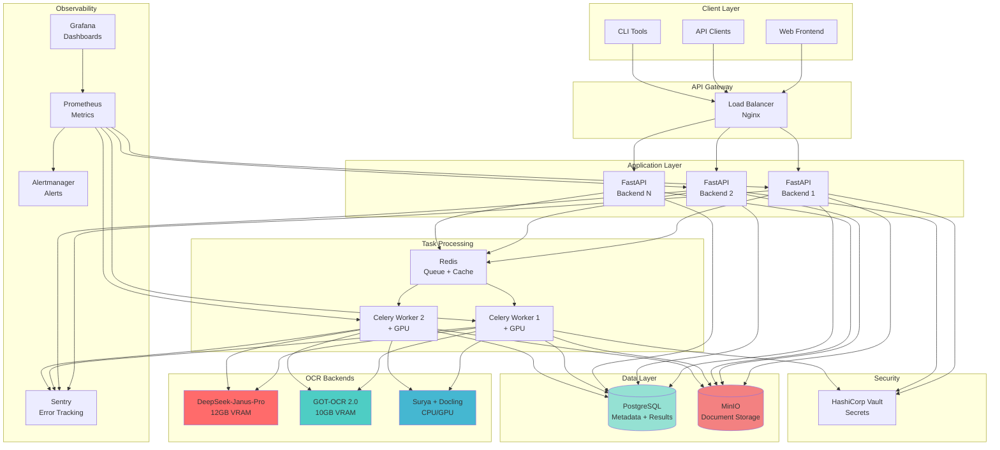
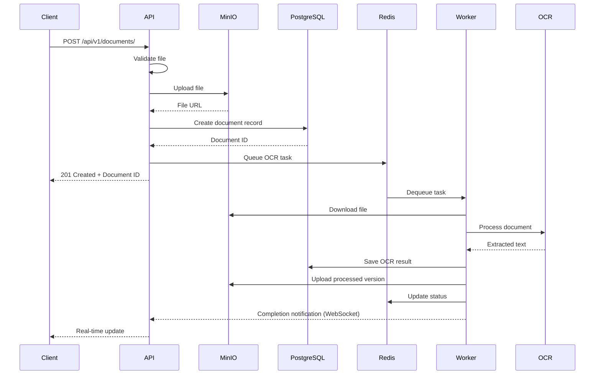
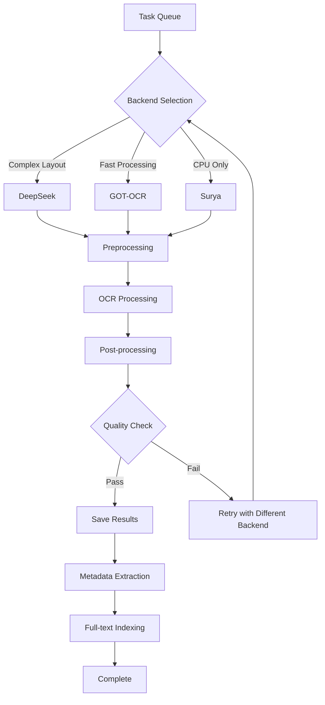

# Architekturübersicht

Diese Seite beschreibt die High-Level-Architektur von Ablage-System OCR.

---

## Systemarchitektur



---

## Komponentenbeschreibung

### Client Layer

#### Web Frontend
- **Technologie**: Vue.js 3 / React 18
- **Features**:
  - 4 Display-Modi (Dark, Light, Whitescreen, Blackscreen)
  - Responsive Design
  - Real-time Updates via WebSocket
  - Drag & Drop Upload
- **Deployment**: Nginx static hosting

#### API Clients
- **Python SDK**: `ablage-sdk` für Python-Integrationen
- **REST API**: OpenAPI 3.1 kompatibel
- **WebSocket**: Echtzeit-Updates für Verarbeitungsstatus

#### CLI Tools
- **ablage-cli**: Command-line Interface für Batch-Operationen
- **Skripte**: Python-Skripte für Automatisierung

---

### API Gateway

#### Load Balancer (Nginx)
- **Version**: Nginx 1.24+
- **Features**:
  - SSL/TLS Termination (Let's Encrypt)
  - HTTP/2 Support
  - WebSocket Proxying
  - Rate Limiting
  - Request Buffering
  - Health Checks

- **Konfiguration**:
  ```nginx
  upstream backend_api {
      least_conn;
      server backend1:8000 max_fails=3 fail_timeout=30s;
      server backend2:8000 max_fails=3 fail_timeout=30s;
  }

  server {
      listen 443 ssl http2;
      server_name api.ablage-system.local;

      ssl_certificate /etc/nginx/certs/fullchain.pem;
      ssl_certificate_key /etc/nginx/certs/privkey.pem;

      location / {
          proxy_pass http://backend_api;
          proxy_set_header Host $host;
          proxy_set_header X-Real-IP $remote_addr;
      }

      location /ws {
          proxy_pass http://backend_api;
          proxy_http_version 1.1;
          proxy_set_header Upgrade $http_upgrade;
          proxy_set_header Connection "upgrade";
      }
  }
  ```

---

### Application Layer

#### FastAPI Backend
- **Framework**: FastAPI 0.110+
- **Python**: 3.11+
- **Features**:
  - Async/Await throughout
  - OpenAPI automatic documentation
  - Pydantic v2 validation
  - Dependency injection
  - Background tasks
  - WebSocket support

- **Endpoints**:
  - `/api/v1/documents/` - Document management
  - `/api/v1/ocr/` - OCR processing
  - `/api/v1/auth/` - Authentication
  - `/api/v1/users/` - User management
  - `/api/v1/search/` - Full-text search
  - `/health` - Health checks
  - `/metrics` - Prometheus metrics

- **Scaling**: Horizontal scaling mit Load Balancer

---

### Task Processing

#### Redis
- **Version**: Redis 7.x
- **Verwendung**:
  - **Task Queue**: Celery broker für OCR-Tasks
  - **Cache**: Session cache, API response cache
  - **Pub/Sub**: Real-time notifications

- **Konfiguration**:
  ```ini
  maxmemory 2gb
  maxmemory-policy allkeys-lru
  save 900 1
  save 300 10
  appendonly yes
  ```

#### Celery Workers
- **Version**: Celery 5.3+
- **Concurrency**: 1 worker per GPU (solo pool)
- **Tasks**:
  - `process_document_task`: Hauptverarbeitungs-Task
  - `batch_process_task`: Batch-Verarbeitung
  - `extract_metadata_task`: Metadaten-Extraktion
  - `generate_thumbnail_task`: Thumbnail-Generierung

- **Configuration**:
  ```python
  # Celery configuration
  broker_url = 'redis://redis:6379/0'
  result_backend = 'redis://redis:6379/1'
  task_serializer = 'json'
  accept_content = ['json']
  result_serializer = 'json'
  task_track_started = True
  task_time_limit = 600  # 10 minutes
  worker_prefetch_multiplier = 1  # Important for GPU
  ```

---

### OCR Backends

#### DeepSeek-Janus-Pro 1.0
- **Typ**: Multimodal Vision-Language Model
- **Parameter**: ~1B
- **VRAM**: 12 GB
- **Performance**: 2-3 Seiten/Sekunde
- **Genauigkeit**: 99.5% (Deutsch)
- **Use Case**: Komplexe Layouts, Tabellen, gemischte Inhalte

#### GOT-OCR 2.0
- **Typ**: Transformer-based OCR
- **Parameter**: 600M
- **VRAM**: 10 GB
- **Performance**: 5-7 Seiten/Sekunde
- **Genauigkeit**: 98.8% (Deutsch)
- **Use Case**: Schnelle Verarbeitung, Standard-Dokumente

#### Surya + Docling
- **Typ**: Layout-aware Pipeline
- **VRAM**: 8 GB (oder CPU)
- **Performance**: 1-2 Seiten/Sekunde
- **Genauigkeit**: 97.5% (Deutsch)
- **Use Case**: CPU-Fallback, Layout-Analyse

[:octicons-arrow-right-24: Detaillierter Backend-Vergleich](../ocr-engines/comparison.md)

---

### Data Layer

#### PostgreSQL
- **Version**: PostgreSQL 16
- **Extensions**:
  - `pgvector`: Vector embeddings für semantische Suche
  - `pg_trgm`: Trigram-basierte Textsuche
  - `uuid-ossp`: UUID-Generierung

- **Schema**:
  ```sql
  -- Dokumente
  CREATE TABLE documents (
      id UUID PRIMARY KEY DEFAULT uuid_generate_v4(),
      filename TEXT NOT NULL,
      file_size BIGINT NOT NULL,
      mime_type TEXT NOT NULL,
      language VARCHAR(10) DEFAULT 'de',
      status VARCHAR(20) NOT NULL,
      owner_id UUID NOT NULL,
      created_at TIMESTAMP DEFAULT NOW(),
      updated_at TIMESTAMP DEFAULT NOW()
  );

  -- OCR-Ergebnisse
  CREATE TABLE ocr_results (
      id UUID PRIMARY KEY DEFAULT uuid_generate_v4(),
      document_id UUID REFERENCES documents(id),
      backend VARCHAR(50) NOT NULL,
      extracted_text TEXT,
      confidence FLOAT,
      processing_time_ms INTEGER,
      created_at TIMESTAMP DEFAULT NOW()
  );

  -- Volltextsuche-Index
  CREATE INDEX idx_ocr_text_search ON ocr_results
  USING gin(to_tsvector('german', extracted_text));
  ```

#### MinIO
- **Version**: MinIO RELEASE.2024-01-18
- **Protokoll**: S3-kompatibel
- **Buckets**:
  - `documents`: Original-Dokumente
  - `thumbnails`: Vorschaubilder
  - `processed`: Verarbeitete Versionen
  - `backups`: Backup-Dateien

- **Features**:
  - Versioning
  - Encryption at rest (AES-256)
  - Access policies
  - Lifecycle management

---

### Observability

#### Prometheus
- **Version**: Prometheus 2.48+
- **Retention**: 30 Tage
- **Metrics**:
  - Application metrics (FastAPI)
  - OCR metrics (processing time, success rate)
  - GPU metrics (VRAM, utilization)
  - System metrics (CPU, RAM, disk)

#### Grafana
- **Version**: Grafana 10.2+
- **Dashboards**:
  - System Overview
  - OCR Performance
  - GPU Utilization
  - API Metrics
  - Database Performance

#### Sentry
- **Version**: Sentry SDK 1.40+
- **Features**:
  - Error tracking
  - Performance monitoring
  - Release tracking
  - User feedback
  - Breadcrumbs

#### Alertmanager
- **Version**: Alertmanager 0.27+
- **Channels**:
  - Email
  - Slack
  - PagerDuty
  - OpsGenie

---

### Security

#### HashiCorp Vault
- **Version**: Vault 1.15+
- **Features**:
  - KV Secrets Engine v2
  - Dynamic database credentials
  - PKI for certificates
  - Token-based authentication
  - Access policies

- **Secrets Organization**:
  ```
  secret/ablage-system/
  ├── database      # PostgreSQL credentials
  ├── minio         # MinIO keys
  ├── redis         # Redis password
  ├── app           # JWT secrets, API keys
  ├── sentry        # Sentry DSN
  └── alerts        # Webhook URLs
  ```

---

## Datenfluss

### Dokument-Upload-Flow



### OCR-Verarbeitungs-Flow



---

## Deployment-Architekturen

### Entwicklung (Single Server)

```
┌─────────────────────────────────────┐
│         Development Server           │
│                                      │
│  ┌────────────────────────────────┐ │
│  │     Docker Compose             │ │
│  │                                │ │
│  │  • Backend (1 instance)        │ │
│  │  • Worker (1 instance + GPU)   │ │
│  │  • PostgreSQL                  │ │
│  │  • Redis                       │ │
│  │  • MinIO                       │ │
│  │  • Prometheus + Grafana        │ │
│  └────────────────────────────────┘ │
└─────────────────────────────────────┘
```

### Staging (Multi-Server)

```
┌──────────────┐  ┌──────────────┐  ┌──────────────┐
│  App Server  │  │  Worker      │  │  Data Server │
│              │  │  Server      │  │              │
│ • Backend x2 │  │ • Worker x1  │  │ • PostgreSQL │
│ • Nginx      │  │ • GPU        │  │ • Redis      │
│              │  │              │  │ • MinIO      │
└──────────────┘  └──────────────┘  └──────────────┘
        │                 │                  │
        └─────────────────┴──────────────────┘
                          │
                 ┌────────────────┐
                 │   Monitoring   │
                 │   Server       │
                 │                │
                 │ • Prometheus   │
                 │ • Grafana      │
                 │ • Alertmanager │
                 └────────────────┘
```

### Produktion (High Availability)

```
                    ┌──────────────┐
                    │ Load Balancer│
                    │   (Nginx)    │
                    └───────┬──────┘
                            │
            ┌───────────────┼───────────────┐
            │               │               │
    ┌───────▼────┐  ┌───────▼────┐  ┌───────▼────┐
    │ Backend 1  │  │ Backend 2  │  │ Backend N  │
    └───────┬────┘  └───────┬────┘  └───────┬────┘
            │               │               │
            └───────────────┼───────────────┘
                            │
    ┌───────────────────────┼───────────────────────┐
    │                       │                       │
┌───▼────┐          ┌───────▼────┐          ┌──────▼────┐
│Worker 1│          │  Worker 2  │          │ Worker N  │
│+ GPU 1 │          │  + GPU 2   │          │ + GPU N   │
└───┬────┘          └───────┬────┘          └──────┬────┘
    │                       │                      │
    └───────────────────────┼──────────────────────┘
                            │
    ┌───────────────────────┼───────────────────────┐
    │                       │                       │
┌───▼────────┐    ┌─────────▼──────┐    ┌──────────▼────┐
│PostgreSQL  │    │     Redis      │    │     MinIO     │
│ Primary    │    │   Cluster      │    │   Cluster     │
│ + Replica  │    │   (3 nodes)    │    │   (4 nodes)   │
└────────────┘    └────────────────┘    └───────────────┘
```

[:octicons-arrow-right-24: Detailliertes Deployment](../deployment/production.md)

---

## Technologie-Stack

### Backend

| Komponente | Technologie | Version | Zweck |
|------------|-------------|---------|-------|
| **Web Framework** | FastAPI | 0.110+ | REST API, WebSocket |
| **Language** | Python | 3.11+ | Application logic |
| **ASGI Server** | Uvicorn | 0.25+ | Production server |
| **ORM** | SQLAlchemy | 2.0+ | Database abstraction |
| **Migrations** | Alembic | 1.13+ | Schema migrations |
| **Validation** | Pydantic | 2.5+ | Data validation |
| **Task Queue** | Celery | 5.3+ | Async task processing |

### Data Storage

| Komponente | Technologie | Version | Zweck |
|------------|-------------|---------|-------|
| **Database** | PostgreSQL | 16+ | Relational data |
| **Cache/Queue** | Redis | 7.x | Caching, queuing |
| **Object Storage** | MinIO | 2024+ | File storage |
| **Vector DB** | pgvector | 0.5+ | Embeddings |

### OCR & ML

| Komponente | Technologie | Version | Zweck |
|------------|-------------|---------|-------|
| **Framework** | PyTorch | 2.1+ | ML framework |
| **Vision Model** | DeepSeek-Janus | 1.0 | Multimodal OCR |
| **OCR Engine** | GOT-OCR | 2.0 | Fast OCR |
| **Layout** | Surya + Docling | 1.1/1.0 | Layout analysis |
| **GPU** | CUDA | 12.0+ | GPU acceleration |

### Infrastructure

| Komponente | Technologie | Version | Zweck |
|------------|-------------|---------|-------|
| **Containerization** | Docker | 24.x | Container runtime |
| **Orchestration** | Docker Compose | 2.20+ | Multi-container |
| **IaC** | Terraform | 1.6+ | Infrastructure |
| **Configuration** | Ansible | 2.15+ | Config management |
| **Proxy** | Nginx | 1.24+ | Reverse proxy |

### Observability

| Komponente | Technologie | Version | Zweck |
|------------|-------------|---------|-------|
| **Metrics** | Prometheus | 2.48+ | Metric collection |
| **Visualization** | Grafana | 10.2+ | Dashboards |
| **Error Tracking** | Sentry | 1.40+ | Error monitoring |
| **Alerting** | Alertmanager | 0.27+ | Alert routing |
| **Logging** | structlog | 23.2+ | Structured logging |

### Security

| Komponente | Technologie | Version | Zweck |
|------------|-------------|---------|-------|
| **Secrets** | Vault | 1.15+ | Secret management |
| **TLS** | Let's Encrypt | - | SSL certificates |
| **Auth** | JWT | - | Authentication |

---

## Design-Prinzipien

### 1. Feinpoliert und Durchdacht

Jeder Aspekt des Systems ist sorgfältig durchdacht und poliert:
- Production-ready code
- Umfassende Fehlerbehandlung
- Detaillierte Dokumentation
- Extensive Testing

### 2. On-Premises First

Keine Cloud-Abhängigkeiten:
- Alle Daten bleiben lokal
- Vollständige Kontrolle über Infrastruktur
- Keine externen API-Aufrufe
- GDPR/DSGVO-konform

### 3. GPU-optimiert

Maximale GPU-Ausnutzung:
- Batch-Processing
- Memory management
- CPU-Fallback
- Multi-GPU-Support (geplant)

### 4. Skalierbar

Horizontal skalierbar:
- Stateless backends
- Worker-Pool
- Load balancing
- Database read replicas

### 5. Beobachtbar

Vollständige Observability:
- Strukturiertes Logging
- Metriken für alles
- Distributed tracing
- Proaktive Alerting

### 6. Sicher

Security by design:
- Input validation
- Output encoding
- Secrets management
- Audit logging
- Encryption everywhere

---

## Performance-Charakteristiken

### Latenz (95th Percentile)

- API Health Check: < 50ms
- Document Upload: < 500ms
- OCR Processing (single page): < 2s (GPU), < 10s (CPU)
- Document Retrieval: < 100ms (cached), < 300ms (DB)
- Search Query: < 500ms

### Durchsatz

- Concurrent Users: 100+
- Documents per Hour: 500+ (GPU), 100+ (CPU)
- API Requests per Second: 1000+

### Ressourcen

- Backend Memory: ~500MB per instance
- Worker Memory: ~4GB per worker (without model)
- Model Memory: 8-12GB VRAM
- Database Connections: 20 per backend
- Redis Memory: ~2GB

[:octicons-arrow-right-24: Performance-Benchmarks](../performance/benchmarks.md)

---

## Nächste Schritte

- [:octicons-arrow-right-24: Systemarchitektur Details](system-architecture.md)
- [:octicons-arrow-right-24: Datenfluss](data-flow.md)
- [:octicons-arrow-right-24: OCR-Backends](ocr-backends.md)
- [:octicons-arrow-right-24: GPU-Management](gpu-management.md)
- [:octicons-arrow-right-24: Sicherheitsarchitektur](security.md)
