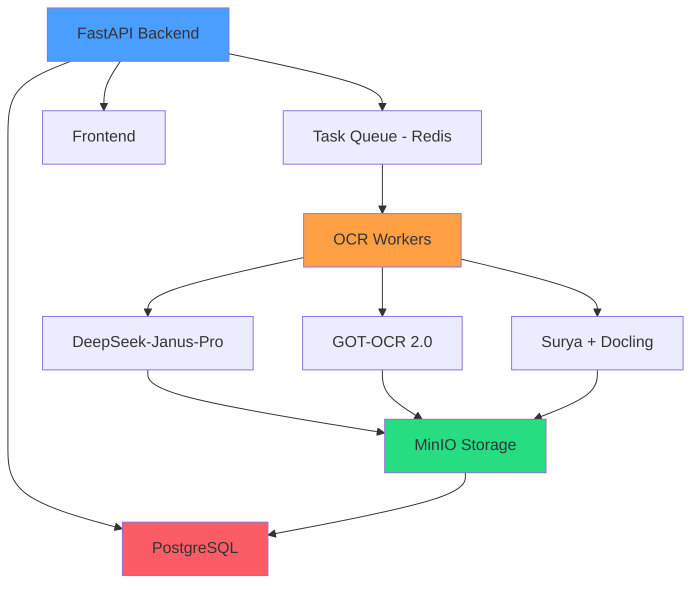

# Ablage-System OCR

<div align="center">
  

  **Enterprise-grade German document processing with GPU-accelerated OCR**

  [](LICENSE)
  [](https://www.python.org/)
  [](https://www.docker.com/)
  [](https://www.nvidia.com/)
</div>

---

## Überblick

Ablage-System ist eine intelligente Dokumentenverarbeitungsplattform, die die Digitalisierung deutscher Dokumente mit mehreren OCR-Backends automatisiert. Entwickelt für Unternehmensumgebungen, die On-Premises-Deployment mit GPU-Beschleunigung erfordern.

### Hauptfunktionen

<div class="grid cards" markdown>

- :material-lightning-bolt:{ .lg .middle } **GPU-beschleunigtes OCR**

    ---

    Nutzt NVIDIA RTX 4080 für Echtzeit-Dokumentenverarbeitung mit bis zu 7 Seiten pro Sekunde

    [:octicons-arrow-right-24: GPU-Setup](installation/gpu-setup.md)

- :material-robot:{ .lg .middle } **Multi-Backend OCR**

    ---

    Drei spezialisierte OCR-Engines: DeepSeek-Janus-Pro, GOT-OCR 2.0, und Surya+Docling

    [:octicons-arrow-right-24: OCR-Backends](architecture/ocr-backends.md)

- :material-translate:{ .lg .middle } **Deutsch-optimiert**

    ---

    Spezialisiert für deutsche Dokumente mit Frakturschrift-Unterstützung und 100% Umlaut-Genauigkeit

    [:octicons-arrow-right-24: Sprachunterstützung](user-guide/language-support.md)

- :material-eye:{ .lg .middle } **Adaptive Anzeigemodi**

    ---

    4 Anzeigemodi für unterschiedliche Lichtverhältnisse und Barrierefreiheit

    [:octicons-arrow-right-24: Display-Modi](user-guide/display-modes.md)

- :material-shield-lock:{ .lg .middle } **Enterprise-Sicherheit**

    ---

    On-Premises-Deployment, keine Cloud-Abhängigkeiten, vollständige Datenkontrolle

    [:octicons-arrow-right-24: Sicherheit](security/overview.md)

- :material-chart-line:{ .lg .middle } **Production-Ready**

    ---

    Komplett mit Monitoring, Alerting, Backup, und Disaster Recovery

    [:octicons-arrow-right-24: Deployment](deployment/production.md)

</div>

---

## Schnellstart

### Voraussetzungen

- **Hardware**: NVIDIA GPU (RTX 4080 empfohlen), 32GB+ RAM
- **Software**: Docker 24.x+, Docker Compose, CUDA 12.x
- **OS**: Ubuntu 22.04 LTS oder Windows mit WSL2

### Installation in 3 Schritten

=== "Docker Compose (empfohlen)"

    ```bash
    # 1. Repository klonen
    git clone https://github.com/ablage-system/ablage-system-ocr.git
    cd ablage-system-ocr

    # 2. Umgebungsvariablen konfigurieren
    cp .env.example .env
    nano .env  # Anpassen nach Bedarf

    # 3. Starten
    docker-compose up -d
    ```

    Die Anwendung ist verfügbar unter: `http://localhost:8000`

=== "Lokale Entwicklung"

    ```bash
    # 1. Repository klonen
    git clone https://github.com/ablage-system/ablage-system-ocr.git
    cd ablage-system-ocr

    # 2. Virtual Environment erstellen
    python3.11 -m venv venv
    source venv/bin/activate

    # 3. Dependencies installieren
    pip install -r requirements.txt
    pip install -r requirements-dev.txt

    # 4. Datenbank migrieren
    alembic upgrade head

    # 5. Server starten
    uvicorn app.main:app --reload
    ```

=== "Terraform (Produktion)"

    ```bash
    # 1. Terraform initialisieren
    cd infrastructure/terraform
    terraform init

    # 2. Konfiguration anpassen
    cp terraform.tfvars.example terraform.tfvars
    nano terraform.tfvars

    # 3. Infrastruktur bereitstellen
    terraform plan
    terraform apply
    ```

### Erstes Dokument verarbeiten

```bash
# Dokument hochladen und verarbeiten
curl -X POST "http://localhost:8000/api/v1/documents/" \
  -H "Authorization: Bearer YOUR_TOKEN" \
  -F "file=@document.pdf"

# Ergebnis abrufen
curl "http://localhost:8000/api/v1/documents/{document_id}"
```

!!! success "Fertig!"
    Ihr erstes Dokument wurde erfolgreich verarbeitet! Siehe [vollständiges Tutorial](tutorials/first-document.md) für detaillierte Schritte.

---

## Architektur



[:octicons-arrow-right-24: Detaillierte Architektur](architecture/system-architecture.md)

---

## Technologie-Stack

### Backend

- **Framework**: FastAPI 0.110+ (async/await, WebSocket)
- **Python**: 3.11+ (für Performance-Verbesserungen)
- **Datenbank**: PostgreSQL 16 mit pgvector-Extension
- **Cache/Queue**: Redis 7.x
- **Storage**: MinIO (S3-kompatibel)
- **Task Queue**: Celery 5.3+

### OCR-Engines

- **DeepSeek-Janus-Pro 1.0**: Multimodales Vision-Language-Modell
- **GOT-OCR 2.0**: 600M-Parameter Transformer
- **Surya v1.1 + Docling v1.0**: Layout-aware Pipeline

### Infrastructure

- **Containerization**: Docker 24.x, Docker Compose
- **IaC**: Terraform 1.6+ (Proxmox)
- **Configuration Management**: Ansible 2.15+
- **GPU**: NVIDIA RTX 4080 (16GB VRAM, CUDA 12.x)
- **Monitoring**: Prometheus, Grafana, Sentry
- **Secrets**: HashiCorp Vault

[:octicons-arrow-right-24: Vollständiger Tech-Stack](architecture/overview.md#technologie-stack)

---

## Leistungsmerkmale

### Benchmark-Ergebnisse (RTX 4080)

| OCR-Engine | Seiten/Sekunde | VRAM-Nutzung | Genauigkeit (Deutsch) |
|------------|----------------|--------------|----------------------|
| DeepSeek-Janus-Pro | 2-3 | 12 GB | 99.5% |
| GOT-OCR 2.0 | 5-7 | 10 GB | 98.8% |
| Surya+Docling | 1-2 | 8 GB | 97.5% |

### Skalierbarkeit

- **Gleichzeitige Benutzer**: 100+
- **Dokumente/Stunde**: 500+ (GPU), 100+ (CPU-Fallback)
- **API-Requests/Sekunde**: 1000+
- **Maximale Dokumentgröße**: 50 MB
- **Batch-Größe**: 32 Dokumente (GPU), 8 (CPU)

[:octicons-arrow-right-24: Performance-Details](performance/benchmarks.md)

---

## Sicherheit

### Sicherheitsfeatures

- ✅ **Ende-zu-Ende-Verschlüsselung**: TLS 1.3 für alle Kommunikation
- ✅ **Datenverschlüsselung**: AES-256 für gespeicherte Dokumente
- ✅ **Secret Management**: HashiCorp Vault für sensible Daten
- ✅ **Audit-Logging**: Vollständige Nachverfolgung aller Zugriffe
- ✅ **GDPR-Compliance**: Datenlöschung, Export, Einwilligung
- ✅ **Rate Limiting**: Schutz vor Missbrauch
- ✅ **Input Validation**: Umfassende Eingabevalidierung

[:octicons-arrow-right-24: Sicherheitsdokumentation](security/overview.md)

---

## Use Cases

### Dokumentenarten

<div class="grid" markdown>

=== "Rechnungen"
    - Automatische Extraktion von Rechnungsdaten
    - Feldvalidierung (Betrag, Datum, USt-ID)
    - Integration mit Buchhaltungssystemen

=== "Verträge"
    - Volltext-OCR mit Layout-Erhaltung
    - Klausel-Extraktion
    - Versionierung und Vergleich

=== "Formulare"
    - Checkbox- und Textfeld-Erkennung
    - Strukturierte Datenextraktion
    - Validierung gegen Vorlagen

=== "Historische Dokumente"
    - Frakturschrift-Unterstützung
    - Bildoptimierung für alte Dokumente
    - Handschriftenerkennung (experimentell)

</div>

[:octicons-arrow-right-24: Weitere Use Cases](user-guide/use-cases.md)

---

## Community & Support

### Hilfe erhalten

- 📖 **Dokumentation**: Sie lesen sie gerade!
- 💬 **Community-Forum**: [forum.ablage-system.local](https://forum.ablage-system.local)
- 🐛 **Bug Reports**: [GitHub Issues](https://github.com/ablage-system/ablage-system-ocr/issues)
- 📧 **Email**: [support@ablage-system.local](mailto:support@ablage-system.local)

### Beitragen

Wir freuen uns über Beiträge! Siehe [Contributing Guide](contributing/guide.md) für Details.

```bash
# Fork & Clone
git clone https://github.com/your-username/ablage-system-ocr.git

# Branch erstellen
git checkout -b feature/amazing-feature

# Changes committen
git commit -m "feat: add amazing feature"

# Push & Pull Request
git push origin feature/amazing-feature
```

[:octicons-arrow-right-24: Contributing Guidelines](contributing/guide.md)

---

## Roadmap

### Version 1.0 (Q1 2025) ✅

- [x] Multi-Backend OCR
- [x] GPU-Acceleration
- [x] Deutsche Sprachoptimierung
- [x] REST API
- [x] Docker Deployment

### Version 1.1 (Q2 2025) 🚧

- [ ] Kubernetes-Support
- [ ] Multi-GPU-Unterstützung
- [ ] Erweiterte Frakturschrift-Erkennung
- [ ] GraphQL-API
- [ ] Mobile App

### Version 2.0 (Q3 2025) 📋

- [ ] AI-gestützte Dokumentenklassifizierung
- [ ] Automatische Formularerkennung
- [ ] Multi-Tenant-Unterstützung
- [ ] SAML/OIDC Integration
- [ ] Advanced Analytics Dashboard

[:octicons-arrow-right-24: Vollständige Roadmap](roadmap.md)

---

## Lizenz

Ablage-System OCR ist unter der [MIT-Lizenz](https://opensource.org/licenses/MIT) lizenziert.

```
Copyright (c) 2025 Ablage-System Team

Permission is hereby granted, free of charge, to any person obtaining a copy
of this software and associated documentation files (the "Software"), to deal
in the Software without restriction...
```

---

## Danksagungen

Dieses Projekt nutzt folgende Open-Source-Technologien:

- [FastAPI](https://fastapi.tiangolo.com/) - Web Framework
- [PostgreSQL](https://www.postgresql.org/) - Datenbank
- [Redis](https://redis.io/) - Cache & Queue
- [MinIO](https://min.io/) - Object Storage
- [Prometheus](https://prometheus.io/) & [Grafana](https://grafana.com/) - Monitoring
- [HashiCorp Vault](https://www.vaultproject.io/) - Secrets Management

Sowie die OCR-Engines:

- DeepSeek-Janus-Pro
- GOT-OCR 2.0
- Surya & Docling

---

<div align="center">
  <p>
    <strong>Made with ❤️ in Germany</strong><br>
    Feinpoliert und durchdacht
  </p>
</div>
